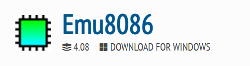
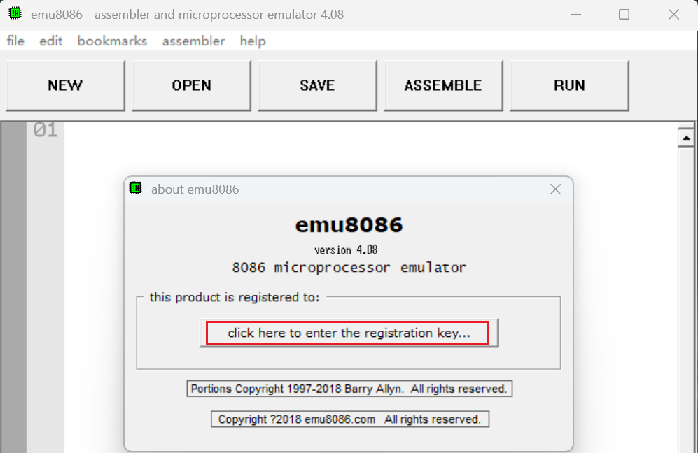
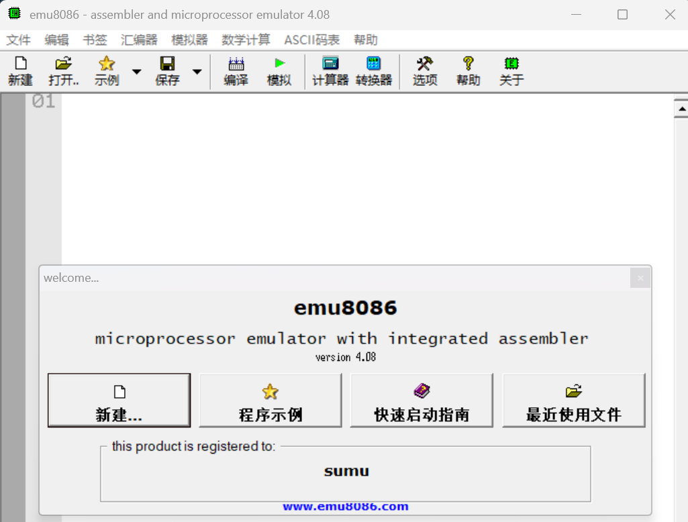

<!-- more -->

## 一、简介

emu8086(8086汇编模拟工具)官方版是一款为学习和开发汇编语言提供理想环境的8086汇编模拟工具emu8086(8086汇编模拟工具)官方版让用户可以编写、调试和运行8086汇编程序，从而学习或研究8086微处理器的原理和应用。

EMU8086是一种学习汇编的工具，它结合了一个原始编辑器、组译器、反组译器、具除错功能的软件模拟工具（虚拟PC），还有一个循序渐进的指导工具。这对刚开始学组合语言的人会是一个很有用的工具。它会在模拟器中一步一步的编译程序码并执行，视觉化的工作环境让它更加容易使用。

> 官网：[Emu8086 - Download](https://emu8086.en.lo4d.com/windows)

## 二、安装eumu8086

### 1. 下载安装包

我这里直接官网下载，下载了个[Emu8086 V4.08](https://emu8086.en.lo4d.com/download/mirror-ls1)

> Tips：[https://wwyy.lanzouu.com/iPfW836iro0j](https://wwyy.lanzouu.com/iPfW836iro0j)

### 2. 安装软件

这个没啥难度，选择好最终的安装目录，一路默认即可，安装完毕后打开是这样的：

说实话，后面会发现在学习汇编过程中还是很好用的。这个软件并不是免费的，当然我们可以有自己的方法，网上搜一下，很多。

### 3. 汉化

找到汉化包中的`.exe`可执行文件，替换刚才安装目录中的`.exe`文件即可。

> 官网下的在汉化后可能会有问题，可以网上直接找那种汉化版，一般都直接带有安装包。

> 参考资料：
>
> [emu8086入门指南：软件安装、汉化及实战教程-CSDN博客](https://blog.csdn.net/qq_36528377/article/details/124989498)
>
> [带你极速掌握EMU8086汇编工具，深刻理解微机原理（含安装与快速上手教程）-CSDN博客](https://blog.csdn.net/qq_52127343/article/details/123722883)
