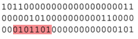

<!-- more -->

## 一、机器语言

机器语言是机器指令的集合。机器指令展开来讲就是一台机器可以正确执行的命令。电子计算机的机器指令是一列二进制数字。计算机将之转变为一列高低电平, 以使计算机的电子器件受到驱动，进行运算。

上面所说的计算机指的是可以执行机器指令, 进行运算的机器。这是早期计算机的概念。现在, 在我们常用的 PC 机中, 有一个芯片来完成上面所说的计算机的功能。这个芯片就是我们常说的 CPU(Cesntral Processing Unit, 中央处理单元), CPU 是一种微处理器。以后我们提到的计算机是指由 CPU 和其他受 CPU 直接或间接控制的芯片、器件、设备组成的计算机系统, 比如我们最常见的 PC 机。

每一种微处理器, 由于硬件设计和内部结构的不同, 就需要用不同的电平脉冲来控制, 使它工作。所以每一种微处理器都有自己的机器指令集, 也就是机器语言。早期的程序设计均使用机器语言。程序员们将用 0、1 数字编成的程序代码打在纸带或卡片上,1 打孔,0 不打孔, 再将程序通过纸带机或卡片机输入计算机, 进行运算。

应用 8086CPU 完成运算 s = 768+12288-1280, 机器码如下。


假如将程序错写成以下这样, 请你找出错误。



书写和阅读机器码程序不是一件简单的工作，要记住所有抽象的二进制码。上面只是一个非常简单的小程序，就暴露了机器码的晦涩难懂和不易查错。写如此小的一个程序尚且如此，实际上一个有用的程序至少要有几十行机器码，那么，情况将怎么样呢？在显示器上输出 "welcome to masm"，机器码如下。


看到这样的程序, 你有什么感想?如果程序里有一个 "1" 被误写为 "0", 又如何去查找呢?

## 二、汇编语言的产生

早期的程序员们很快就发现了使用机器语言带来的麻烦, 它是如此难于辨别和记忆, 给整个产业的发展带来了障碍。于是汇编语言产生了。

汇编语言的主体是汇编指令。汇编指令和机器指令的差别在于指令的表示方法上。汇编指令是机器指令便于记忆的书写格式。

例如: 机器指令 1000100111011000 表示把寄存器 BX 的内容送到 AX 中。汇编指令则写成 mov ax, bx。这样的写法与人类语言接近, 便于阅读和记忆。

```assembly
操作   : 寄存器 BX 的内容送到 AX 中
机器指令: 1000100111011000
汇编指令: mov ax, bx
```

> Tips：寄存器, 简单地讲是 CPU 中可以存储数据的器件, 一个 CPU 中有多个寄存器。AX 是其中一个寄存器的代号, BX 是另一个寄存器的代号。更详细的内容我们在以后的课程中将会讲到。

此后, 程序员们就用汇编指令编写源程序。可是, 计算机能读懂的只有机器指令, 那么如何让计算机执行程序员用汇编指令编写的程序呢?这时, 就需要有一个能够将汇编指令转换成机器指令的翻译程序, 这样的程序我们称其为编译器。程序员用汇编语言写出源程序, 再用汇编编译器将其编译为机器码, 由计算机最终执行。图 1.1 描述了这个工作过程。


## 三、汇编语言的组成

汇编语言发展至今, 有以下 3 类指令组成。

（1）汇编指令: 机器码的助记符, 有对应的机器码。

（2）伪指令: 没有对应的机器码, 由编译器执行, 计算机并不执行。

（3）其他符号: 如 `+`、`-`、`*`、`/` 等, 由编译器识别, 没有对应的机器码。

汇编语言的核心是汇编指令, 它决定了汇编语言的特性。
