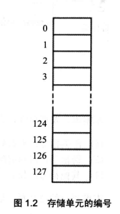
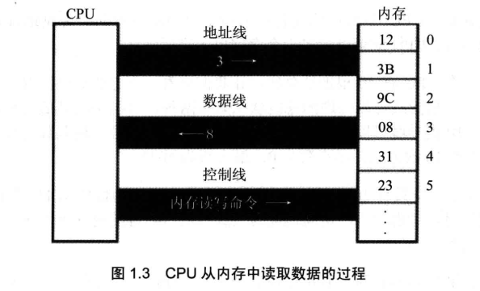
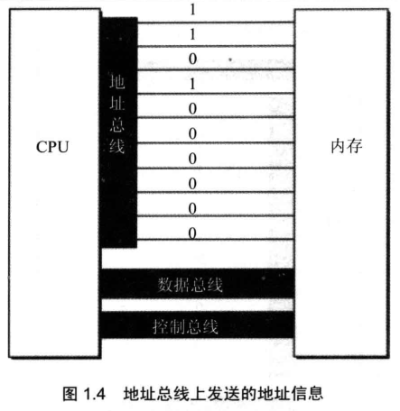
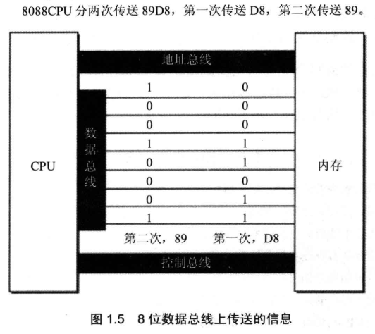
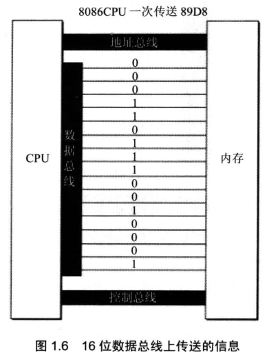

<!-- more -->

这一部分来了解一下和处理器相关的一些属于和基本概念。

## 一、存储器

CPU 是计算机的核心部件, 它控制整个计算机的运作并进行运算。要想让一个 CPU 工作, 就必须向它提供指令和数据。指令和数据在存储器中存放, 也就是我们平时所说的内存。

在一台 PC 机中内存的作用仅次于 CPU。离开了内存, 性能再好的 CPU 也无法工作。这就像再聪明的大脑, 没有了记忆也无法进行思考。磁盘不同于内存, 磁盘上的数据或程序如果不读到内存中, 就无法被 CPU 使用。要灵活地利用汇编语言编程, 我们首先要了解 CPU 是如何从内存中读取信息, 以及向内存中写入信息的。

## 二、指令和数据

指令和数据是应用上的概念。在内存或磁盘上, 指令和数据没有任何区别, 都是二进制信息。CPU 在工作的时候把有的信息看作指令, 有的信息看作数据, 为同样的信息赋予了不同的意义。就像围棋的棋子, 在棋盒里的时候没有任何区别, 在对弈的时候就有了不同的意义。

例如, 内存中的二进制信息 1000100111011000, 计算机可以把它看作大小为 89D8H 的数据来处理, 也可以将其看作指令 mov ax, bx 来执行。

```assembly
1000100111011000 --> 89D8H(数据)
1000100111011000 --> mov ax,bx (程序)
```

## 三、存储单元



存储器被划分成若干个存储单元, 每个存储单元从 0 开始顺序编号, 例如一个存储器有 128 个存储单元, 编号从 0~127, 如图 1.2 所示。

那么一个存储单元能存储多少信息呢?我们知道电子计算机的最小信息单位是 bit(音译为比特), 也就是一个二进制位。8 个 bit 组成一个 Byte, 也就是通常讲的一个字节。微型机存储器的存储单元可以存储一个 Byte, 即 8 个二进制位。一个存储器有 128 个存储单元, 它可以存储 128 个 Byte。

微机存储器的容量是以字节为最小单位来计算的。对于拥有 128 个存储单元的存储器, 我们可以说, 它的容量是 128 个字节。

对于大容量的存储器一般还用以下单位来计量容量(以下用 B 来代表 Byte)：

```assembly
1KB=1024B 1MB=1024KB 1GB=1024MB 1TB=1024GB
```

磁盘的容量单位同内存的一样, 实际上以上单位是微机中常用的计量单位。

## 四、总线

### 1. CPU 对存储器的读写

以上讲到, 存储器被划分成多个存储单元, 存储单元从零开始顺序编号。这些编号可以看作存储单元在存储器中的地址。就像一条街, 每个房子都有门牌号码。

CPU 要从内存中读数据, 首先要指定存储单元的地址。也就是说它要先确定它要读取哪一个存储单元中的数据。就像在一条街上找人, 先要确定他住在哪个房子里。

另外, 在一台微机中, 不只有存储器这一种器件。CPU 在读写数据时还要指明, 它要对哪一个器件进行操作, 进行哪种操作, 是从中读出数据, 还是向里面写入数据。

可见, CPU 要想进行数据的读写, 必须和外部器件(标准的说法是芯片)进行下面 3 类信息的交互。

- 存储单元的地址(地址信息);

- 器件的选择, 读或写的命令(控制信息);

- 读或写的数据(数据信息)。

那么 CPU 是通过什么将地址、数据和控制信息传到存储器芯片中的呢?电子计算机能处理、传输的信息都是电信号, 电信号当然要用导线传送。在计算机中专门有连接 CPU 和其他芯片的导线, 通常称为 **总线**。总线从物理上来讲, 就是一根根导线的集合。根据传送信息的不同, 总线从逻辑上又分为 3 类, **地址总线**、**控制总线** 和 **数据总线**。

CPU 从 3 号单元中读取数据的过程(见图 1.3)如下。



（1）CPU 通过地址线将地址信息 3 发出。

（2）CPU 通过控制线发出内存读命令, 选中存储器芯片, 并通知它, 将要从中读取数据。

（3）存储器将 3 号单元中的数据 8 通过数据线送入 CPU。

写操作与读操作的步骤相似。如向 3 号单元写入数据 26。

（1）CPU 通过地址线将地址信息 3 发出。

（2）CPU 通过控制线发出内存写命令, 选中存储器芯片, 并通知它, 要向其中写入数据。

（3）CPU 通过数据线将数据 26 送入内存的 3 号单元中。

从上面我们知道了 CPU 是如何进行数据读写的。可是, 如何命令计算机进行数据的读写呢?

要让一个计算机或微处理器工作, 应向它输入能够驱动它进行工作的电平信息(机器码)。

对于 8086CPU, 下面的机器码, 能够完成从 3 号单元读数据。

```assembly
机器码: 101000010000001100000000
含义:   从 3 号单元读取数据送入寄存器 AX
```

CPU 接收这条机器码后将完成我们上面所述的读写工作。机器码难于记忆, 用汇编指令来表示, 情况如下。

```assembly
机器码:       10100001 00000011 00000000
对应的汇编指令: MOV AX, [3]
含义:         传送 3 号单元的内容入 AX
```

### 2. 地址总线

现在我们知道, CPU 是通过地址总线来指定存储器单元的。可见地址总线上能传送多少个不同的信息, CPU 就可以对多少个存储单元进行寻址。

现假设, 一个 CPU 有 10 根地址总线, 让我们来看一下它的寻址情况。我们知道, 在电子计算机中, 一根导线可以传送的稳定状态只有两种, 高电平或是低电平。用二进制表示就是 1 或 0,10 根导线可以传送 10 位二进制数据。而 10 位二进制数可以表示多少个不同的数据呢?2 的 10 次方个。最小数为 0, 最大数为 1023。

图 1.4 展示了一个具有 10 根地址线的 CPU 向内存发出地址信息 11 时 10 根地址线上传送的二进制信息。考虑一下, 读访问地址为 12、13、读 14 试等的内存单元时, 地址总线上传送的内容是什么?

一个 CPU 有 N 根地址线, 则可以说这个 CPU 的地址总线的宽度为 N。这样的 CPU 最多可以寻找 **2 的 N 次方** 个内存单元。



### 3. 数据总线

CPU 与内存或其他器件之间的数据传送是通过数据总线来进行的。数据总线的宽度决定了 CPU 和外界的数据传送速度。8 根数据总线一次可传送一个 8 位二进制数据(即一个字节)。16 根数据总线一次可传送两个字节。

8088CPU 的数据总线宽度为 8，8086CPU 的数据总线宽度为 16。我们来分别看一下它们向内存中写入数据 89D8H 时, 是如何通过数据总线传送数据的。图 1.5 展示了 8088CPU 数据总线上的数据传送情况; 图 1.6 展示了 8086CPU 数据总线上的数据传送情况。

<table>
  <tbody>
    <tr>
	<td width="50%" align="center">  </td> <td width="50%" align="center">  </td>
	</tr>
  </tbody>
</table>
8086 有 16 根数据线, 可一次传送 16 位数据, 所以可一次传送数据 89D8H; 而 8088 只有 8 根数据线, 一次只能传 8 位数据, 所以向内存写入数据 89D8H 时需要进行两次数据传送。

### 4. 控制总线

CPU 对外部器件的控制是通过控制总线来进行的。在这里控制总线是个总称，控制总线是一些不同控制线的集合。有多少根控制总线，就意味着 CPU 提供了对外部器件的多少种控制。所以，**控制总线的宽度决定了 CPU 对外部器件的控制能力**。

前面所讲的内存读或写命令是由几根控制线综合发出的，其中有一根称为 "读信号输出" 的控制线负责由 CPU 向外传送读信号，CPU 向该控制线上输出低电平表示将要读取数据：有一根称为 "写信号输出" 的控制线则负责传送写信号。

### 5. 总结

（1）汇编指令是机器指令的助记符, 同机器指令一一对应。

（2）每一种 CPU 都有自己的汇编指令集。

（3）CPU 可以直接使用的信息在存储器中存放。

（4）在存储器中指令和数据没有任何区别, 都是二进制信息。

（5）存储单元从零开始顺序编号。

（6）一个存储单元可以存储 8 个 bit, 即 8 位二进制数。

（7）1Byte = 8bit 1KB = 1024B 1MB = 1024KB 1GB = 1024MB。

（8）每一个 CPU 芯片都有许多管脚, 这些管脚和总线相连。也可以说, 这些管脚引出总线。一个 CPU 可以引出 3 种总线的宽度标志了这个 CPU 的不同方面的性能:

- 地址总线的宽度决定了 CPU 的寻址能力;

- 数据总线的宽度决定了 CPU 与其他器件进行数据传送时的一次数据传送量;

- 控制总线的宽度决定了 CPU 对系统中其他器件的控制能力。

## 五、主板

在每一台 PC 机中, 都有一个主板, 主板上有核心器件和一些主要器件, 这些器件通过总线(地址总线、数据总线、控制总线)相连。这些器件有 CPU、存储器、外围芯片组、扩展插槽等。扩展插槽上一般插有 RAM 内存条和各类接口卡。

## 六、接口卡

计算机系统中, 所有可用程序控制其工作的设备, 必须受到 CPU 的控制。CPU 对外部设备都不能直接控制, 如显示器、音箱、打印机等。直接控制这些设备进行工作的是插在扩展插槽上的接口卡。扩展插槽通过总线和 CPU 相连, 所以接口卡也通过总线同 CPU 相连。CPU 可以直接控制这些接口卡, 从而实现 CPU 对外设的间接控制。简单地讲, 就是 CPU 通过总线向接口卡发送命令, 接口卡根据 CPU 的命令控制外设进行工作。
