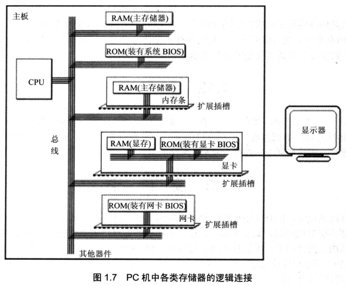
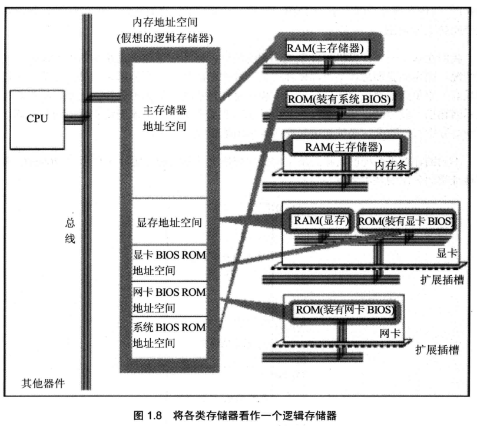
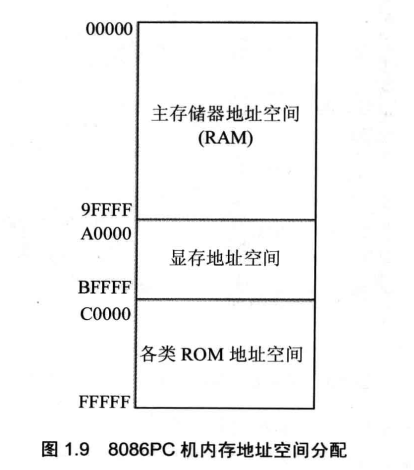

<!-- more -->

## 一、各类存储器芯片

一台 PC 机中, 装有多个存储器芯片, 这些存储器芯片从物理连接上看是独立的、不同的器件。从读写属性上看分为两类: **随机存储器(RAM)** 和 **只读存储器(ROM)**。随机存储器可读可写, 但必须带电存储, 关机后存储的内容丢失; 只读存储器只能读取不能写入, 关机后其中的内容不丢失。这些存储器从功能和连接上又可分为以下几类。

- 随机存储器

用于存放供 CPU 使用的绝大部分程序和数据, 主随机存储器一般由两个位置上的 RAM 组成, 装在主板上 RAM 和插在扩展插槽上的 RAM。

- 装有 BIOS(Basic Input/Output System, 基本输入/输出系统)的 ROM

BIOS 是由主板和各类接口卡(如显卡、网卡等)厂商提供的软件系统, 可以通过它利用该硬件设备进行最基本的输入输出。在主板和某些接口卡上插有存储相应 BIOS 的 ROM。例如, 主板上的 ROM 中存储着主板的 BIOS(通常称为系统 BIOS); 显卡上的 ROM 中存储着显卡的 BIOS; 如果网卡上装有 ROM, 那其中就可以存储网卡的 BIOS。

- 接口卡上的 RAM

某些接口卡需要对大批量输入、输出数据进行暂时存储, 在其上装有 RAM。最典型的是显示卡上的 RAM, 一般称为显存。显示卡随时将显存中的数据向显示器上输出。换句话说, 我们将需要显示的内容写入显存, 就会出现在显示器上。

图 1.7 展示了 PC 系统中各类存储器的逻辑连接情况。



## 二、内存地址空间

上述的那些存储器，在物理上是独立的器件，但是在以下两点上相同。

- 都和 CPU 的总线相连。

- CPU 对它们进行读或写的时候都通过控制线发出内存读写命令。

这也就是说，CPU 在操控它们的时候，把它们都当作内存来对待，把它们总的看作一个由若干存储单元组成的逻辑存储器，这个逻辑存储器就是我们所说的内存地址空间。在汇编这门课中，我们所面对的是内存地址空间。


图 1.8 展示了 CPU 将系统中各类存储器看作一个逻辑存储器的情况。



在图 1.8 中, 所有的物理存储器被看作一个由若干存储单元组成的逻辑存储器, 每个物理存储器在这个逻辑存储器中占有一个地址段, 即一段地址空间。CPU 在这段地址空间中读写数据, 实际上就是在相对应的物理存储器中读写数据。

假设, 图 1.8 中的内存地址空间的地址段分配如下：

```assembly
地址 0000H ~ 7FFFH 的 32KB 空间为主随机存储器的地址空间;
地址 8000H ~ 9FFFH 的 8KB 空间为显存地址空间;
地址 A000H ~ FFFFH 的 24KB 空间为各个ROM的地址空间。
```

这样, CPU 向内存地址为 1000H 的内存单元中写入数据, 这个数据就被写入主随机存储器中; CPU 向内存地址为 8000H 的内存单元中写入数据, 这个数据就被写入显存中, 然后会被显卡输出到显示器上; CPU 向内存地址为 C000H 的内存单元中写入数据的操作是没有结果的, C000H 单元中的内容不会被改变, C000H 单元实际上就是 ROM 存储器中的一个单元。

内存地址空间的大小受 CPU 地址总线宽度的限制。8086CPU 的地址总线宽度为 20, 可以传送 2^20 个不同的地址信息(大小从 0 至 2^20-1)。即可以定位 2^20 个内存单元, 则 8086PC 的内存地址空间大小为 1MB。同理, 80386CPU 的地址总线宽度为 32, 则内存地址空间最大为 4GB。

我们在基于一个计算机硬件系统编程的时候, 必须知道这个系统中的内存地址空间分配情况。因为当我们想在某类存储器中读写数据的时候, 必须知道它的第一个单元的地址和最后一个单元的地址, 才能保证读写操作是在预期的存储器中进行。比如, 我们希望向显示器输出一段信息, 那么必须将这段信息写到显存中, 显卡才能将它输出到显示器上。要向显存中写入数据, 必须知道显存在内存地址空间中的地址。

不同的计算机系统的内存地址空间的分配情况是不同的, 图 1.9 展示了 8086PC 机内存地址空间分配的基本情况。



图 1.9 告诉我们，从地址 0 \~ 9FFFF 的内存单元中读取数据，实际上就是在读取主随机存储器中的数据; 向地址 A0000 \~ BFFFF 的内存单元中写数据, 就是向显存中写入数据, 这些数据会被显示卡输出到显示器上; 我们向地址 C0000 \~ FFFF 的内存单元中写入数据的操作是无效的, 因为这等于改写只读存储器中的内容。
