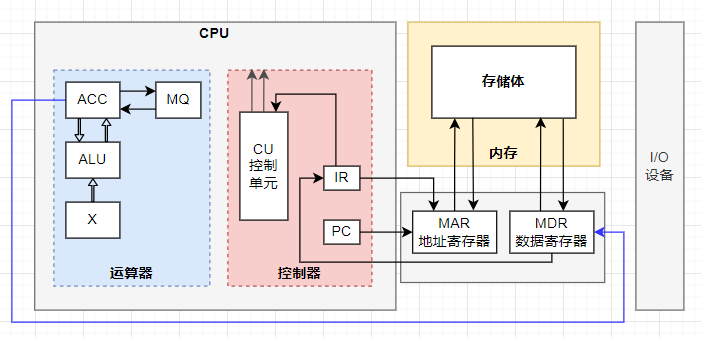
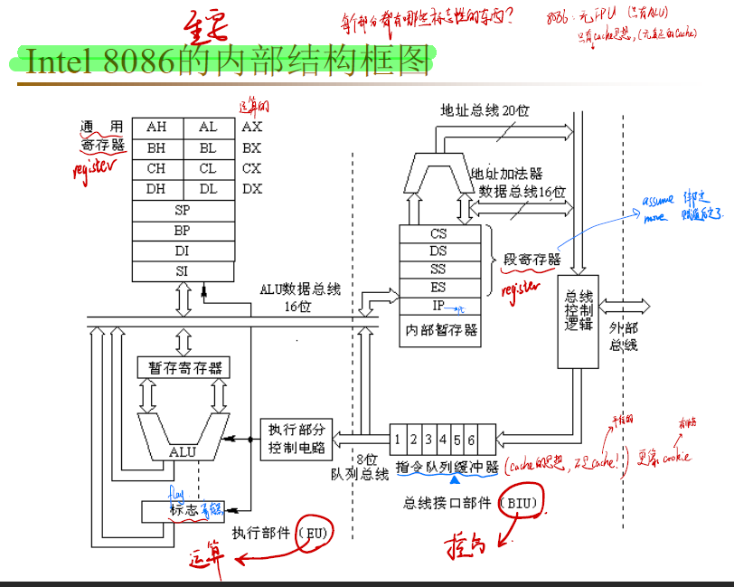
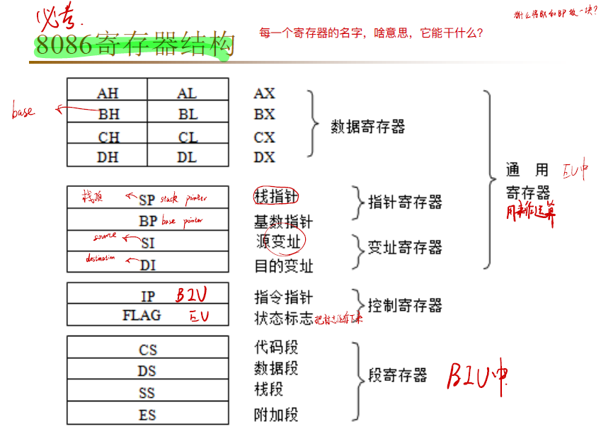
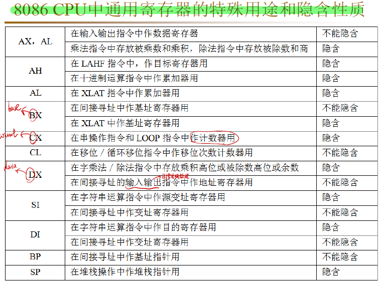
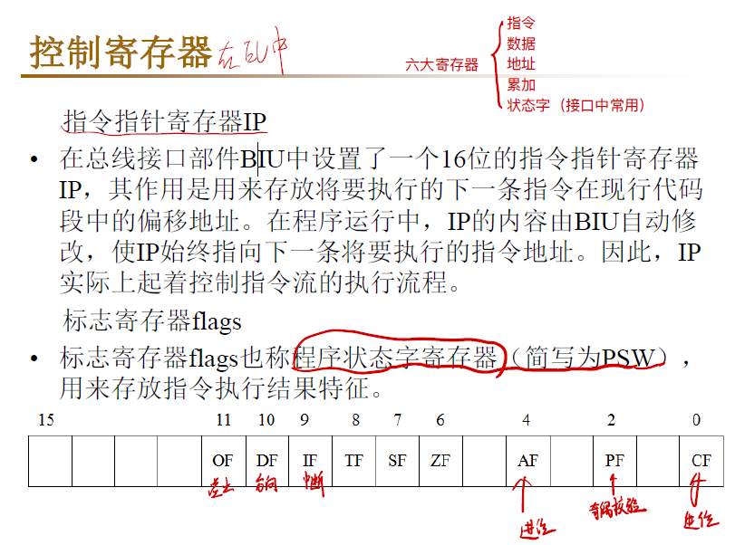

<!-- more -->

## 一、CPU 基本组成

CPU 内部主要由运算器、控制器、寄存器三大部分组成。

**运算器** 负责算术运算（`+`、`-`、`*`、`/` 基本运算和附加运算）和逻辑运算（包括 移位、逻辑测试或比较两个值等）。

**控制器** 负责应对所有的信息情况，调度运算器把计算做好。

**寄存器** 它们可用来暂存指令、数据和地址。既要对接控制器的命令，传达命令给运算器；还要帮运算器记录处理完或者将要处理的数据。

内部总线连接各种器件，在它们之间进行数据的传送。可以看一下 8086 的内部结构框图：

## 二、寄存器

这里我们主要来了解一下寄存器。对于一个汇编程序员来说，CPU 中的主要部件是寄存器。寄存器是 CPU 中程序员可以用指令读写的部件。程序员通过改变各种寄存器中的内容来实现对 CPU 的控制。

不同的 CPU，寄存器的个数、结构是不相同的。8086CPU 有 14 个寄存器，每个寄存器有一个名称。这些寄存器是：AX、BX、CX、DX、SI、DI、SP、BP、IP、CS、SS、DS、ES、PSW。

### 1. 通用寄存器组

**数据寄存器**：数据寄存器包括 AX、BX、CX、DX 等 4 个 **16 位寄存器**，主要用来保存算术、逻辑运算的操作数、中间结果和地址。它们既可以作为 16 位寄存器使用，也可以将每个寄存器高字节和低字节分开作为两个独立的 8 位寄存器使用。而 8 位寄存器（AL、BL、CL、DL、AH、BH、CH、DH）只能用于存放数据。

**地址指针和变址寄存器**

- 地址指针和变址寄存器组包括堆栈指针 SP、堆栈基址寄存器 指针 BP 以及变址寄存器 指针 SI 和 DI 等 4 个 16 位寄存器。它们主要是用来存放或指示操作数的偏移地址。
- 堆栈指针 SP 中存放的是当前堆栈段中 **栈顶** 的偏移地址。堆栈操作指令 PUSH 和 POP 就是从 SP 中得到操作数的段内偏移地址的。
- BP 是访问堆栈时的基址寄存器。BP 中存放的是堆栈中某一存储单元的偏移地址，SP、BP 通常和 SS 联用。
- **SI 和 DI 称为变址寄存器**。它们通常与 DS 联用，为程序访问当前数据段提供操作数的 **段内** 偏移地址。SI 和 DI 除作为一般的变址寄存器外，在 **串操作指令中 SI 规定用作存放源操作数(即源串)的偏移地址，称为源变址寄存器；DI 规定用作存放目的操作数(目的串)的偏移地址，故称之为目的变址寄存器，二者不能混用**。由于串操作指令规定源字符串必须位于当前数据段 DS 中，目的串必须位于附加段 ES 中，所以 SI 和 DI 中的内容分别是当前数据段和当前附加段中某一存储单元的偏移地址。 当 SI、DI 和 BP 不作指示器和变址寄存器使用时，也可将它们当作一般数据寄存器使用，存放操作数或运算结果。

**隐含寻址**

- 8 个 16 位通用寄存器在一般情况下都具有通用性。但是，为了缩短指令代码的长度，某些通用寄存器又规定了专门的用途。**隐含寻址就是在指令中隐含地使用了一些通用寄存器，而这些通用寄存器不直接在指令中表现出来 。**
- 例如，在字符串处理指令中约定必须用 CX 作为 **计数器** 存放串的长度。这样指令中就不必给出 CX 寄存器名，缩短了指令长度，简化了指令的书写形式，这种使用方法称为“隐含寻址”。

8086 CPU 中通用寄存器的特殊用途和隐含性质

### 2. 控制寄存器

控制标志 控制标志是用来控制 CPU 的工作方式或工作状态的标志。用户可以使用指令设置或清除。

（1）IF(Interrupt Flag) ——中断允许标志。它是控制可屏蔽中断的标志，如 IF = 1 时，允许 CPU 响应可屏蔽中断；当 IF = 0 时，即使外设有中断申请，CPU 也不响应，即禁止中断。

（2）DF(Direction Flag) ——方向标志。该标志用来控制串操作指令中地址指针的变化方向。在串操作指令中，若 **DF＝0，地址指针为自动增量**，即由低地址向高地址进行串操作；若 DF＝1，地址指针自动减量，即由高地址向低地址进行串操作。

（3）TF(Trap Flag)——单步标志。TF＝1 时，CPU 为单步方式，即每执行完一条指令就自动产生一个内部中断，使用户可逐条跟踪程序进行调试。若 TF＝0 时，CPU 正常执行程序。

### 3. 段寄存器组

- CS (Code Segment)：代码段寄存器；

- DS (Data Segment)：数据段寄存器；

- SS (Stack Segment)：堆栈段寄存器；

- ES (Extra Segment)：附加段寄存器；

>参考资料：
>
>[微机原理与接口技术 重点详解与章节总结——8086 微处理器系统结构-腾讯云开发者社区-腾讯云](https://cloud.tencent.com/developer/article/2052669)
>
>[计算机组成原理系列（三）：计算机存储器结构体系详解-阿里云开发者社区](https://developer.aliyun.com/article/1160966)
