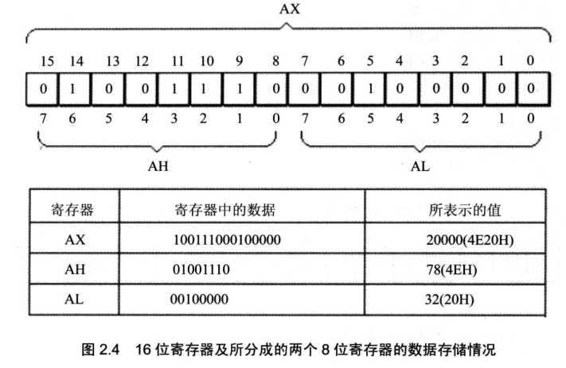

<!-- more -->

## 一、通用寄存器

8086CPU 的所有寄存器都是 16 位的, 可以存放两个字节。AX、BX、CX、DX 这 4 个寄存器通常用来存放一般性的数据, 被称为通用寄存器。

以 AX 为例, 寄存器的逻辑结构如图 2.1 所示。


一个 16 位寄存器可以存储一个 16 位的数据, 数据在寄存器中的存放情况如图 2.2 所示。


想一想, 一个 16 位寄存器所能存储的数据的最大值为多少?

8086CPU 的上一代 CPU 中的寄存器都是 8 位的, 为了保证兼容, 使原来基于上代 CPU 编写的程序稍加修改就可以运行在 8086 之上, 8086CPU 的 AX、BX、CX、DX 这 4 个寄存器都可分为两个可独立使用的 8 位寄存器来用:

- AX 可分为 AH 和 AL；
- BX 可分为 BH 和 BL；
- CX 可分为 CH 和 CL；
- DX 可分为 DH 和 DL。

以 AX 为例，8086CPU 的 16 位寄存器分为两个 8 位寄存器的情况如图 2.3 所示。


AX 的低 8 位（0 位~7 位）构成了 AL 寄存器，高 8 位（8 位~15 位）构成了 AH 寄存器。AH 和 AL 寄存器是可以独立使用的 8 位寄存器。图 2.4 展示了 16 位寄存器及它所分成的两个 8 位寄存器的数据存储的情况。



想一想，一个 8 位寄存器所能存储的数据的最大值为多少？

## 二、字在寄存器中的存储

出于对兼容性的考虑,8086CPU 可以一次性处理以下两种尺寸的数据。

- 字节: 记为 byte, 一个字节由 8 个 bit 组成, 可以存在 8 位寄存器中。
- 字: 记为 word, 一个字由两个字节组成, 这两个字节分别称为这个字的高位字节和低位字节, 如图 2.5 所示。


一个字可以存在一个 16 位寄存器中，这个字的高位字节和低位字节自然就存在这个寄存器的高 8 位寄存器和低 8 位寄存器中。如图 2.4 所示，一个字型数据 20000，存在 AX 寄存器中，在 AH 中存储了它的高 8 位，在 AL 中存储了它的低 8 位。AH 和 AL 中的数据，既可以看成是一个字型数据的高 8 位和低 8 位，这个字型数据的大小是 20000；又可以看成是两个独立的字节型数据，它们的大小分别是 78 和 32。

> Tips：关于数制的讨论
>
> 任何数据，到了计算机中都是以二进制的形式存放的。为了描述不同的问题，又经常将它们用其他的进制来表示。比如图 2.4 中寄存器 AX 中的数据是 0100111000100000，这就是读 AX 中的信息本身，可以用不同的逻辑意义来看待它。可以将它看作一个数值，大小是 20000。
>
> 当然, 二进制数 0100111000100000 本身也可表示一个数值的大小, 但人类习惯的是十进制, 用十进制 20000 表示可以使我们直观地感受到这个数值的大小。
>
> 十六进制数的一位相当于二进制数的四位, 如 0100111000100000 可表示成: 4(0100)、E(1110)、2(0010)、0(0000)四位十六进制数。
>
> 由于一个内存单元可存放 8 位数据, CPU 中的寄存器又可存放 n 个 8 位的数据。也就是说, 计算机中的数据大多是由 1~N 个 8 位数据构成的。很多时候, 需要直观地看出组成数据的各个字节数据的值, 用十六进制来表示数据可以直观地看出这个数据是由哪些 8 位数据构成的。比如 20000 写成 4E20 就可以直观的看出，这个数据是由 4E 和 20 两个 8 位数据构成的, 如果 AX 中存放 4E20, 则 AH 里是 4E, AL 里是 20。这种表示方法便于许多问题的直观分析。在以后的课程中, 我们多用十六进制来表示一个数据。
>
> 在以后的课程中, 为了区分不同的进制, 在十六进制表示的数据的后面加 H, 在二进制表示的数据后面加 B, 十进制表示的数据后面什么也不加。如: 可用 3 种不同的进制表示图 2.4 中 AX 里的数据, 十进制: 20000, 十六进制: 4E20H, 二进制: 0100111000100000B。
>

## 三、几条汇编指令

通过汇编指令控制 CPU 进行工作，看一下表 2.1 中的几条指令。

<p align="center"> 表 2.1 汇编指令举例 </p>

| 汇编指令  | 控制 CPU 完成的操作                        | 用高级语言的语法描述 |
| --------- | ---------------------------------------- | -------------------- |
| mov ax,18 | 将 18 送入寄存器 AX                      | AX = 18                |
| mov ah,78 | 将 78 送入寄存器 AH                      | AH = 78                |
| add ax,8  | 将寄存器 AX 中的数值加上 8               | AX = AX+8              |
| mov ax, bx | 将寄存器 BX 中的数据送入寄存器 AX         | AX = BX             |
| add ax, bx | 将 AX 和 BX 中的数值相加，结果存在 AX 中 | AX = AX+BX             |

注意, 为了使具有高级语言基础的读者更好地理解指令的含义, 有时会用文字描述和高级语言描述这两种方式来描述一条汇编指令的含义。在写一条汇编指令或一个寄存器的名称时不区分大小写。 如: mov ax,18 和 MOV AX,18 的含义相同; bx 和 BX 的含义相同。

接下来看一下 CPU 执行表 2.2 中所列的程序段中的每条指令后, 对寄存器中的数据进行的改变。

<p align="center"> 表 2.2 程序段中指令的执行情况之一（原 AX 中的值：0000H，原 BX 中的值：0000H）</p>

| 程序段中的指令 | 指令执行后 AX 中的数据 | 指令执行后 BX 中的数据 |
| -------------- | -------------------- | -------------------- |
| mov ax,4E20H   | 4E20H                | 0000H                |
| add ax,1406H   | 6226H                | 0000H                |
| mov bx,2000H   | 6226H                | 2000H                |
| add ax, bx      | 8226H                | 2000H                |
| mov bx, ax      | 8226H                | 8226H                |
| add ax, bx      | ？ （参见问题 2.1）   | 8226H                |

- 问题 2.1：指令执行后 AX 中的数据为多少?思考后看分析。

分析:

程序段中的最后一条指令 add ax, bx, 在执行前 ax 和 bx 中的数据都为 8226H, 相加后所得的值为: 1044CH, 但是 ax 为 16 位寄存器, 只能存放 4 位十六进制的数据, 所以最高位的 1 不能在 ax 中保存, ax 中的数据为: 044CH。

表 2.3 中所列的一段程序的执行情况。


- 问题 2.2：指令执行后 AX 中的数据为多少?思考后看分析。

分析：

程序段中的最后一条指令 add al，93H，在执行前，al 中的数据为 C5H，相加后所得的值为：158H，但是 al 为 8 位寄存器，只能存放两位十六进制的数据，所以最高位的 1 丢失，ax 中的数据为：0058H。（这里的丢失，指的是进位值不能在 8 位寄存器中保存，但是 CPU 并不真的丢弃这个进位值，关于这个问题，我们将在后面的课程中讨论。）

注意, 此时 al 是作为一个独立的 8 位寄存器来使用的, 和 ah 没有关系, CPU 在执行这条指令时认为 ah 和 al 是两个不相关的寄存器。不要错误地认为, 诸如 add al,93H 的指令产生的进位会存储在 ah 中, add al,93H 进行的是 8 位运算。

如果执行 add ax,93H, 低 8 位的进位会存储在 ah 中, CPU 在执行这条指令时认为只有一个 16 位寄存器 ax, 进行的是 16 位运算。 指令 add ax,93H 执行后, ax 中的值为: 0158H。 此时, 使用的寄存器是 16 位寄存器 ax, add ax,93H 相当于将 ax 中的 16 位数据 00c5H 和另一个 16 位数据 0093H 相加, 结果是 16 位的 0158H。

在进行数据传送或运算时, 要注意指令的两个操作对象的位数应当是一致的, 例如:

```assembly
mov ax,bx
mov bx,cx
mov ax,18H
mov al,18H
add ax,bx
add ax,20000
```

等都是正确的指令, 而:

```assembly
mov ax,bl    ; (在8位寄存器和16位寄存器之间传送数据)
mov bh,ax    ; (在16位寄存器和8位寄存器之间传送数据)
mov al,20000 ; (8位寄存器最大可存放值为255的数据)
add al,100H  ; (将一个高于8位的数据加到一个8位寄存器中)
```

等都是错误的指令, 错误的原因都是指令的两个操作对象的位数不一致。
