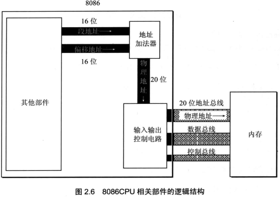
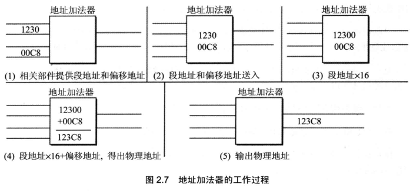
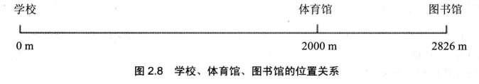
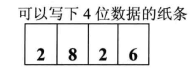
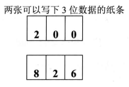
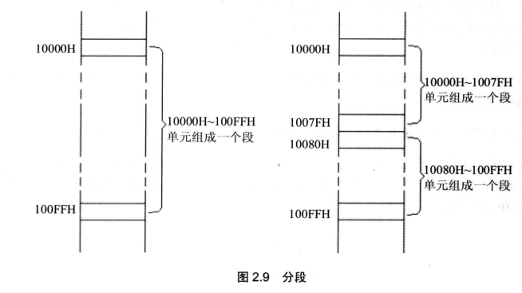

<!-- more -->

## 一、什么是物理地址？

我们知道, CPU 访问内存单元时, 要给出内存单元的地址。所有的内存单元构成的存储空间是一个一维的线性空间, 每一个内存单元在这个空间中都有唯一的地址, 我们将这个唯一的地址称为物理地址。

CPU 通过地址总线送入存储器的, 必须是一个内存单元的物理地址。在 CPU 向地址总线上发出物理地址之前, 必须要在内部先形成这个物理地址。不同的 CPU 可以有不同的形成物理地址的方式。我们现在讨论 8086CPU 是如何在内部形成内存单元的物理地址的。

## 二、16 位结构 CPU

我们说 8086CPU 的上一代 CPU（8080、8085）等是 8 位机，而 8086 是 16 位机，也可以说 8086 是 16 位结构的 CPU。那么什么是 16 位结构的 CPU 呢？

概括地讲，16 位结构（16 位机、字长为 16 位等常见说法，与 16 位结构的含义相同）描述了一个 CPU 具有下面几方面的结构特性。

- 运算器一次最多可以处理 16 位的数据；

- 寄存器的最大宽度为 16 位；
- 寄存器和运算器之间的通路为 16 位。

8086 是 16 位结构的 CPU，这也就是说，在 8086 内部，能够一次性处理、传输、暂时存储的信息的最大长度是 16 位的。内存单元的地址在送上地址总线之前，必须在 CPU 中处理、传输、暂时存放，对于 16 位 CPU，能一次性处理、传输、暂时存储 16 位的地址。

## 三、8086CPU 怎么给出物理地址？

### 1. 段地址加偏移地址

8086CPU 有 20 位地址总线, 可以传送 20 位地址, 达到 1MB 寻址能力。8086CPU 又是 16 位结构, 在内部一次性处理、传输、暂时存储的地址为 16 位。从 8086CPU 的内部
结构来看, 如果将地址从内部简单地发出, 那么它只能送出 16 位的地址, 表现出的寻址能力只有 64KB。

8086CPU 采用一种在内部用两个 16 位地址合成的方法来形成一个 20 位的物理地址。8086CPU 相关部件的逻辑结构如图 2.6 所示。



如图 2.6 所示，当 8086CPU 要读写内存时：

（1）CPU 中的相关部件提供两个 16 位的地址，一个称为段地址，另一个称为偏移地址：

（2）段地址和偏移地址通过内部总线送入一个称为地址加法器的部件；

（3）地址加法器将两个 16 位地址合成为一个 20 位的物理地址；

（4）地址加法器通过内部总线将 20 位物理地址送入输入输出控制电路；

（5）输入输出控制电路将 20 位物理地址送上地址总线；

（6）20 位物理地址被地址总线传送到存储器。

地址加法器采用 **物理地址 = 段地址 x16+偏移地址** 的方法用 **段地址和偏移地址合成物理地址**。例如，8086CPU 要访问地址为 123C8H 的内存单元，此时，地址加法器的工作过程如图 2.7 所示（图中数据皆为十六进制表示）。



> Tips：由段地址 x16 引发的讨论
>
> "段地址 x16" 有一个更为常用的说法是左移 4 位。计算机中的所有信息都是以二进制的形式存储的，段地址当然也不例外。机器只能处理二进制信息，"左移 4 位" 中的位，指的是二进制位。
>
> 我们看一个例子，一个数据为 2H，二进制形式为 10B，对其进行左移运算：
>
> ```markdown
> 左移位数    二进制  十六进制 十进制
>    0          10B     2H       2
>    1         100B     4H       4
>    2        1000B     8H       8
>    3       10000B    10H      16
>    4      100000B    20H      32
> ```
>
> 观察上面移位次数和各种形式数据的关系, 我们可以发现:
>
> （1）一个数据的二进制形式左移 1 位, 相当于该数据乘以 2;
>
> （2）一个数据的二进制形式左移 N 位, 相当于该数据乘以 2 的 N 次方;
>
> （3）地址加法器如何完成段地址 x16 的运算?就是将以二进制形式存放的段地址左移 4 位。
>
> 进一步思考, 我们可看出: 一个数据的十六进制形式左移 1 位, 相当于乘以 16; 一个数据的十进制形式左移 1 位, 相当于乘以 10; 一个 X 进制的数据左移 1 位, 相当于乘以 X。

### 2. 本质含义

注意, 这里讨论的是 8086CPU 段地址和偏移地址的本质含义, 而不是为了解决具体的问题而在本质含义之上引申出来的更高级的逻辑意义。不管以多少种不同的逻辑意义去看待 "段地址 x16+偏移地址 = 物理地址" 的寻址模式, 一定要清楚地知道它的本质含义, 这样才能更灵活地利用它来分析、解决问题。如果只拘泥于某一种引申出来的逻辑含义, 而模糊本质含义的话, 将从意识上限制对这种寻址功能的灵活应用。

"段地址 x16+偏移地址 = 物理地址" 的本质含义是: CPU 在访问内存时, 用一个基础地址(段地址 x16)和一个相对于基础地址的偏移地址相加, 给出内存单元的物理地址。

更一般地说,8086CPU 的这种寻址功能是 "**基础地址+偏移地址 = 物理地址**" 寻址模式的一种具体实现方案。8086CPU 中, 段地址 x16 可看作是基础地址。

第一个比喻说明 "基础地址+偏移地址 = 物理地址" 的思想。

比如说，学校、体育馆、图书馆同在一条笔直的单行路上（参考图 2.8），学校位于路的起点（从路的起点到学校距离是 0 米）。



你要去图书馆, 问我那里的地址, 我可以用两种方式告诉你图书馆的地址:

（1）从学校走 2826m 到图书馆。这 2826m 可以认为是图书馆的物理地址。

（2）从学校走 2000m 到体育馆, 从体育馆再走 826m 到图书馆。第一个距离 2000m, 是相对于起点的基础地址, 第二个距离 826m 是相对于基础地址的偏移地址(以基础地址为起点的地址)。

第一种方式是直接给出物理地址 2826m, 而第二种方式是用基础地址和偏移地址相加来得到物理地址的。

第二个比喻进一步说明 "段地址 x16+偏移地址 = 物理地址" 的思想。

我们为上面的例子加一些限制条件，比如，只能通过纸条来互相通信，你问我图书馆的地址我只能将它写在纸上告诉你。显然，我必须有一张可以容纳 4 位数据的纸条，才能写下 2826 这个数据。



可不巧的是, 我没有能容纳 4 位数据的纸条, 仅有两张可以容纳 3 位数据的纸条。这样我只能以这种方式告诉你 2826 这个数据。



在第一张纸上写上 200（段地址），在第二张纸上写上 826（偏移地址）。假设我们事前对这种情况又有过相关的约定：你得到这两张纸后，做这样的运算：200（段地址）x 10 + 826（偏移地址）= 2826（物理地址）。

8086CPU 就是这样一个只能提供两张 3 位数据纸条的 CPU。

## 四、段的概念

我们注意到，"段地址" 这个名称中包含着 "段" 的概念。这种说法可能对一些学习者产生了误导，使人误以为内存被划分成了一个一个的段，每一个段有一个段地址。如果我们在一开始形成了这种认识, 将影响以后对汇编语言的深入理解和灵活应用。

其实, 内存并没有分段, 段的划分来自于 CPU, 由于 8086CPU 用 "基础地址(段地址 x16)+偏移地址 = 物理地址" 的方式给出内存单元的物理地址, 使得我们可以用分段的方式来管理内存。如图 2.9 所示, 我们可以认为: 地址 10000H \~ 100FFH 的内存单元组成一个段, 该段的起始地址(基础地址)为 10000H, 段地址为 1000H, 大小为 100H; 我们也可以认为地址 10000H \~ 1007FH、10080H \~100FFH 的内存单元组成两个段, 它们的起始地址(基础地址)为: 10000H 和 10080H, 段地址为: 1000H 和 1008H, 大小都为 80H。



以后, 在编程时可以根据需要, 将若干地址连续的内存单元看作一个段, 用段地址 x16 定位段的起始地址(基础地址), 用偏移地址定位段中的内存单元。有两点需要注意: 段地址 x16 必然是 16 的倍数, 所以一个段的起始地址也一定是 16 的倍数; 偏移地址为 16 位,16 位地址的寻址能力为 64KB, 所以一个段的长度最大为 64KB。

## 五、内存单元地址小结

CPU 访问内存单元时，必须向内存提供内存单元的物理地址。8086CPU 在内部用段地址和偏移地址移位相加的方法形成最终的物理地址。

- （1）观察下面的地址, 你有什么发现?

```text
物理地址   段地址  偏移地址
21F60H   2000H   1F60H 
         2100H   0F60H
         21F0H   0060H
         21F6H   0000H
         1F00H   2F60H
```

结论: CPU 可以用不同的段地址和偏移地址形成同一个物理地址。

比如 CPU 要访问 21F60H 单元, 则它给出的段地址 SA 和偏移地址 EA 满足 SAX16+EA = 21F60H 即可。

- （2）如果给定一个段读地址，仅通过变化偏移地址来进行寻址，最多可定位读多少个内存单元？

结论：偏移地址 16 位，变化范围为 0~FFFFH，仅用偏移地址来寻址最读多可寻 64KB 读个内存单元。


比如给定段地址 1000H，用偏移地址寻址，CPU 的寻址范围为：10000H~1FFFFH。


在 8086PC 机中，存储单元的地址用两个元素来描述，即段地址和偏移地址。

"数据在 21F60H 内存单元中。" 这句话对于 8086PC 机一般不这样讲，取而代之的是两种类似的说法：① 数据存在内存 2000:1F60 单元中；② 数据存在内存的 2000H 段中的 1F60H 单元中。这两种描述都表示 "数据在内存 21F60H 单元中"。

可以根据需要，将地址连续、起始地址为 16 的倍数的一组内存单元定义为一个段。
