<!-- more -->

## 一、段寄存器

我们前面讲到,8086CPU 在访问内存时要由相关部件提供内存单元的段地址和偏移地址, 送入地址加法器合成物理地址。这里, 需要看一下, 是什么部件提供段地址。段地址在 8086CPU 的段寄存器中存放。8086CPU 有 4 个段寄存器: CS、DS、SS、ES。当 8086CPU 要访问内存时由这 4 个段寄存器提供内存单元的段地址。本章中只看一下 CS。

## 二、CS 和 IP

### 1. 两个寄存器的作用

CS 和 IP 是 8086CPU 中两个最关键的寄存器, 它们指示了 CPU 当前要读取指令的地址。CS 为代码段寄存器, IP 为指令指针寄存器, 从名称上我们可以看出它们和指令的关系。

在 8086PC 机中, 任意时刻, 设 CS 中的内容为 M, IP 中的内容为 N, 8086CPU 将从内存 Mx16+N 单元开始, 读取一条指令并执行。也可以这样表述: 8086 机中, 任意时刻, CPU 将 CS: IP 指向的内容当作指令执行。

图 2.10 展示了 8086CPU 读取、执行指令的工作原理(图中只包括了和所要说明的问题密切相关的部件, 图中数字都为十六进制)。


图 2.10 说明如下：

（1）8086CPU 当前状态：CS 中的内容为 2000H，IP 中的内容为 0000H；

（2）内存 20000H~20009H 单元存放着可执行的机器码；

（3）内存 20000H~20009H 单元中存放的机器码对应的汇编指令如下。

```assembly
地址： 20000H~20002H， 内容： B8 23 01，长度： 3Byte，对应汇编指令：mov ax，0123H
地址： 20003H~20005H， 内容： BB 03 00，长度： 3Byte，对应汇编指令：mov bx，0003H
地址： 20006H~20007H， 内容：    89 D8，长度： 2Byte，对应汇编指令：mov ax，bx
地址： 20008H~20009H， 内容：    01 D8，长度： 2Byte，对应汇编指令：add ax，bx
```

### 2. 执行指令实例 1

下面的一组图(图 2.11\~图 2.19), 以图 2.10 描述的情况为初始状态, 展示了 8086CPU 读取、执行一条指令的过程。注意每幅图中发生的变化(下面对 8086CPU 的描述, 是在逻辑结构、宏观过程的层面上进行的, 目的是使读者对 CPU 工作原理有一个清晰、直观的认识, 为汇编语言的学习打下基础。其中隐蔽了 CPU 的物理结构以及具体的工作细节)。


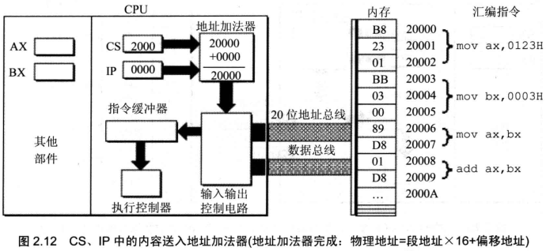

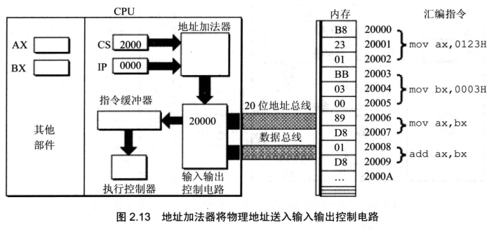

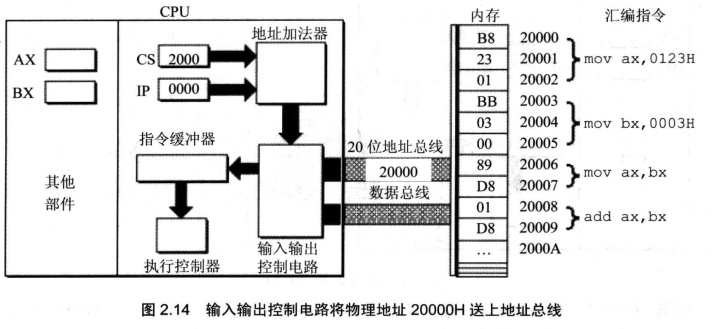

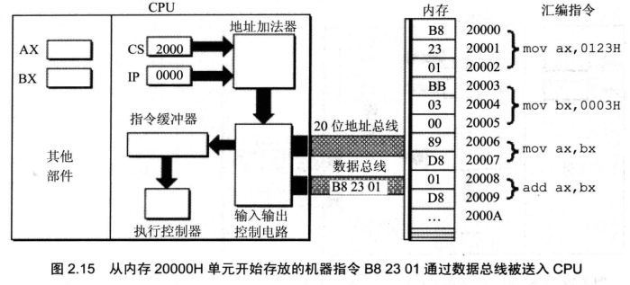

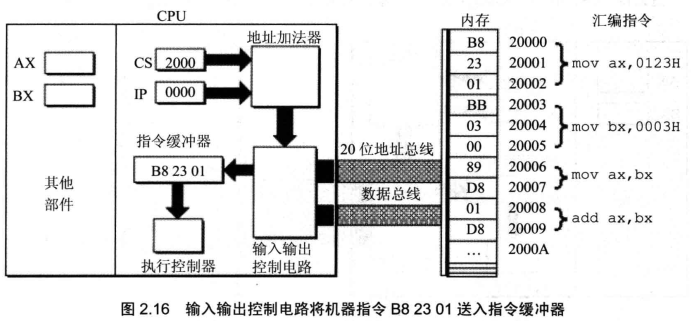

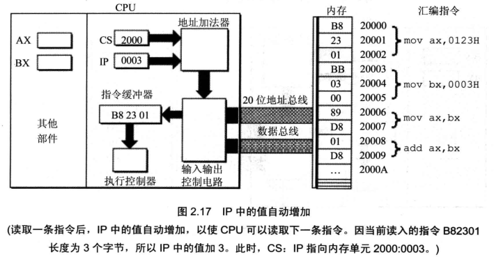

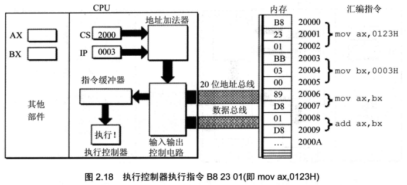

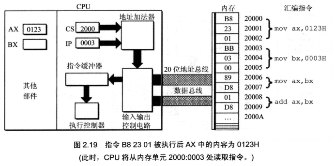

### 3. 执行指令实例 2

下面的一组图(图 2.20\~图 2.26), 以图 2.19 的情况为初始状态, 展示了 8086CPU 继续读取、执行 3 条指令的过程。注意 IP 的变化(下面的描述中, 隐蔽了读取每条指令的细节)。

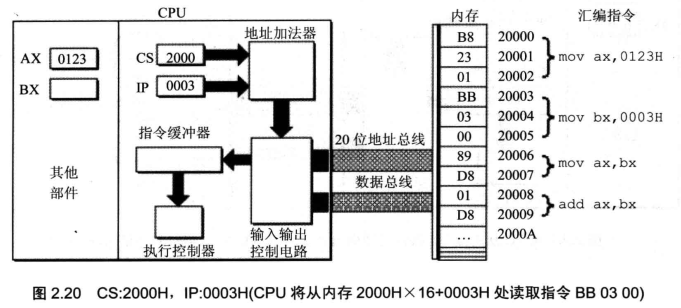

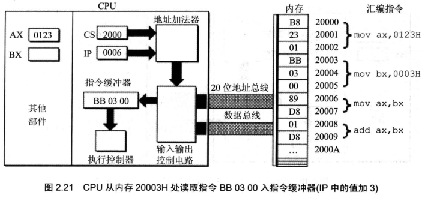

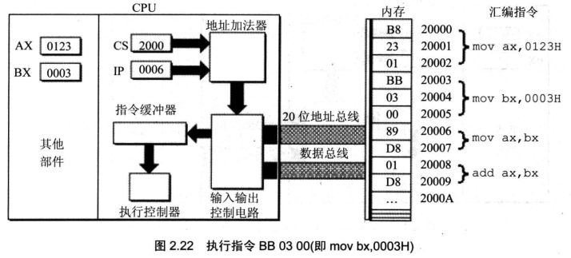

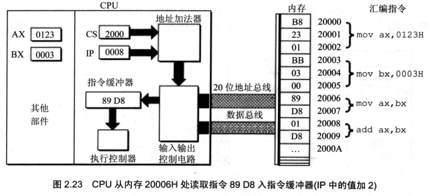

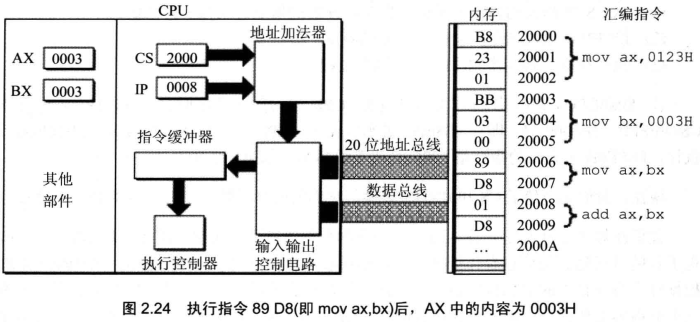


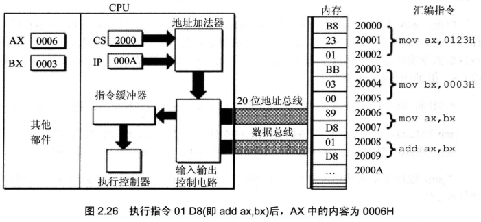

### 4. 工作过程总结

通过上面的过程展示,8086CPU 的工作过程可以简要描述如下。

（1）从 CS: IP 指向的内存单元读取指令，读取的指令进入指令缓冲器；

（2）IP = IP+所读取指令的长度，从而指向下一条指令；

（3）执行指令。转到步骤（1），重复这个过程。

在 8086CPU 加电启动或复位后（即 CPU 刚开始工作时）CS 和 IP 被设置为 CS = FFFFH，IP = 0000H，即在 8086PC 机刚启动时，CPU 从内存 FFFF0H 单元中读取指令执行，FFFF0H 单元中的指令是 8086PC 机开机后执行的第一条指令。

现在，我们更清楚了 CS 和 IP 的重要性，它们的内容提供了 CPU 要执行指令的地址。

我们在 [01-Assembly/10-汇编语言/05-寄存器/LV010-处理器相关术语在内存中](/sdoc/assembly/assembly/basic/126b0e807bb9204808675f69) ，指令和数据没有任何区别，都是二进制信息，CPU 在工作的时候把有的信息看作指令，有的信息看作数据。现在，如果提出一个问题：CPU 根据什么将内存中的信息看作指令？如何回答？我们可以说，CPU 将 CS: IP 指向的内存单元中的内容看作指令，因为，在任何时候，CPU 将 CS、IP 中的内容当作指令的段地址和偏移地址，用它们合成指令的物理地址，到内存中读取指令码，执行。如果说，内存中的一段信息曾被 CPU 执行过的话，那么，它所在的内存单元必然被 CS: IP 指向过。

## 三、修改 CS、IP 的指令

在 CPU 中，程序员能够用指令读写的部件只有寄存器，程序员可以通过改变寄存器中的内容实现对 CPU 的控制。CPU 从何处执行指令是由 CS、IP 中的内容决定的，程序员可以通过改变 CS、IP 中的内容来控制 CPU 执行目标指令。

我们如何改变 CS、IP 的值呢？显然，8086CPU 必须提供相应的指令。我们如何修改 AX 中的值？可以用 mov 指令，如 mov ax，123 将 ax 中的值设为 123，显然，我们也可以用同样的方法设置其他寄存器的值，如 mov bx，123，mov cx，123，mov dx，123 等。其实，8086CPU 大部分寄存器的值，都可以用 mov 指令来改变，mov 指令被称为传送指令。

但是，mov 指令不能用于设置 CS、IP 的值，原因很简单，因为 8086CPU 没有提供这样的功能。8086CPU 为 CS、IP 提供了另外的指令来改变它们的值。能够改变 CS、IP 的内容的指令被统称为转移指令（我们以后会深入研究）。我们现在介绍一个最简单的可以修改 CS、IP 的指令：jmp 指令。

若想同时修改 CS、IP 的内容，可用形如 "jmp 段地址：偏移地址" 的指令完成，如：

```assembly
jmp 2AE3:3 ;执行后：CS=2AE3H，IP=0003H，CPU将从2AE33H处读取指令。
jmp 3:0B16 ;执行后：CS=0003H，IP=0B16H，CPU将从00B46H 处读取指令。
```

"jmp 段地址：偏移地址" 指令的功能为：用指令中给出的段地址修改 CS，偏移地址修改 IP。

若想仅修改 IP 的内容，可用形如 "jmp 某一合法寄存器" 的指令完成，如:

```assembly
jmp ax  ;指令执行前: ax=1000H, CS=2000H, IP=0003H
        ;指令执行后: ax=1000H, CS=2000H, IP=1000H
jmp bx  ;指令执行前: bx=0B16H, CS=2000H, IP=0003H
        ;指令执行后: bx=0B16H, CS=2000H, IP=0B16H
```

"jmp 某一合法寄存器" 指令的功能为: 用寄存器中的值修改 IP。jmp ax, 在含义上好似: mov IP, ax。

注意, 我们在适当的时候, 会用已知的汇编指令的语法来描述新学的汇编指令的功能。采用一种 "用汇编解释汇编" 的方法来使读者更好地理解汇编指令的功能, 这样做有助于读者进行知识的相互融会。要强调的是, 我们是用 "已知的汇编指令的语法" 进行描述, 并不是用 "已知的汇编指令" 来描述, 比如, 我们用 mov IP, ax 来描述 jmp ax, 并不是说真有 mov IP, ax 这样的指令, 而是用 mov 指令的语法来说明 jmp 指令的功能。 我们可以用同样的方法描述 jmp 3:01B6 的功能: jmp 3:01B6 在含义上好似 mov CS,3 读 mov IP,01B6。

- 问题 2.3

内存中存放的机器码和对应的汇编指令情况如图 2.27 所示, 设 CPU 初始状态: CS = 2000H, IP = 0000H, 请写出指令执行序列。思考后看分析。

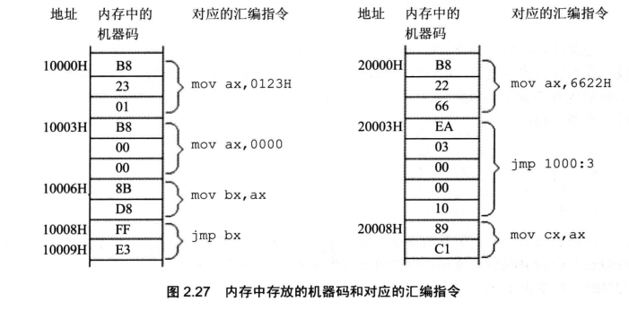

分析：

（1）当前 CS = 2000H，IP = 0000H，则 CPU 从内存 2000HX16+0 = 20000H 处读取指令，读入的指令是： B8 22 66（mov ax，6622H），读入后 IP = IP+3 = 0003H；

（2）指令执行后，CS = 2000H，IP = 0003H，则 CPU 从内存 2000HX16+0003H = 20003H 处读取指令，读入的指令是：EA 03 00 00 10（jmp1000:0003），读入后
IP = IP+5 = 0008H;

（3） 指令执行后，CS = 1000H，IP = 0003H（上一步是 jmp 指令，这里直接被修改了），则 CPU 从内存 1000HX16+0003H = 10003H 处读取指令，读入的指令是：B8 00 00（mov ax，0000），读入后 IP = IP+3 = 0006H；此时 ax 中存放的数据为 0000H；

（4） 指令执行后，CS = 1000H，IP = 0006H，则 CPU 从内存 1000HX16+0006H = 10006H 处读取指令，读入的指令是： 8B D8（mov bx，ax）， 读入后 IP = IP+2 = 0008H；这里将 ax 中的数据存到 bx 中，此时 bx 中数据为 0000H；

（5） 指令执行后，CS = 1000H，IP = 0008H，则 CPU 从内存 1000HX16+0008H = 10008H 处读取指令， 读入的指令是： FF E3（jmp bx），读入后 IP = IP+2 = 000AH；由于 bx 中数据为 0000H，所以这一步执行完毕，IP 会直接等于 0000H；

（6） 指令执行后，CS = 1000H，IP = 0000H，CPU 从内存 10000H 处读取指令……

经分析后, 可知指令执行序列为:

```assembly
mov ax,6622H  ; （1）
jmp 1000:3    ; （2） 
mov ax,0000   ; （3）
mov bx,ax     ; （4）
jmp bx        ; （5）
mov ax,0123H  ; （6）
转到第3步执行  ; （7）
```
