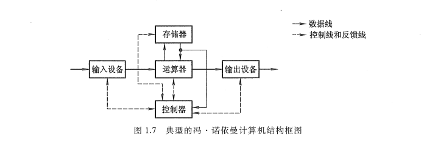
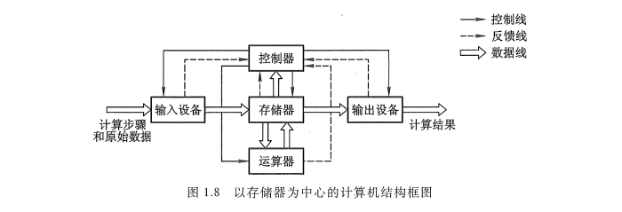
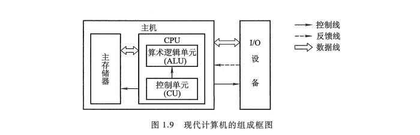
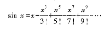
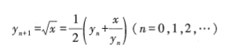
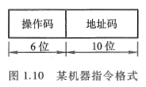
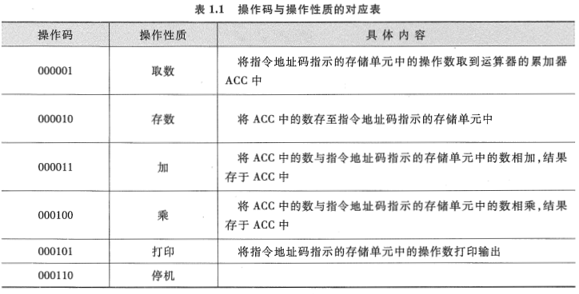
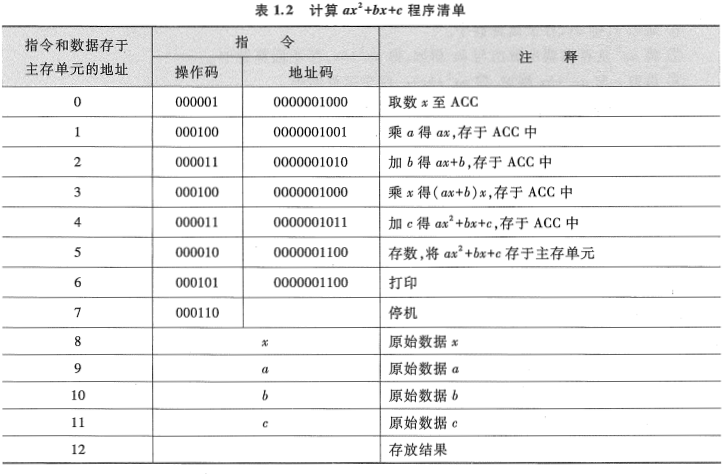
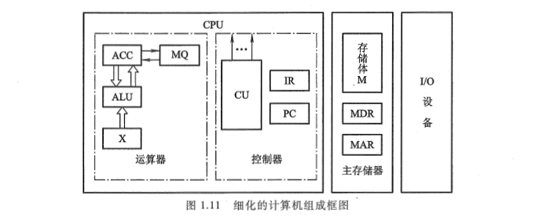
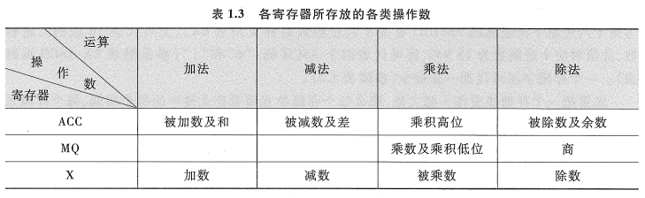

<!-- more -->

## 一、冯·诺依曼计算机特点

1945 年，数学家冯·诺依曼（von Neumann）在研究 EDVAC 机时提出了 "存储程序" 的概念。以此概念为基础的各类计算机通称为冯·诺依曼机。它的特点可归结如下：

- 计算机由运算器、存储器、控制器、输入设备和输出设备五大部件组成。
- 指令和数据以同等地位存放于存储器内，并可按地址寻访。
- 指令和数据均用二进制数表示。
- 指令由操作码和地址码组成，操作码用来表示操作的性质，地址码用来表示操作数在存储器中的位置。
- 指令在存储器内按顺序存放。通常，指令是顺序执行的，在特定条件下，可根据运算结果或根据设定的条件改变执行顺序。
- 机器以运算器为中心，输入输出设备与存储器间的数据传送通过运算器完成。

## 二、计算机硬件框图

典型的冯·诺依曼计算机是以运算器为中心的，如图 1.7 所示。



现代的计算机已转化为以存储器为中心，如图 1.8 所示。



图中各部件的功能如下:

- 运算器用来完成算术运算和逻辑运算, 并将运算的中间结果暂存在运算器内。
- 存储器用来存放数据和程序。
- 控制器用来控制、指挥程序和数据的输入、运行以及处理运算结果。
- 输入设备用来将人们熟悉的信息形式转换为机器能识别的信息形式, 常见的有键盘、鼠标等。
- 输出设备可将机器运算结果转换为人们熟悉的信息形式, 如打印机输出、显示器输出等。

计算机的五大部件(又称五大子系统)在控制器的统一指挥下, 有条不紊地自动工作。

由于**运算器和控制器**在逻辑关系和电路结构上联系十分紧密, 尤其在大规模集成电路制作工艺出现后, 这两大部件往往集成在同一芯片上, 因此, 通常将它们合起来统称为**中央处理器(Central Processing Unit, CPU)**。把输入设备与输出设备简称为 I/O 设备(Input/Output Equip-ment)。

这样, 现代计算机可认为由三大部分组成: **CPU、I/O 设备及主存储器(Main Memory, MM)**, 如图 1.9 所示。CPU 与主存储器合起来又可称为主机, I/O 设备又可称为外部设备。



图 1.9 中的主存储器是存储器子系统中的一类，用来存放程序和数据，可以直接与 CPU 交换信息。另一类称为辅助存储器，简称辅存，又称外存，其功能参阅 4.4 节。

算术逻辑单元（Arithmetic Logic Unit，ALU）简称算逻部件，用来完成算术逻辑运算。控制单元（ControlUnit，CU）用来解释存储器中的指令，并发出各种操作命令来执行指令。ALU 和 CU 是 CPU 的核心部件。

I/O 设备也受 CU 控制，用来完成相应的输入、输出操作。

可见，计算机有条不紊地自动工作都是在控制器统一指挥下完成的。

## 三、计算机工作步骤

用计算机解决一个实际问题通常包含两大步骤。一个是上机前的各种准备, 另一个是上机运行。

### 1. 上机前的准备

在许多科学技术的实际问题中, 往往会遇到许多复杂的数学方程组, 而数字计算机通常只能执行加、减、乘、除四则运算, 这就要求在上机解题前, 先由人工完成一些必要的准备工作。这些工作大致可归纳为: 建立数学模型、确定计算方法和编制解题程序 3 个步骤。

（1）建立数学模型

有许多科技问题很难直接用物理模型来模拟被研究对象的变化规律, 如地球大气环流、原子反应堆的核裂变过程、航天飞行速度对飞行器的影响等。不过, 通过大量的实验和分析, 总能找到一系列反映研究对象变化规律的数学方程组。通常, 将这类方程组称为被研究对象变化规律的数学模型。一旦建立了数学模型, 研究对象的变化规律就变成了解一系列方程组的数学问题, 这便可通过计算机来求解。因此, 建立数学模型是用计算机解题的第一步。

（2）确定计算方法

由于数学模型中的数学方程式往往是很复杂的, 欲将其变成适合计算机运算的加、减、乘、除四则运算, 还必须确定对应的计算方法。

例如, 欲求 sin x​ 的值, 只能采用近似计算方法, 用四则运算的式子来求得(因计算机内部没有知己完成三角计算的不见）。



又如，计算机不能直接求解开方 x，但是可以用迭代公式：



通过多次迭代，便可求得相应精度的 $\sqrt{x}$ 值：  

（3）编制解题程序

程序是适合于机器运算的全部步骤, 编制解题程序就是将运算步骤用一一对应的机器指令描述。

例如，计算 $ax^2+bx+c$ 可以分解为如下步骤：

① 将 $x$ 取至运算器中。

② 乘以 $x$, 得 $x^2$, 存于运算器中。

③ 再乘以 $a$, 得 $ax^2$, 存于运算器中。

④ 将 $ax^2$ 送至存储器中。

⑤ 取 $b$ 至运算器中。

⑥ 乘以 $x$, 得 $bx$, 存于运算器中。

⑦ 将 $ax^2$ 从存储器中取出与 $bx$ 相加, 得 $ax^2+bx$, 存于运算器中。

⑧ 再取 $c$ 与 $ax^2+bx$ 相加, 得 $ax^2+bx+c$, 存于运算器中。

可见, 不包括停机、输出打印共需 8 步。若将上式改写成: $(ax+b)x+c$, 则其步骤可简化为以下 5 步。

① 将 $x$ 取至运算器中。

② 乘以 $a$, 得 $ax$, 存于运算器中。

③ 加 $b$, 得 $ax+b$, 存于运算器中。

④ 乘以 $x$, 得 $(ax+b)x$, 存于运算器中。

⑤ 加 $c$, 得 $(ax+b)x+c$, 存于运算器中。

设某机的指令字长为 16 位, 其中操作码占 6 位, 地址码占 10 位, 如图 1.10 所示。



操作码表示机器所执行的各种操作, 如取数、存数、加、减、乘、除、停机、打印等。地址码表示参加运算的数在存储器内的位置。

机器指令的操作码和地址码都采用 0、1 代码的组合来表示。表 1.1 列出了某机与上例有关的各条机器指令的操作码及其操作性质的对应关系。



此例中所用到的数 a 、 b 、c 、 x ，事先需存入存储器的相应单元内。按 $ax^2+bx+c$ 的运算分解，可用上述机器指令编写出一份运算的程序清单，如表 1.2 所列。



以上程序编完后，便可进入下一步上机。

 ### 2. 工作过程

为了比较形象地了解计算机的工作过程，首先分析一个比图 1.9 更细化的计算机组成框图，如图 1.11 所示。



（1）主存储器

主存储器（简称主存或内存）包括存储体 M、各种逻辑部件及控制电路等。存储体由许多存储单元组成，每个存储单元又包含若干个存储元件（或称存储基元、存储元），每个存储元件能寄存一位二进制代码 "0" 或 "1"。可见，一个存储单元可存储一串二进制代码，称这串二进制代码为一个 **存储字**，这串二进制代码的位数称为存储字长。存储字长可以是 8 位、16 位或 32 位等。一个存储字可代表一个二进制数，也可代表一串字符，如存储字为 0011011001111101，既可表示为由十六进制字符组成的 367DH（有关十六进制数制详见附录 6A），又可代表 16 位的二进制数，此值对应十进制数为 13949，还可代表两个 ASCII 码："6" 和 "}"（参见附录 5AASCII 编码表）。一个存储字还可代表一条指令（参阅表 1.2）。

如果把一个存储体看作一幢大楼，那么每个存储单元可看作大楼中的每个房间，每个存储元可看作每个房间中的一张床位，床位有人相当于 "1"，无人相当于 "0"。床位数相当于存储字长。显然，每个房间都需要有一个房间编号，同样可以赋予每个存储单元一个编号，称为存储单元的地址号。

主存的工作方式就是按存储单元的地址号来实现对存储字各位的存（写入）、取（读出）。这种存取方式称为按地址存取方式，即按地址访问存储器（简称访存）。存储器的这种工作性质对计算机的组成和操作是十分有利的。

例如，人们只要事先将编好的程序按顺序存入主存各单元，当运行程序时，先给出该程序在主存的首地址，然后采用程序计数器加 1 的方法，自动形成下一条指令所在存储单元的地址，机器便可自动完成整个程序的操作。又如，由于数据和指令都存放在存储体内各自所占用的不同单元中，因此，当需要反复使用某个数据或某条指令时，只要指出其相应的单元地址号即可，而不必占用更多的存储单元重复存放同一个数据或同一条指令，大大提高了存储空间的利用率。此外, 由于指令和数据都由存储单元地址号来反映, 因此, 取一条指令和取一个数据的操作完全可视为是相同的, 这样就可使用一套控制线路来完成两种截然不同的操作。

为了能实现按地址访问的方式, 主存中还必须配置两个寄存器 MAR 和 MDR。**MAR(Memory Address Register)** 是存储器地址寄存器, 用来存放欲访问的存储单元的地址, 其位数对应存储单元的个数(如 MAR 为 10 位, 则有 2^10 = 1024 个存储单元, 记为 1K)。**MDR(MemoryData Register)** 是存储器数据寄存器, 用来存放从存储体某单元取出的代码或者准备往某存储单元存入的代码, 其位数与存储字长相等。当然, 要想完整地完成一个取或存操作, CPU 还得给主存加以各种控制信号, 如读命令、写命令和地址译码驱动信号等。随着硬件技术的发展, 主存都制成大规模集成电路的芯片, 而将 MAR 和 MDR 集成在 CPU 芯片中(参阅图 4.5)。

早期计算机的存储字长一般和机器的指令字长与数据字长相等, 故访问一次主存便可取一条指令或一个数据。随着计算机应用范围的不断扩大, 解题精度的不断提高, 往往要求指令字长是可变的, 数据字长也要求可变。为了适应指令和数据字长的可变性, 其长度不由存储字长来确定, 而由字节的个数来表示。1 个字节(Byte)被定义为由 8 位(bit)二进制代码组成。例如, 4 字节数据就是 32 位二进制代码; 2 字节构成的指令字长是 16 位二进制代码。当然, 此时存储字长、指令字长、数据字长三者可各不相同, 但它们必须是字节的整数倍。

（2）运算器

运算器最少包括 3 个寄存器（现代计算机内部往往设有通用寄存器组）和一个算术逻辑单元（ALU）。其中 ACC（Accumulator）为累加器，MQ（Multiplier-Quotient Register）为乘商寄存器，X 为操作数寄存器。这 3 个寄存器在完成不同运算时，所存放的操作数类别也各不相同。表 1.3 列出了寄存器存放不同类别操作数的情况。

> Tips：寄存器是 CPU 内部用于临时存储数据的高速存储器件。它们是计算机硬件系统中速度最快的存储部件，直接与运算器和控制器交互。



不同机器的运算器结构是不同的。图 1.11 所示的运算器可将运算结果从 ACC 送至存储器中的 MDR；而存储器的操作数也可从 MDR 送至运算器中的 ACC、MQ 或 X。有的机器用 MDR 取代 X 寄存器。

下面简要地分析一下这种结构的运算器加、减、乘、除四则运算的操作过程。

设：M 表示存储器的任一地址号，[M] 表示对应 M 地址号单元中的内容；X 表示 X 寄存器，[X] 表示 X 寄存器中的内容；ACC 表示累加器，[ACC] 表示累加器中的内容；MQ 表示乘商寄存器, [MQ] 表示乘商寄存器中的内容。

假设 ACC 中已存有前一时刻的运算结果, 并作为下述运算中的一个操作数, 则

- 加法操作过程为

```assembly
[M] → X
[ACC]+[X] → ACC
```

即将 [ACC] 看作被加数, 先从主存中取一个存放在 M 地址号单元内的加数 [M], 送至运算器的 X 寄存器中, 然后将被加数 [ACC] 与加数 [X] 相加, 结果(和)保留在 ACC 中。

- 减法操作过程为

```assembly
[M] → X
[ACC]-[X] → ACC
```

即将 [AC] 看作被减数, 先取出存放在主存 M 地址号单元中的减数 [M] 并送入 X, 然后 [ACC]-[X], 结果(差)保留在 ACC 中。

- 乘法操作过程为

```assembly
[M] → MQ
[ACC] →X
0 → ACC
[X] x [MQ] →ACC // MQ ; // 表示两个寄存器串接
```

即将 [ACC] 看作被乘数, 先取出存放在主存 M 号地址单元中的乘数 [M] 并送入乘商寄存器 MQ, 再把被乘数送入 X 寄存器, 并将 ACC 清 "0", 然后 [X] 和 [MQ] 相乘, 结果(积)的高位保留在 ACC 中, 低位保留在 MQ 中。

- 除法操作过程为

```assembly
[M] → X
[ACC]+[X] → MQ
余数 R 在 ACC 中
```

即将 [ACC] 看作被除数, 先取出存放在主存 M 号地址单元内的除数 [M] 并送至 X 寄存器, 然后 [ACC] 除以 [X], 结果(商)暂留于 MQ, [ACC] 为余数 R。若需要将商保留在 ACC 中, 只需做一步 [MQ] →ACC 即可。

（3）控制器

控制器是计算机的神经中枢，由它指挥各部件自动、协调地工作。具体而言，它首先要命令存储器读出一条指令，称为 **取指过程**（也称取指阶段）。接着，它要对这条指令进行分析，指出该指令要完成什么样的操作，并按寻址特征指明操作数的地址，称为 **分析过程**（也称分析阶段）。最后根据操作数所在的地址以及指令的操作码完成某种操作，称为 **执行过程**（也称执行阶段）。以上就是通常所说的完成一条指令操作的取指、分析和执行 3 个阶段。

控制器由程序计数器（Program Counter，PC）、指令寄存器（Instruction Register，IR）以及控制单元（CU）组成。PC 用来存放当前欲执行指令的地址，它与主存的 MAR 之间有一条直接通路，且具有自动加 1 的功能，即可自动形成下一条指令的地址。IR 用来存放当前的指令，IR 的内容来自主存的 MDR。IR 中的操作码（OP（IR））送至 CU，记作 OP（IR）→ CU，用来分析指令；其地址码（Ad（IR））作为操作数的地址送至存储器的 MAR，记作 Ad（IR）→ MAR。CU 用来分析当前指令所需完成的操作，并发出各种微操作命令序列，用以控制所有被控对象。

（4）I/O

I/O 子系统包括各种 I/O 设备及其相应的接口。每一种 I/O 设备都由 I/O 接口与主机联系, 它接收 CU 发出的各种控制命令, 并完成相应的操作。例如, 键盘(输入设备)由键盘接口电路与主机联系; 打印机(输出设备)由打印机接口电路与主机联系。

下面结合图 1.11 进一步深入领会计算机工作的全过程。


首先按表 1.2 所列的有序指令和数据, 通过键盘输入到主存第 0 号至第 12 号单元中, 并置 PC 的初值为 0(令程序的首地址为 0)。启动机器后, 计算机便自动按存储器中所存放的指令顺序有序地逐条完成取指令、分析指令和执行指令, 直至执行到程序的最后一条指令为止。


例如, 

（1）启动机器后, 控制器立即将 PC 的内容送至主存的 MAR(记作 PC→MAR), 并命令存储器做读操作, 此刻主存 "0" 号单元的内容 "000001 0000001000"(表 1.2 所列程序的第一条指令)便被送入 MDR 内。然后由 MDR 送至控制器的 IR(记作 MDR→IR), 完成了一条指令的取指过程。

（2）经 CU 分析(记作 OP(IR)→CU), 操作码 "000001" 为取数指令, 于是 CU 又将 IR 中的地址码 "0000001000" 送至 MAR(记作 Ad(IR)→MAR), 并命令存储器做读操作, 将该地址单元中的操作数 x 送至 MDR, 再由 MDR 送至运算器的 ACC(记作 MDR→ACC), 完成此指令的执行过程。此刻, 也即完成了第一条取数指令的全过程, 即将操作数 x 送至运算器 ACC 中。

（3）与此同时, PC 完成自动加 1 的操作, 形成下一条指令的地址 "1" 号。

同上所述, 由 PC 将第二条指令的地址送至 MAR, 命令存储器做读操作, 将 "000100 0000001001" 送入 MDR, 又由 MDR 送至 IR。接着 CU 分析操作码 "000100" 为乘法指令, 故 CU 向存储器发出读命令, 取出对应地址为 "00001001" 单元中的操作数 a, 经 MDR 送至运算器 MQ, CU 再向运算器发送乘法操作命令, 完成 ax 的运算, 并把运算结果 ax 存放在 ACC 中。同时 PC 又完成一次(PC)+1→PC, 形成下一条指令的地址 "2" 号。依次类推, 逐条取指、分析、执行, 直至打印出结果。最后执行完停机指令后, 机器便自动停机。

## 四、计算机硬件主要技术指标

衡量一台计算机性能的优劣是根据多项技术指标综合确定的。其中, 既包含硬件的各种性能指标, 又包括软件的各种功能。这里主要讨论硬件的技术指标。

### 1. 机器字长

机器字长是指 CPU 一次能处理数据的位数, 通常与 CPU 的寄存器位数有关。字长越长, 数的表示范围越大, 精度也越高。机器的字长也会影响机器的运算速度。倘若 CPU 字长较短, 又要运算位数较多的数据, 那么需要经过两次或多次的运算才能完成, 这样势必影响机器的运算速度。

机器字长对硬件的造价也有较大的影响。它将直接影响加法器(或 ALU)、数据总线以及存储字长的位数。所以机器字长的确定不能单从精度和数的表示范围来考虑。

### 2. 存储容量

存储器的容量应该包括主存容量和辅存容量。

**主存容量** 是指主存中存放二进制代码的总位数。即

```txt
存储容量=存储单元个数x存储字长
```

图 1.11 中 MAR 的位数反映了存储单元的个数，MDR 的位数反映了存储字长。例如，MAR 为 16 位，根据 2^16 = 65536，表示此存储体内有 65536 个存储单元（即 64K 个存储字，1K = 1024 = 2^10）；而 MDR 为 32 位，表示存储容量为 2^16x32 = 2^21 = 2M 位（1M = 2^20）。

现代计算机中常以字节数来描述容量的大小，因一个字节已被定义为 8 位二进制代码，故用字节数便能反映主存容量。例如，上述存储容量为 2M 位，也可用 2^18 字节表示，记作 2^18B 或 256KB（B 用来表示一个字节）。

**辅存容量** 通常用字节数来表示，例如，某机辅存（如硬盘）容量为 80GB（1G = 1024M = 2^10x2^20 = 2^30）。

### 3. 运算速度

计算机的运算速度与许多因素有关, 如机器的主频、执行什么样的操作、主存本身的速度(主存速度快, 取指、取数就快)等都有关。早期用完成一次加法或乘法所需的时间来衡量运算速度, 即普通法, 显然是很不合理的。 后来采用吉普森(Gibson)法, 它综合考虑每条指令的执行时间以及它们在全部操作中所占的百分比, 即
$$
T_M = \sum\limits^{n}\limits_{i = 1}f_it_i
$$
其中, $T_M$ 为机器运行速度; $f_i$ 为第 i 种指令占全部操作的百分比数; $t_i$ 为第 i 种指令的执行时间。

现在机器的运算速度普遍采用单位时间内执行指令的平均条数来衡量, 并用 MIPS(Millon In-struction Per Second, 百万条指令每秒)作为计量单位。例如, 某机每秒能执行 200 万条指令, 则记作 2 MIPS。 也可以用 CPI(Cycle Per Instruction)即执行一条指令所需的时钟周期(机器主频的倒数)数, 或用 FLOPS(Floating Point Operation Per Second, 浮点运算次数每秒)来衡量运算速度。
