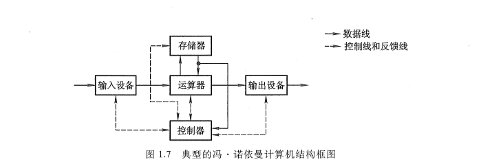
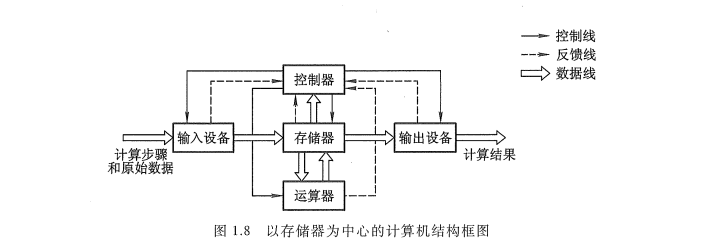
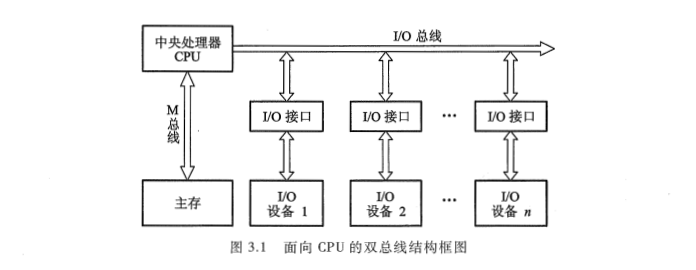
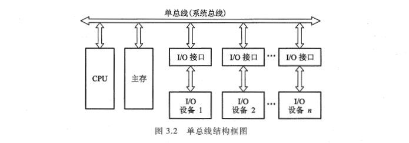
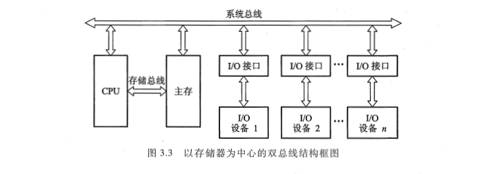

<!-- more -->

## 一、总线的基本概念

计算机系统的五大部件之间的互连方式有两种, 一种是各部件之间使用单独的连线, 称为分散连接; 另一种是将各部件连到一组公共信息传输线上, 称为总线连接。

早期的计算机大多数用分散连接方式, 如图 1.7 所示。它是以运算器为中心的结构, 其内部连线十分复杂, 尤其是当 I/O 与存储器交换信息时, 都需经过运算器, 致使运算器停止运算, 严重影响了 CPU 的工作效率。

后来, 虽然改进为以存储器为中心的如图 1.8 所示的分散连接结构：

I/O 与主存交换信息可以不经过运算器, 又采用了中断、DMA 等技术, 使 CPU 工作效率得到很大的提高, 但是仍无法解决 I/O 设备与主机之间连接的灵活性。随着计算机应用领域的不断扩大, I/O 设备的种类和数量也越来越多, 人们希望随时增添或减撤设备, 用分散连接方式简直是一筹莫展, 由此出现了 **总线连接方式**。

**总线是连接多个部件的信息传输线, 是各部件共享的传输介质**。当多个部件与总线相连时, 如果出现两个或两个以上部件同时向总线发送信息, 势必导致信号冲突, 传输无效。因此, 在某一时刻, 只允许有一个部件向总线发送信息, 而多个部件可以同时从总线上接收相同的信息。

总线实际上是由许多传输线或通路组成, 每条线可一位一位地传输二进制代码, 一串二进制代码可在一段时间内逐一传输完成。若干条传输线可以同时传输若干位二进制代码, 例如,16 条传输线组成的总线可同时传输 16 位二进制代码。

采用总线连接的计算机结构, 如图 3.1 所示, 它是以 CPU 为中心的双总线结构。

其中一组总线连接 CPU 和主存, 称为存储总线(M 总线); 另一组用来建立 CPU 和各 I/O 设备之间交换信息的通道, 称为输入输出总线(I/O 总线)。各种 I/O 设备通过 I/O 接口挂到 I/O 总线上, 更便于增删设备。这种结构在 I/O 设备与主存交换信息时仍然要占用 CPU, 因此还会影响 CPU 的工作效率。

倘若将 CPU、主存和 I/O 设备(通过 I/O 接口)都挂到一组总线上, 便形成单总线结构的计算机, 如图 3.2 所示。

图 3.2 与图 3.1 相比, 最明显的特点是当 I/O 设备与主存交换信息时, 原则上不影响 CPU 的工作, CPU 仍可继续处理不访问主存或 I/O 设备的操作, 这就使 CPU 工作效率有所提高。但是, 因只有一组总线, 当某一时刻各部件都要占用总线时, 就会发生冲突。为此, 必须设置总线判优逻辑, 让各部件按优先级高低来占用总线, 这也会影响整机的工作速度。PDP-11 和国产 DJS183 机均采用这种结构。

还有一种以存储器为中心的双总线结构, 如图 3.3 所示。

它是在单总线基础上又开辟出的一条 CPU 与主存之间的总线, 称为存储总线。这组总线速度高, 只供主存与 CPU 之间传输信息。这样既提高了传输效率, 又减轻了系统总线的负担, 还保留了 I/O 设备与存储器交换信息时不经过 CPU 的特点。国产 DJS184 机采用这种结构。

现代计算机大多数采用各类总线结构。
