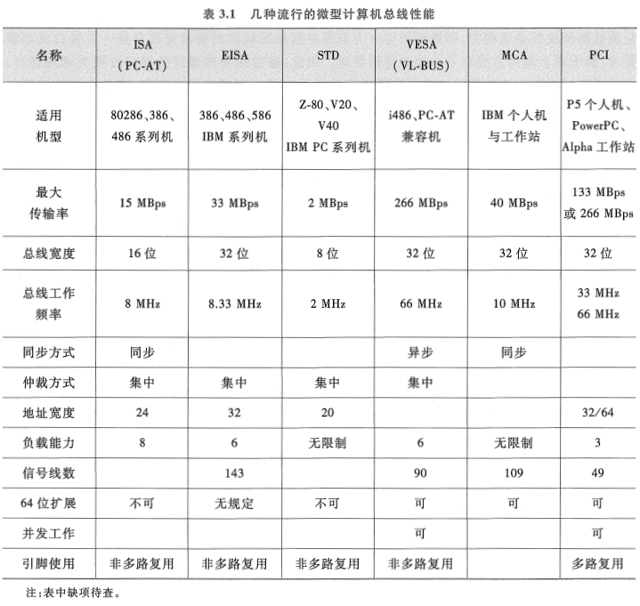
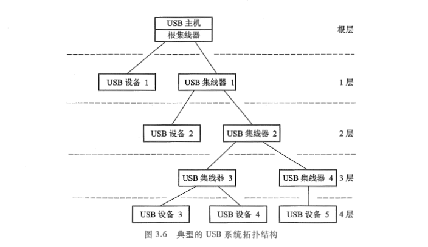

<!-- more -->

## 一、总线特性

从物理角度来看, 总线由许多导线直接印制在电路板上, 延伸到各个部件。图 3.4 形象地表示了各个部件与总线之间的物理摆放位置。

图中 CPU、主存、I/O 这些插板（又称插卡）通过插头与水平方向总线插槽（按总线标准用印刷电路板或一束电缆连接而成的多头插座）连接。为了保证机械上的可靠连接，必须规定其机械特性；为了确保电气上正确连接，必须规定其电气特性；为保证正确地连接不同部件，还需规定其功能特性和时间特性。随着计算机的发展，PentiumIII 以上的微型计算机已将 CPU 芯片直接安置在主板上，而且很多插卡已做成专用芯片，减少了插槽，使其结构更合理。

总线特性包括以下几项。

（1）机械特性

机械特性是指总线在机械连接方式上的一些性能, 如插头与插座使用的标准, 它们的几何尺寸、形状、引脚的个数以及排列的顺序, 接头处的可靠接触等。

（2）电气特性

电气特性是指总线的每一根传输线上信号的传递方向和有效的电平范围。通常规定由 CPU 发出的信号称为输出信号, 送入 CPU 的信号称为输入信号。例如, 地址总线属于单向输出线, 数据总线属于双向传输线, 它们都定义为高电平为 "1", 低电平为 "0"。控制总线的每一根都是单向的, 但从整体看, 有输入, 也有输出。有的定义为高电平有效, 也有的定义为低电平有效, 必须注意不同的规格。大多数总线的电平定义与 TTL 是相符的, 也有例外, 如 RS-232C(串行总线接口标准), 其电气特性规定低电平表示逻辑 "1", 并要求电平低于-3V; 用高电平表示逻辑 "0", 还要求高电平需高于+3V, 额定信号电平为-10V 和+10V 左右。

（3）功能特性

功能特性是指总线中每根传输线的功能, 例如, 地址总线用来指出地址码; 数据总线用来传递数据; 控制总线发出控制信号, 既有从 CPU 发出的, 如存储器读/写、I/O 设备读/写, 也有 I/O 设备向 CPU 发来的, 如中断请求、DMA 请求等。由此可见, 各条线的功能不同。

（4）时间特性

时间特性是指总线中的任一根线在什么时间内有效。每条总线上的各种信号互相存在一种有效时序的关系, 因此, 时间特性一般可用信号时序图来描述。

## 二、总线性能指标

总线性能指标如下。

① 总线宽度：通常是指数据总线的根数，用 bit（位）表示，如 8 位、16 位、32 位、64 位（即 8 根、16 根、32 根、64 根）。

② 总线带宽：总线带宽可理解为总线的数据传输速率，即单位时间内总线上传输数据的位数，通常用每秒传输信息的字节数来衡量，单位可用 MBps（兆字节每秒）表示。例如，总线工作频率为 33MHz，总线宽度为 32 位（4B），则总线带宽为 33 x（32/8）= 132MBps。

③ 时钟同步/异步：总线上的数据与时钟同步工作的总线称为同步总线，与时钟不同步工作的总线称为异步总线。

④ 总线复用：一条信号线上分时传送两种信号。例如，通常地址总线与数据总线在物理上是分开的两种总线，地址总线传输地址码，数据总线传输数据信息。为了提高总线的利用率，优化设计，特将地址总线和数据总线共用一组物理线路，在这组物理线路上分时传输地址信号和数据信号，即为总线的多路复用。

⑤ 信号线数：地址总线、数据总线和控制总线三种总线数的总和。

⑥ 总线控制方式：包括突发工作、自动配置、仲裁方式、逻辑方式、计数方式等。

⑦ 其他指标：如负载能力、电源电压（是采用 5V 还是 3.3V）、总线宽度能否扩展等。

**总线的负载能力即驱动能力**，是指当总线接上负载后，总线输入输出的逻辑电平是否能保持在正常的额定范围内。例如，PC 总线的输出信号为低电平时，要吸入电流，这时的负载能力即指当它吸收电流时，仍能保持额定的逻辑低电平。总线输出为高电平时，要输出电流，这时的负载能力是指当它向负载输出电流时，仍能保持额定的逻辑高电平。由于不同的电路对总线的负载是不同的，即使同一电路板在不同的工作频率下，总线的负载也是不同的，因此，总线负载能力的指标不是太严格的。通常用可连接扩增电路板数来反映总线的负载能力。

表 3.1 列出了几种流行的微机总线性能，可供参考。

## 三、总线标准

总线是在计算机系统模块化的发展过程中产生的, 随着计算机应用领域的不断扩大, 计算机系统中各类模块(特别是 I/O 设备所带的各类接口模块)品种极其繁杂, 往往一种模块要配一种总线, 很难在总线上更换、组合各类模块或设备。

20 世纪 70 年代末, 为了使系统设计简化, 模块生产批量化, 确保其性能稳定、质量可靠, 实现可移化, 便于维护等, 人们开始研究如何使总线建立标准, 在总线的统一标准下, 完成系统设计、模块制作。这样, 系统、模块、设备与总线之间不适应、不通用及不匹配的问题就迎刃而解了。

所谓总线标准，可视为系统与各模块、模块与模块之间的一个互连的标准界面。这个界面对它两端的模块都是透明的，即界面的任一方只需根据总线标准的要求完成自身一方接口的功能要求，而无须了解对方接口与总线的连接要求。因此，按总线标准设计的接口可视为通用接口。采用总线标准可以为计算机接口的软硬件设计提供方便。对硬件设计而言，使各个模块的接口芯片设计相对独立；对软件设计而言，更有利于接口软件的模块化设计。

目前流行的总线标准有以下几种。  

### 1. ISA 总线

ISA（Industrial Standard Architecture）总线是 IBM 为了采用全 16 位的 CPU 而推出的，又称 AT 总线，它使用独立于 CPU 的总线时钟，因此 CPU 可以采用比总线频率更高的时钟，有利于 CPU 性能的提高。

由于 ISA 总线没有支持总线仲裁的硬件逻辑，因此它不能支持多台主设备（不支持多台具有申请总线控制权的设备）系统，而且 ISA 上的所有数据的传送必须通过 CPU 或 DMA（直接存储器存取）接口来管理，因此使 CPU 花费了大量时间来控制与外部设备交换数据。

ISA 总线时钟频率为 8MHz，最大传输率为 16MBps，数据线为 16 位，地址线为 24 位。

### 2. EISA 总线

EISA(Extended Industrial Standard Architecture)是一种在 ISA 基础上扩充开放的总线标准, 与 ISA 可以完全兼容, 从 CPU 中分离出了总线控制权, 是一种具有智能化的总线, 能支持多个总线主控器和突发方式(总线上可进行成块的数据传送)的传输。

EISA 总线的时钟频率为 8MHz, 最大传输率可达 33MBps, 数据总线为 32 位, 地址总线为 32 位, 扩充 DMA 访问范围达 2^32。

### 3. VESA(VL-BUS)总线

VESA 总线是由 VESA(Video Electronic Standard Association, 视频电子标准协会)提出的局部总线标准, 又称为 VL-BUS(Local BUS)总线。

所谓局部总线, 是指在系统外为两个以上模块提供的高速传输信息通道。VL-BUS 是由 CPU 总线演化而来的, 采用 CPU 的时钟频率达 33MHz、数据线为 32 位, 可通过扩展槽扩展到 64 位, 配有局部控制器, 最大传输率达 133MBps。通过局部总线控制器, 将高速 I/O 设备直接挂在 CPU 上, 实现 CPU 与高速 I/O 设备之间的高速数据交换 (参见图 3.12)。

### 4. PCI 总线

随着图形用户界面(Graphical User Interface, GUI)和多媒体技术在 PC 系统中的广泛应用, ISA 总线和 EISA 总线由于受带宽的限制, 已不能适应系统工作的要求, 成为整个系统的主要瓶颈。因此对总线提出了更高的性能要求, 促使总线技术进一步发展。

1991 年下半年, Intel 公司首先提出 PCI(Peripheral Component Interconnect, 外围部件互连)总线的概念, 并联合 IBM、Compaq、Apple、DEC、AST、HP 等计算机业界大户, 成立了 PCI 集团 PCISIG(PCI Special Interest Group, PCI 专门权益组织), 于 1992 年 6 月 22 日推出了 PCI 1.0 版,1995 年和 1999 年又先后推出了 2.1 版和 2.2 版, PCI 总线已成为现代计算机中最常用的总线之一, 它的主要特点如下所述。

① 高性能。PCI 总线是一种不依附于某个具体处理器的局部总线。它为系统提供了一个高速的数据传输通道，与 CPU 时钟频率无关，自身采用 33MHz 和 66MHz 的总线时钟，数据线为 32 位，可扩展到 64 位，传输速率从 132MBps（33MHz 时钟，32 位数据通路）可升级到 528MBps（66MHz 时钟，64 位数据通路）。它支持突发工作方式，这种方式是指若被传送的数据在主存中连续存放，则在访问此组数据时，只需给出第一个数据的地址，占用一个时钟周期，其后每个数据的传送各占一个时钟周期，不必每次给出各个数据的地址，因此可提高传输速率。

② 良好的兼容性。PCI 总线部件和插件接口相对于处理器是独立的，它支持所有的目前和将来不同结构的处理器，因此具有相对长的生命周期。PCI 总线与 ISA、EISA 总线均可兼容，可以转换为标准的 ISA、EISA。

③ 支持即插即用（Plug and Play），即任何扩展卡只要插入系统便可工作。PCI 设备中配有存放设备具体信息的寄存器，这些信息可供 BIOS（基本输入输出系统）和操作系统层的软件自动配置 PCI 总线部件和插件，使系统使用方便，无须进行复杂的手动配置。

④ 支持多主设备能力。主设备即对总线有控制权的设备，PCI 支持多主设备，即允许任何主设备和从设备（对总线没有控制权的设备）之间实现点到点对等存取，体现了接纳设备的高度灵活性。

⑤ 具有与处理器和存储器子系统完全并行操作的能力。PCI 总线可视为 CPU 与外设之间的一个中间层，它通过 PCI 桥路（PCI 控制器）与 CPU 相连。PCI 桥路有多级缓冲，可把一批数据快速写入缓冲器中，在这些数据不断写入 PCI 设备过程中，可真正实现与处理器/存储器子系统的安全并发工作。

⑥ 提供数据和地址奇偶校验功能，保证了数据的完整和准确。

⑦ 支持两种电压标准：5V 和 3.3V。3.3~5V 的组件技术可以使电压平滑过渡。3.3V 电压的 PCI 总线可用于便携式微型计算机中。

⑧ 可扩充性好。当 PCI 总线驱动能力不足时，可以采用多层结构（参见图 3.14）。

⑨ 软件兼容性好。PCI 部件可以完全兼容现有的驱动程序和应用程序。设备驱动程序可被移植到各类平台上。

⑩ 采用多路复用技术，减少了总线引脚个数。

随着网络的高速发展以及其他周边设备的技术革新，诸如千兆网卡之类的设备对 PCI 总线提出了更高要求。Intel 公司近年来又推出了 PCI-Express 总线，它采用了类似网络传输 TCP/IP 协议的分层结构和数据帧逐层传递的模式。

### 5. AGP 总线

随着多媒体计算机的普及, 对三维技术的应用也越来越广。处理三维数据不仅要求有惊人的数据量, 而且要求有更宽广的数据传输带宽。例如, 对 640x480 像素的分辨率而言, 以每秒 75 次画面更新率计算, 要求全部的数据带宽达 370MBps; 若分辨率提高到 800x600 像素时, 总带宽高达 580MBps。因此 PCI 总线成为传输瓶颈。

为了解决此问题, Intel 公司于 1996 年 7 月又推出了 AGP（Accelerated Graphics Port，加速图形端口），这是显示卡专用的局部总线，基于 PCI2.1 版规范并进行扩充修改而成，它采用点对点通道方式，以 66.7MHz 的频率直接与主存联系，以主存作为帧缓冲器，实现了高速存取。最大数据传输率（数据宽度为 32 位）为 266MBps，是传统 PCI 总线带宽的 2 倍。

AGP 还定义了一种 "双激励"（DoublePumping）的传输技术，能在一个时钟的上、下沿双向传递数据，这样，AGP 实现的传输频率为 66.7MHzx2，即 133MHz，最大数据传输率可增为 533MBps。后来又依次推出了 AGP2X，AGP4X，AGP8X 多个版本，数据传输速率可达 2.1GBps。

### 6. RS-232C 总线

RS-232C（RS 即 RecommendedStandard 的缩写，232 为标识号，C 表示修改次数）是由美国电子工业协会 EIA（Electronic Industries Association）推荐的一种串行通信总线标准，它是应用于串行二进制交换的数据终端设备（DTE）和数据通信设备（DCE）之间的标准接口，如图 3.5 所示。

在图 3.5 中，DTE（Data Terminal Equipment）是数据终端设备，它是产生二进制信号的数据源，也是接收信息的目的地，是由数据发生器或接收器或兼具两者组成的设备，它可以是一台计算机。

DCE（Data Communication Equipment）是数据通信设备，它实质是一个信号的匹配器，既能满足 DTE 的要求，又能使传输信号符合线路要求。它具有提供数据终端设备与通信线路之间通信的建立、维持和终止连接等功能，同时还执行信号变换与编码。它可以是一个 Modem（调制解调器）。

DTE 与 DCE 之间传输的是 "0" 或 "1" 的数据，通过 RS-232C 接口规定的各种控制信号，可实现两者之间的协调配合。

众所周知，计算机之间通信传送的是数字信号，它要求传送的频带很宽，而计算机远程通信通常是通过载波电话传送的，不可能有这样宽的频带。如果数字信号直接进行通信，经过传输线后，必然会产生畸变。因此在发送端必须通过调制器将数字信号转换成模拟信号，即对载波电话线上载波进行调制；而在接收端又必须用解调器检出从发送端来的模拟信号，并恢复为原来的数字信号。

值得注意的是：RS-232C 规定的逻辑电平与计算机系统中 TTL 和 MOS 电平不一样。在计算机系统中，以+5V 代表逻辑 "1"，接地电压代表逻辑 "0"。而 RS-232C 的电气特征规定低电平表示逻辑 "1"，并要求低电平为-15\~-3V；用高电平表示逻辑 "0"，并要求高电平为+3\~+15V，因此使用 RS-232C 时, 必须实现两种电平的转换。

随着计算机网络的发展, 现代计算机之间的远距离通信可直接由网卡经网线(8 根, 双绞线)传输。

### 7. USB 总线

USB（Universal Serial Bus）通用串行总线是 Compaq、DEC、IBM、Intel、Microsoft、NEC（日本）和 Northern Telecom（加拿大）等七大公司于 1994 年 11 月联合开发的计算机串行接口总线标准，1996 年 1 月颁布了 USB1.0 版本。

它基于通用连接技术，实现外设的简单快速连接，达到方便用户、降低成本、扩展 PC 接连外设范围的目的。用户可以将几乎所有的外设装置，包括显示器、键
盘、鼠标、打印机、扫描仪、数码相机、U 盘、调制解调器等直接插入标准 USB 插口。还可以将一些 USB 外设进行串接，使一大串设备共用 PC 上的端口。

它的主要特点是：

① 具有真正的即插即用特征。用户可以在不关机的情况下很方便地对外设实行安装和拆卸，主机可按外设的增删情况自动配置系统资源，外设装置驱动程序的安装、删除均自动实现。

② 具有很强的连接能力。使用 USBHUB（USB 集线器）实现系统扩展，最多可链式连接 127 个外设到同一系统。图 3.6 是典型的 USB 系统拓扑结构。标准 USB 电缆长度为 3m，低速传输方式时可为 5m，通过 HUB 或中继器可使传输距离达 30m。

③ 数据传输率（USB1.0 版）有两种，即采用普通无屏蔽双绞线，速度可达 1.5Mbps，若用带屏蔽的双绞线，速度可达 12Mbps。USB2.0 版的数据传输率最高可达 480Mbps。

④ 标准统一。USB 的引入减轻了对目前 PC 中所有标准接口的需求，如串口的鼠标、键盘，并口的打印机、扫描仪，IDE 接口的硬盘，都可以改成以统一的 USB 标准接入系统，从而减少了对 PC 插槽的需求，节省空间。

⑤ 连接电缆轻巧，电源体积缩小。USB 使用的 4 芯电缆中的 2 条用于信号连接，2 条用于电源/地，可为外设提供+5V 的直流电源，方便用户。

⑥ 生命力强。USB 是一种开放性的不具有专利版权的工业标准，它是由一个标准化组织 "USB 实施者论坛"（该组织由 150 多家企业组成）制定出来的，因此不存在专利版权问题，USB 规范具有强大的生命力。

