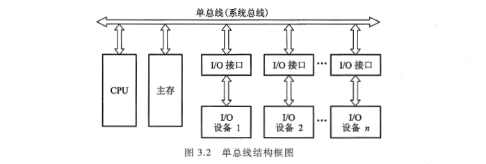
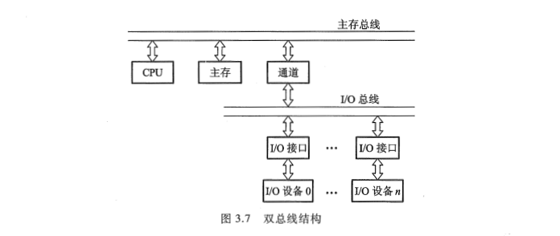
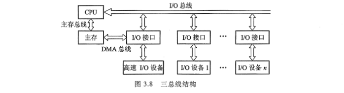
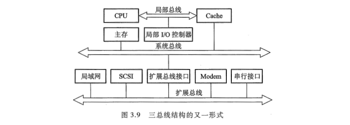
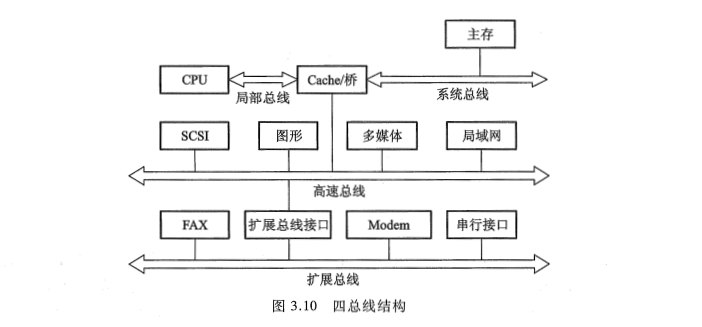
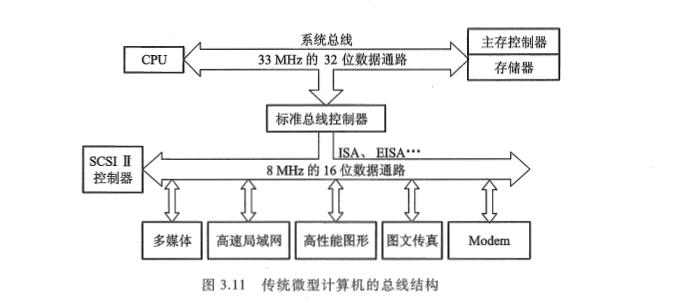
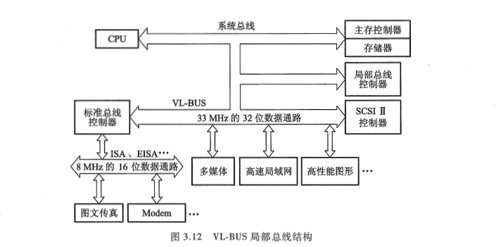
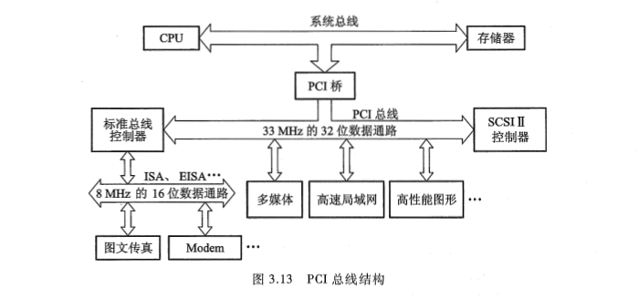
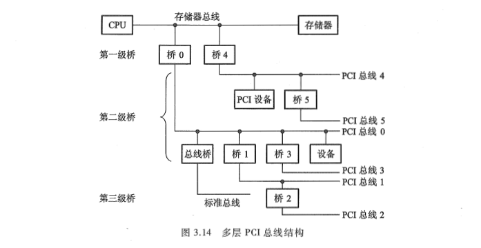

<!-- more -->

总线结构通常可分为单总线结构和多总线结构两种。  

## 一、单总线结构

图 3.2 是单总线结构的示意, 它是将 CPU、主存、I/O 设备(通过 I/O 接口)都挂在一组总线上, 允许 I/O 设备之间、I/O 设备与 CPU 之间或 I/O 设备与主存之间直接交换信息。

这种结构简单, 也便于扩充, 但所有的传送都通过这组共享总线, 因此极易形成计算机系统的瓶颈。它也不允许两个以上的部件在同一时刻向总线传输信息, 这就必然会影响系统工作效率的提高。这类总线多数被小型计算机或微型计算机所采用。

随着计算机应用范围不断扩大, 其外部设备的种类和数量越来越多, 它们对数据传输数量和传输速度的要求也就越来越高。倘若仍然采用单总线结构, 那么, 当 I/O 设备量很大时, 总线发出的控制信号从一端逐个顺序地传递到第 n 个设备, 其传播的延迟时间就会严重地影响系统的工作效率。在数据传输需求量和传输速度要求不太高的情况下, 为克服总线瓶颈问题, 尽可能采用增加总线宽度和提高传输速率来解决; 但当总线上的设备, 如高速视频显示器、网络传输接口等, 其数据量很大和传输速度要求相当高的时候, 单总线结构则不能满足系统工作的需要。因此, 为了根本解决数据传输速率, 解决 CPU、主存与 I/O 设备之间传输速率的不匹配, 实现 CPU 与其他设备相对同步, 不得不采用多总线结构。

## 二、多总线结构

### 1. 双总线

图 3.7 是双总线结构的示意图。

双总线结构的特点是将速度较低的 I/O 设备从单总线上分离出来，形成主存总线与 I/O 总线分开的结构。图中通道是一个具有特殊功能的处理器，CPU 将一部分功能下放给通道，使其对 I/O 设备具有统一管理的功能，以完成外部设备与主存储器之间的数据传送，其系统的吞吐能力可以相当大。这种结构大多用于大、中型计算机系统。

如果将速率不同的 I/O 设备进行分类, 然后将它们连接在不同的通道上, 那么计算机系统的工作效率将会更高, 由此发展成多总线结构。

### 2. 三总线

图 3.8 是三总线结构的示意图。  

图 3.8 中主存总线用于 CPU 与主存之间的传输；I/O 总线供 CPU 与各类 I/O 设备之间传递信息；DMA 总线用于高速 I/O 设备（磁盘、磁带等）与主存之间直接交换信息。在三总线结构中，任一时刻只能使用一种总线。主存总线与 DMA 总线不能同时对主存进行存取，I/O 总线只有在 CPU 执行 I/O 指令时才能用到。

图 3.9 是另一种三总线结构的示意图。

由图可见, 处理器与 Cache(详见 4.3 节)之间有一条局部总线, 它将 CPU 与 Cache 或与更多的局部设备连接。Cache 的控制机构不仅将 Cache 连到局部总线上, 而且还直接连到系统总线上, 这样 Cache 就可通过系统总线与主存传输信息, 而且 I/O 设备与主存之间的传输也不必通过 CPU。还有一条扩展总线, 它将局域网、小型计算机接口(SCSI)、调制解调器(Modem)以及串行接口等都连接起来，并且通过这些接口又可与各类 I/O 设备相连，因此它可支持相当多的 I/O 设备。与此同时，扩展总线又通过扩展总线接口与系统总线相连，由此便可实现这两种总线之间的信息传递，可见其系统的工作效率明显提高。

### 3. 四总线

为了进一步提高 I/O 设备的性能，使其更快地响应命令，又出现了四总线结构，如图 3.10 所示。

在这里又增加了一条与计算机系统紧密相连的高速总线。在高速总线上挂接了一些高速、I/O 设备, 如高速局域网、图形工作站、多媒体、SCSI 等。它们通过 Cache 控制机构中的高速总线桥或高速缓冲器与系统总线和局部总线相连, 使得这些高速设备与 CPU 更密切。而一些较低速的设备如图文传真 FAX、调制解调器及串行接口仍然挂在扩展总线上, 并由扩展总线接口与高速总线相连。

这种结构对高速设备而言, 其自身的工作可以很少依赖 CPU, 同时它们又比扩展总线上的设备更贴近 CPU, 可见对于高性能设备与 CPU 来说, 各自的效率将获得更大的提高。在这种结构中, CPU、高速总线的速度以及各自信号线的定义完全可以不同, 以至各自改变其结构也不会影响高速总线的正常工作, 反之亦然。

## 三、总线结构举例

图 3.11 是传统微型计算机的总线结构示意图。

由图 3.11 中可见，不论高速局域网、高性能图形还是低速的 FAX、Modem 都挂接在 ISA 或 EISA 总线上，并通过 ISA 或 EISA 总线控制器与系统总线相连，这样势必出现总线数据传输的瓶颈。只有将高速、高性能的外设，如高速局域网卡、高性能图形卡等尽量靠近 CPU 本身的总线，并与 CPU 同步或准同步，才可能消除瓶颈问题。这就要求改变总线结构来提高数据传送速率，为此，出现了图 3.12 的 VL-BUS 局部总线结构。

由图 3.12 中可见，将原先挂在 ISA 总线上的高速局域网卡、多媒体卡、高性能图形卡等从 ISA 总线卸下来，挂到局部总线 VL-BUS 上，再与系统总线相连。而将打印机、FAX、Modem 等低速设备仍挂在 ISA 总线上。局部总线 VL-BUS 就相当于在 CPU 与高速 I/O 设备之间架上了高速通道，使 CPU 与高性能外设得到充分发挥，满足了图形界面软件的要求。

由于 VL-BUS 是从 CPU 总线演化而来的，与 CPU 的关系太紧密（实际上这种总线与 486 配合最佳），以致很难支持功能更强的 CPU，因此出现了 PCI 总线。

图 3.13 是 PCI 总线结构的示意图。

由图 3.13 可见, PCI 总线是通过 PCI 桥路(包括 PCI 控制器和 PCI 加速器)与 CPU 总线相连。这种结构使 CPU 总线与 PCI 总线互相隔离, 具有更高的灵活性, 可以支持更多的高速运行设备, 而且具有即插即用的特性。当然, 挂在 PCI 总线上的设备都要求数据传输速率高的设备, 如多媒体卡、高速局域网适配器、高性能图形卡等, 与高速 CPU 总线是相匹配的。至于低速的 FAX、Modem、打印机仍然挂在 ISA、EISA 总线上。

当 PCI 总线驱动能力不足时, 可采用多层结构, 如图 3.14 所示。

