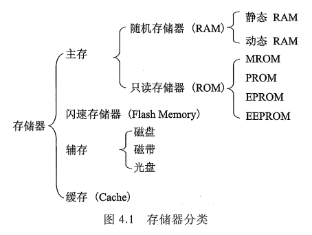
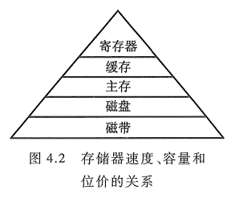
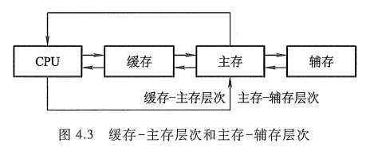

<!-- more -->

## 一、存储器分类

存储器是计算机系统中的记忆设备, 用来存放程序和数据。随着计算机发展, 存储器在系统中的地位越来越重要。由于超大规模集成电路的制作技术, 使 CPU 的速度变得惊人的高, 而存储器的取数和存数的速度与它很难适配, 这使计算机系统的运行速度在很大程度上受存储器速度的制约。此外, 由于 I/O 设备不断增多, 如果它们与存储器交换信息都通过 CPU 来实现, 这将大大降低 CPU 的工作效率。为此, 出现了 I/O 与存储器的直接存取方式(DMA), 这也使存储器的地位更为突出。尤其在多处理机的系统中, 各处理机本身都需与其主存交换信息, 而且各处理机在互相通信中, 也都需共享存放在存储器中的数据。因此, 存储器的地位就更为显要。可见, 从某种意义而言, 存储器的性能已成为计算机系统的核心。当今, 存储器的种类繁多, 从不同的角度对存储器可作不同的分类。

### 1. 按存储介质分类

存储介质是指能寄存 "0" "1" 两种代码并能区别两种状态的物质或元器件。存储介质主要有半导体器件、磁性材料和光盘等。

#### 1.1 半导体存储器

存储元件由半导体器件组成的存储器称为半导体存储器。现代半导体存储器都用超大规模集成电路工艺制成芯片, 其优点是体积小、功耗低、存取时间短。其缺点是当电源消失时, 所存信息也随即丢失, 它是一种易失性存储器。近年来已研制出用非挥发性材料制成的半导体存储器, 克服了信息易失的弊病。

半导体存储器又可按其材料的不同, 分为双极型(TTL)半导体存储器和 MOS 半导体存储器两种。前者具有高速的特点; 后者具有高集成度的特点, 并且制造简单, 成本低廉, 功耗小, 故 MOS 半导体存储器被广泛应用。

#### 1.2 磁表面存储器

磁表面存储器是在金属或塑料基体的表面上涂一层磁性材料作为记录介质, 工作时磁层随载磁体高速运转, 用磁头在磁层上进行读/写操作, 故称为磁表面存储器。按载磁体形状的不同, 可分为磁盘、磁带和磁鼓。现代计算机已很少采用磁鼓。由于用具有矩形磁滞回线特性的材料作磁表面物质, 它们按其剩磁状态的不同而区分 "0" 或 "1", 而且剩磁状态不会轻易丢失, 故这类存储器具有非易失性的特点。

#### 1.3 磁芯存储器

磁芯是由硬磁材料做成的环状元件, 在磁芯中穿有驱动线(通电流)和读出线, 这样便可进行读/写操作。磁芯属磁性材料, 故它也是不易失的永久记忆存储器。不过, 磁芯存储器的体积过大、工艺复杂、功耗太大, 故 20 世纪 70 年代后, 逐渐被半导体存储器取代, 目前几乎已不被采用。

#### 1.4 光盘存储器

光盘存储器是应用激光在记录介质(磁光材料)上进行读/写的存储器, 具有非易失性的特点。由于光盘记录密度高、耐用性好、可靠性高和可互换性强等特点, 光盘存储器越来越被用于计算机系统。

### 2. 按存取方式分类

按存取方式可把存储器分为随机存储器、只读存储器、顺序存取存储器和直接存取存储器。

#### 2.1 随机存储器(Random Access Memory, RAM)

RAM 是一种可读/写存储器, 其特点是存储器的任何一个存储单元的内容都可以随机存取, 而且存取时间与存储单元的物理位置无关。计算机系统中的主存都采用这种随机存储器。由于存储信息原理的不同, RAM 又分为静态 RAM(以触发器原理寄存信息)和动态 RAM(以电容充放电原理寄存信息)。

#### 2.2 只读存储器(Read Only Memory, ROM)

只读存储器是能对其存储的内容读出, 而不能对其重新写入的存储器。这种存储器一旦存入了原始信息后, 在程序执行过程中, 只能将内部信息读出, 而不能随意重新写入新的信息去改变原始信息。因此, 通常用它存放固定不变的程序、常数和汉字字库, 甚至用于操作系统的固化。它与随机存储器可共同作为主存的一部分, 统一构成主存的地址域。

早期只读存储器的存储内容根据用户要求, 厂家采用掩模工艺, 把原始信息记录在芯片中, 一旦制成后无法更改, 称为掩模型只读存储器(Masked ROM, MROM)。

随着半导体技术的发展和用户需求的变化, 只读存储器先后派生出可编程只读存储器(Programmable ROM, PROM)、可擦除可编程只读存储器(Erasable Programmable ROM, EPROM)以及电擦除可编程只读存储器(Electrically-Erasable Programmable ROM, EEPROM)。

近年来还出现了闪速存储器 Flash Memory, 它具有 EEPROM 的特点, 而速度比 EEPROM 快得多。

#### 2.3 串行访问存储器

如果对存储单元进行读/写操作时, 需按其物理位置的先后顺序寻找地址, 则这种存储器称为串行访问存储器。显然这种存储器由于信息所在位置不同, 使得读/写时间均不相同。例如, 磁带存储器, 不论信息处在哪个位置, 读/写时必须从其介质的始端开始按顺序寻找, 故这类串行访问的存储器又称为顺序存取存储器。还有一种属于部分串行访问的存储器, 如磁盘。在对磁盘读/写时, 首先直接指出该存储器中的某个小区域(磁道), 然后再顺序寻访, 直至找到位置。故其前段是直接访问, 后段是串行访问, 称为直接存取存储器。

### 3. 按在计算机中的作用分类

按在计算机系统中的作用不同, 存储器主要分为主存储器、辅助存储器、缓冲存储器。主存储器(简称主存)的主要特点是它可以和 CPU 直接交换信息。辅助存储器(简称辅存)是主存储器的后援存储器, 用来存放当前暂时不用的程序和数据, 它不能与 CPU 直接交换信息。两者相比, 主存速度快、容量小、每位价格高; 辅存速度慢、容量大、每位价格低。缓冲存储器(简称缓存)用在两个速度不同的部件之中, 例如, CPU 与主存之间可设置一个快速缓存(有关内容将在 4.3 节中讲述), 起到缓冲作用。

### 4. 总结

综上所述, 存储器分类如图 4.1 所示。

## 二、存储器的层次结构

存储器有 3 个主要性能指标: 速度、容量和每位价格(简称位价)。一般来说, 速度越高, 位价就越高; 容量越大, 位价就越低, 而且容量越大, 速度必越低。人们追求大容量、高速度、低位价的存储器, 可惜这是很难达到的。图 4.2 形象地反映了上述三者的关系。

图中由上至下, 位价越来越低, 速度越来越慢, 容量越来越大, CPU 访问的频度也越来越少。最上层的寄存器通常都制作在 CPU 芯片内。寄存器中的数直接在 CPU 内部参与运算, CPU 内可以有十几个、几十个寄存器, 它们的速度最快, 位价最高, 容量最小。主存用来存放将要参与运行的程序和数据, 其速度与 CPU 速度差距较大, 为了使它们之间速度更好地匹配, 在主存与 CPU 之间插入了一种比主存速度更快、容量更小的高速缓冲存储器 Cache, 显然其位价要高于主存。以上三类存储器都是由速度不同、位价不等的半导体存储材料制成的, 它们都设在主机内。现代计算机将 Cache 也制作在 CPU 内。磁盘、磁带属于辅助存储器, 其容量比主存大得多, 大都用来存放暂时未用到的程序和数据文件。CPU 不能直接访问辅存, 辅存只能与主存交换信息, 因此辅存的速度可以比主存慢得多。

> 什么是寄存器？可以参考 [05-计算机原理/03-第 3 篇-中央处理器/03-第 8 章-CPU 结构和功能/LV001-CPU 的结构.md](/sdoc/principle-of-computer/cpu/structure-and-function/126b0e9084c530de3f9806a1)

实际上, 存储系统层次结构主要体现在缓存-主存和主存-辅存这两个存储层次上, 如图 4.3 所示。显然, CPU 和缓存、主存都能直接交换信息; 缓存能直接和 CPU、主存交换信息; 主存可以和 CPU、缓存、辅存交换信息。

**缓存-主存层次** 主要解决 CPU 和主存速度不匹配的问题。由于缓存的速度比主存的速度高, 只要将 CPU 近期要用的信息调入缓存, CPU 便可以直接从缓存中获取信息, 从而提高访存速度。但由于缓存的容量小, 因此需不断地将主存的内容调入缓存, 使缓存中原来的信息被替换掉。主存和缓存之间的数据调动是由硬件自动完成的, 对程序员是透明的。

**主存-辅存层次** 主要解决存储系统的容量问题。辅存的速度比主存的速度低, 而且不能和 CPU 直接交换信息, 但它的容量比主存大得多, 可以存放大量暂时未用到的信息。当 CPU 需要用到这些信息时, 再将辅存的内容调入主存, 供 CPU 直接访问。主存和辅存之间的数据调动是由硬件和操作系统共同完成的。

从 CPU 角度来看, 缓存-主存这一层次的速度接近于缓存, 高于主存; 其容量和位价却接近于主存, 这就从速度和成本的矛盾中获得了理想的解决办法。主存-辅存这一层次, 从整体分析, 其速度接近于主存, 容量接近于辅存, 平均位价也接近于低速、廉价的辅存位价, 这又解决了速度、容量、成本这三者的矛盾。现代的计算机系统几乎都具有这两个存储层次, 构成了缓存、主存、辅存三级存储系统。

在主存-辅存这一层次的不断发展中, 逐渐形成了 **虚拟存储系统**。在这个系统中, 程序员编程的地址范围与虚拟存储器的地址空间相对应。例如, 机器指令地址码为 24 位, 则虚拟存储器存储单元的个数可达 16M。可是这个数与主存的实际存储单元的个数相比要大得多, 称这类指令地址码为**虚地址**(虚存地址、虚拟地址)或逻辑地址, 而把主存的实际地址称为**物理地址**或实地址。物理地址是程序在执行过程中能够真正访问的地址, 也是实实在在的主存地址。对具有虚拟存储器的计算机系统而言, 程序员编程时, 可用的地址空间远远大于主存空间, 使程序员以为自己占有一个容量极大的主存, 其实这个主存并不存在, 这就是将其称为虚拟存储器的原因。对虚拟存储器而言, 其逻辑地址变换为物理地址的工作是由计算机系统的硬件和操作系统自动完成的, 对程序员是透明的。当虚地址的内容在主存时, 机器便可立即使用; 若虚地址的内容不在主存, 则必须先将此虚地址的内容传递到主存的合适单元后再为机器所用。
