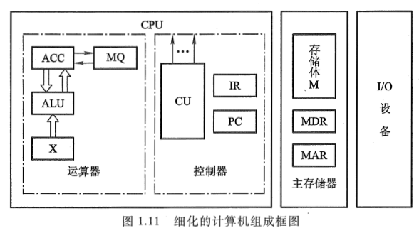

<!-- more -->

## 一、概述

主存储器(简称主存)的基本结构已在第 1 章介绍过, 如图 1.11 所示。

实际上, 根据 MAR 中的地址访问某个存储单元时, 还需经过地址译码、驱动等电路, 才能找到所需访问的单元。读出时, 需经过读出放大器, 才能将被选中单元的存储字送到 MDR。写入时, MDR 中的数据也必须经过写入电路才能真正写入被选中的单元中。可见, 主存的实际结构如图 4.4 所示。

现代计算机的主存都由半导体集成电路构成, 图中的驱动器、译码器和读写电路均制作在存储芯片中, 而 MAR 和 MDR 制作在 CPU 芯片内。存储芯储芯片中，而 MAR 和 MDR 制作在 CPU 芯片内。存储芯片和 CPU 芯片可通过总线连接，如图 4.5 所示。

当要从存储器读出某一信息字时，首先由 CPU 将该字的地址送到 MAR，经地址总线送至主存，然后发出读命令。主存接到读命令后，得知需将该地址单元的内容读出，便完成读操作，将该单元的内容读至数据总线上，至于该信息由 MDR 送至什么地方，这已不是主存的任务，而是由 CPU 决定的。若要向主存存入一个信息字时, 首先 CPU 将该字所在主存单元的地址经 MAR 送到地址总线, 并将信息字送入 MDR, 然后向主存发出写命令, 主存接到写命令后, 便将数据线上的信息写入对应地址线指出的主存单元中。

### 1. 主存中存储单元地址的分配

主存各存储单元的空间位置是由单元地址号来表示的，而地址总线是用来指出存储单元地址号的，根据该地址可读出或写入一个存储字。不同的机器存储字长也不同，为了满足字符处理的需要，常用 8 位二进制数表示一个字节，因此存储字长都取 8 的倍数。通常计算机系统既可按字寻址，也可按字节寻址。例如 IBM370 机的字长为 32 位，它可按字节寻址，即它的每一个存储字包含 4 个可独立寻址的字节，其地址分配如图 4.6（a）所示。字地址是用该字高位字节的地址来表示，故其字地址是 4 的整数倍，正好用地址码的末两位来区分同一字的 4 个字节的位置。但对 PDP-11 机而言，其字长为 16 位，字地址是 2 的整数倍，它用低位字节的地址来表示字地址，如图 4.6（b）所示。

由图 4.6(a)所示, 对 24 位地址线的主存而言, 按字节寻址的范围是 16M(2^24), 按字（一个字为 4 个字节）寻址的范围为 4M。由图 4.6(b)所示, 对 24 位地址线而言, 按字节寻址的范围仍为 16M, 但按字（一个字为 2 个字节）寻址的范围为 8M。

### 2. 主存的技术指标

主存的主要技术指标是存储容量和存储速度。

（1）存储容量

存储容量是指主存能存放二进制代码的总位数, 即：

 存储容量 = 存储单元个数 x 存储字长 

它的容量也可用字节总数来表示, 即：

 存储容量 = 存储单元个数 x 存储字长/8 

目前的计算机存储容量大多以字节数来表示, 例如, 某机主存的存储容量为 256MB, 则按字节寻址的地址线位数应对应 28 位。

（2）存储速度

存储速度是由存取时间和存取周期来表示的。

存取时间又称为存储器的访问时间(Memory Access Time), 是指启动一次存储器操作(读或写)到完成该操作所需的全部时间。存取时间分读出时间和写入时间两种。读出时间是从存储器接收到有效地址开始, 到产生有效输出所需的全部时间。写入时间是从存储器接收到有效地址开始, 到数据写入被选中单元为止所需的全部时间。

存取周期(Memory Cycle Time)是指存储器进行连续两次独立的存储器操作(如连续两次读操作)所需的最小间隔时间, 通常存取周期大于存取时间。现代 MOS 型存储器的存取周期可达 100 ns; 双极型 TTL 存储器的存取周期接近于 10 ns。

（3）存储器带宽

与存取周期密切相关的指标为存储器带宽, 它表示单位时间内存储器存取的信息量, 单位可用字/秒或字节/秒或位/秒表示。如存取周期为 500ns, 每个存取周期可访问 16 位, 则它的带宽为 32M 位/秒。带宽是衡量数据传输率的重要技术指标。

存储器的带宽决定了以存储器为中心的机器获得信息的传输速度, 它是改善机器瓶颈的一个关键因素。为了提高存储器的带宽, 可以采用以下措施:

① 缩短存取周期。

② 增加存储字长, 使每个存取周期可读/写更多的二进制位数。

③ 增加存储体(详见 4.2.7 节)。

## 二、半导体存储芯片简介

### 1. 半导体存储芯片的基本结构

半导体存储芯片采用超大规模集成电路制造工艺, 在一个芯片内集成具有记忆功能的存储矩阵、译码驱动电路和读/写电路等, 如图 4.7 所示。

译码驱动能把地址总线送来的地址信号翻译成对应存储单元的选择信号, 该信号在读/写电路的配合下完成对被选中单元的读/写操作。

读/写电路包括读出放大器和写入电路, 用来完成读/写操作。

存储芯片通过地址总线、数据总线和控制总线与外部连接。

地址线是单向输入的, 其位数与芯片容量有关。

数据线是双向的(有的芯片可用成对出现的数据线分别作为输入或输出), 其位数与芯片可读出或写入的数据位数有关。数据线的位数与芯片容量有关。

地址线和数据线的位数共同反映存储芯片的容量。例如, 地址线为 10 根, 数据线为 4 根, 则芯片容量为 2^10x4 = 4K 位; 又如地址线为 14 根, 数据线为 1 根, 则其容量为 16K 位。

控制线主要有**读/写控制线**与**片选线**两种。不同存储芯片的读/写控制线和片选线可以不同。有的芯片的读/写控制线共用 1 根(如 2114), 有的分用两根(如 6264); 有的芯片的片选线用 1 根(如 2114), 有的用 2 根(如 6264)。读/写控制线决定芯片进行读/写操作, 片选线用来选择存储芯片。由于半导体存储器是由许多芯片组成的, 为此需用片选信号来确定哪个芯片被选中。例如, 一个 64Kx8 位的存储器可由 32 片 16Kx1 位的存储芯片组成, 如图 4.8 所示。但每次读出一个存储字时, 只需选中 8 片。

### 2. 半导体存储芯片的译码驱动方式

半导体存储芯片的译码驱动方式有两种：线选法和重合法，如图4.9和图4.10所示。

图4.9是一个16x1字节线选法存储芯片的结构示意图。它的特点是用一根字选择线（字线），直接选中一个存储单元的各位（如一个字节）。这种方式结构较简单，但只适于容量不大的存储芯片。如当地址线A3A2A1A0为1111时，则第15根字线被选中，对应图4.9中的最后一行8位代码便可直接读出或写入。

图4.10是一个1Kx1位重合法结构示意图。显然，只要用64根选择线（X、Y两个方向各32根），便可选择32x32矩阵中的任一位。例如，当地址线为全0时，译码输出X0和Y0有效，矩阵中第0行、第0列共同选中的那位即被选中。由于被选单元是由X、Y两个方向的地址决定的，故称为重合法。当欲构成1Kx1字节的存储器时，只需用8片如图4.10所示的芯片即可。

