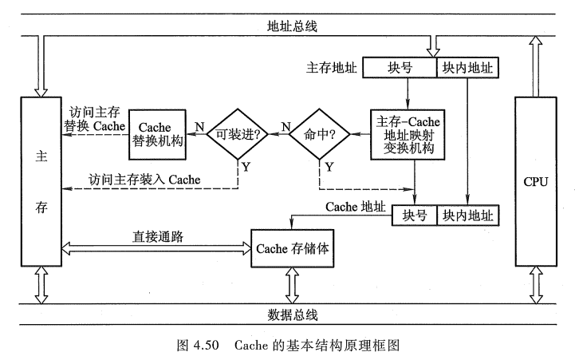

<!-- more -->

## 一、概述

### 1. 问题的提出

在多体并行存储系统中，由于 I/O 设备向主存请求的级别高于 CPU 访存，这就出现了 CPU 等待 I/O 设备访存的现象，致使 CPU 空等一段时间，甚至可能等待几个主存周期，从而降低了 CPU 的工作效率。为了避免 CPU 与 I/O 设备争抢访存，可在 CPU 与主存之间加一级缓存（参见图 4.3），这样，主存可将 CPU 要取的信息提前送至缓存，一旦主存在与 I/O 设备交换时，CPU 可直接从缓存中读取所需信息，不必空等而影响效率。

从另一角度来看，主存速度的提高始终跟不上 CPU 的发展。据统计，CPU 的速度平均每年改进 60%，而组成主存的动态 RAM 速度平均每年只改进 7%，结果是 CPU 和动态 RAM 之间的速度间隙平均每年增大 50%。例如，100MHz 的 Pentium 处理器平均每 10ns 就执行一条指令，而动态 RAM 的典型访问时间为 60~120ns。这也希望由高速缓存 Cache 来解决主存与 CPU 速度的不匹配问题。

Cache 的出现使 CPU 可以不直接访问主存，而与高速 Cache 交换信息。那么，这是否可能呢？通过大量典型程序的分析，发现 CPU 从主存取指令或取数据，在一定时间内，只是对主存局部地址区域的访问。这是由于指令和数据在主存内都是连续存放的，并且有些指令和数据往往会被多次调用（如子程序、循环程序和一些常数），即指令和数据在主存的地址分布不是随机的，而是相对的簇聚，使得 CPU 在执行程序时，访存具有相对的局部性，这就称为程序访问的局部性原理。根据这一原理，很容易设想，只要将 CPU 近期要用到的程序和数据提前从主存送到 Cache，那么就可以做到 CPU 在一定时间内只访问 Cache。一般 Cache 采用高速的 SRAM 制作，其价格比主存贵，但因其容量远小于主存，因此能很好地解决速度和成本的矛盾。

### 2. Cache 的工作原理

图 4.49 是 Cache-主存存储空间的基本结构示意图。

主存由 $2^n$ 个可编址的字组成, 每个字有唯一的 n 位地址。为了与 Cache 映射, 将主存与缓存都分成若干块, 每块内又包含若干个字, 并使它们的块大小相同(即块内的字数相同)。这就将主存的地址分成两段: 高 m 位表示主存的块地址, 低 b 位表示块内地址, 则 $2^m=M$ 表示主存的块数。同样, 缓存的地址也分为两段: 高 c 位表示缓存的块号, 低 b 位表示块内地址, 则 $2^c=C$ 表示缓存块数, 且 C 远小于 M。主存与缓存地址中都用 b 位表示其块内字数, 即 $B=2^b$ 反映了块的大小, 称 B 为块长。

任何时刻都有一些主存块处在缓存块中。CPU 欲读取主存某字时, 有两种可能: 一种是所需要的字已在缓存中, 即可直接访问 Cache(CPU 与 Cache 之间通常一次传送一个字); 另一种是所需的字不在 Cache 内, 此时需将该字所在的主存整个字块一次调入 Cache 中(Cache 与主存之间是字块传送)。如果主存块已调入缓存块, 则称该主存块与缓存块建立了对应关系。

上述第一种情况为 CPU 访问 Cache 命中，第二种情况为 CPU 访问 Cache 不命中。由于缓存的块数 C 远小于主存的块数 M，因此，一个缓存块不能唯一地、永久地只对应一个主存块，故 **每个缓存块需设一个标记**（参见图 4.49），用来表示当前存放的是哪一个主存块，该标记的内容相当于主存块的编号。CPU 读信息时，要将主存地址的高 m 位（或 m 位中的一部分）与缓存块的标记进行比较，以判断所读的信息是否已在缓存中（参见图 4.54）。

Cache 的容量与块长是影响 Cache 效率的重要因素，通常用 "命中率" 来衡量 Cache 的效率。命中率是指 CPU 要访问的信息已在 Cache 内的比率。

在一个程序执行期间，设 $N_c$ 为访问 Cache 的总命中次数，$N_m$ 为访问主存的总次数，则命中率 $h$ 为：

$$
h =\frac{N_c}{N_c+N_m}
$$

设 $t_c$ 为命中时的 Cache 访问时间，$t_m$ 为未命中时的主存访问时间，$1-h$ 表示未命中率，则 Cache-主存系统的平均访问时间 $t_a$ 为

$$
t_a = ht_c+(1-h)t_m
$$

当然，以较小的硬件代价使 Cache-主存系统的平均访问时间 $t_a$ 越接近于 $t_n$ 越好。用 $e$ 表示访问效率，则有

$$
e = \frac{t_c}{t_a}*100\% = \frac{t_c}{ht_c+(1-h)t_m}* 100\%
$$

可见，为提高访问效率，命中率 h 越接近 1 越好。

【例 4.7】假设 CPU 执行某段程序时, 共访问 Cache 命中 2000 次, 访问主存 50 次。已知 Cache 的存取周期为 50ns, 主存的存取周期为 200 ns。求 Cache-主存系统的命中率、效率和平均访问时间。

【解】:

（1）Cache 的命中率为

$$
h =\frac{2000}{2000+50}= 0.97
$$

（2）由题可知, 访问主存的时间是访问 Cache 时间的 4 倍(200/50 = 4)。设访问 Cache 的时间为 t, 访问主存的时间为 4t, Cache-主存系统的访问效率为 e, 则
访问 Cache 的时间

$$
\begin{align}
e &= \frac{访问 Cache 的时间}{平均访问时间}*100\% \\
&= \frac{t}{0.97 *t+(1-0.97)* 4t}*100\% = 91.7\%
\end{align}
$$

(3)平均访问时间为

$$
50 ns *0.97+200 ns*(1-0.97)= 54.5 ns
$$

一般而言, Cache 容量越大, 其 CPU 的命中率就越高。当然容量也没必要太大, 太大会增加成本, 而且当 Cache 容量达到一定值时, 命中率已不因容量的增大而有明显的提高。因此, Cache 容量是总成本价与命中率的折中值。例如,80386 的主存最大容量为 4GB, 与其配套的 Cache 容量为 16KB 或 32KB，其命中率可达 95%以上。

块长与命中率之间的关系更为复杂，它取决于各程序的局部特性。当块由小到大增长时，起初会因局部性原理使命中率有所提高。由局部性原理指出，在已被访问字的附近，近期也可能被访问，因此，增大块长，可将更多有用字存入缓存，提高其命中率。可是，倘若继续增大块长，命中率很可能下降，这是因为所装入缓存的有用数据反而少于被替换掉的有用数据。由于块长的增大，导致缓存中块数的减少，而新装入的块要覆盖旧块，很可能出现少数块刚刚装入就被覆盖，因此命中率反而下降。再者，块增大后，追加上的字距离已被访问的字更远，故近期被访问的可能性会更小。块长的最优值是很难确定的，一般每块取 4 至 8 个可编址单（字或字节）较好，也可取一个主存周期所能调出主存的信息长度。例如，CRAY-1 的主存是 16 体交叉，每个体为单字宽，其存放指令的 Cache 块长为 16 个字。又如，IBM370/168 机主存是 4 体交叉，每个体宽为 64 位（8 个字节），其 Cache 块长为 32 个字节。

### 3. Cache 的基本结构

Cache 的基本结构原理框图如图 4.50 所示。

它主要由 Cache 存储体、地址映射变换机构、Cache 替换机构几大模块组成。

（1）Cache 存储体

Cache 存储体以块为单位与主存交换信息，为加速 Cache 与主存之间的调动，主存大多采用多体结构，且 Cache 访存的优先级最高。

（2）地址映射变换机构

地址映射变换机构是将 CPU 送来的主存地址转换为 Cache 地址。由于主存和 Cache 的块大小相同，块内地址都是相对于块的起始地址的偏移量（即低位地址相同），因此地址变换主要是主存的块号（高位地址）与 Cache 块号间的转换。而地址变换又与主存地址以什么样的函数关系映射到 Cache 中（称为地址映射）有关，这些内容可详见 4.3.2 节。

如果转换后的 Cache 块已与 CPU 欲访问的主存块建立了对应关系，即已命中，则 CPU 可直接访问 Cache 存储体。如果转换后的 Cache 块与 CPU 欲访问的主存块未建立对应关系，即不命中，此刻 CPU 在访问主存时，不仅将该字从主存取出，同时将它所在的主存块一并调入 Cache，供 CPU 使用。当然，此刻能将主存块调入 Cache 内，也是由于 Cache 原来处于未被装满的状态。反之，倘若 Cache 原来已被装满，即已无法将主存块调入 Cache 内时，就得采用替换策略。

（3）替换机构

当 Cache 内容已满，无法接受来自主存块的信息时，就由 Cache 内的替换机构按一定的替换算法来确定应从 Cache 内移出哪个块返回主存，而把新的主存块调入 Cache。有关替换算法详见 [计算机组成原理第 3 版唐朔飞.pdf](https://gitee.com/docs-site/computer-reference-guide/blob/master/10-%E8%AE%A1%E7%AE%97%E6%9C%BA%E7%BB%84%E6%88%90%E5%8E%9F%E7%90%86/%E8%AE%A1%E7%AE%97%E6%9C%BA%E7%BB%84%E6%88%90%E5%8E%9F%E7%90%86%E7%AC%AC3%E7%89%88%E5%94%90%E6%9C%94%E9%A3%9E.pdf) 的 4.3.3 节。

特别需指出的是，Cache 对用户是透明的，即用户编程时所用到的地址是主存地址，用户根本不知道这些主存块是否已调入 Cache 内。因为，将主存块调入 Cache 的任务全由机器硬件自动完成。

（4）Cache 的读写操作

读操作的过程可用流程图 4.51 来描述。当 CPU 发出主存地址后, 首先判断该存储字是否在 Cache 中。若命中, 直接访问 Cache, 将该字送至 CPU; 若未命中, 一方面要访问主存, 将该字传送给 CPU, 与此同时, 要将该字所在的主存块装入 Cache, 如果此时 Cache 已装满, 就要执行替换算法, 腾出空位才能将新的主存块调入。

写操作比较复杂, 因为对 Cache 块内写入的信息, 必须与被映射的主存块内的信息完全一致。当程序运行过程中需对某个单元进行写操作时, 会出现 **如何使 Cache 与主存内容保持一致** 的问题。目前主要采用以下几种方法。

① 写直达法(Write-through), 又称为存直达法(Store-through), 即写操作时数据既写入 Cache 又写入主存。它能随时保证主存和 Cache 的数据始终一致, 但增加了访存次数。

② 写回法(Write-back), 又称为拷回法(Copy-back), 即写操作时只把数据写入 Cache 而不写入主存, 但当 Cache 数据被替换出去时才写回主存。可见写回法 Cache 中的数据会与主存中的不一致。**为了识别 Cache 中的数据是否与主存一致, Cache 中的每一块要增设一个标志位**, 该位有两个状态: "清"(表示未修改过, 与主存一致)和 "浊"(表示修改过, 与主存不一致)。在 Cache 替换时, "清" 的 Cache 块不必写回主存, 因为此时主存中相应块的内容与 Cache 块是一致的。在写 Cache 时, 要将该标志位设置为 "浊", 替换时此 Cache 块要写回主存, 同时要使标志位为 "清"。

写回法和写直达法各有特色。在写直达法中, 由于 Cache 中的数据始终和主存保持一致, 在读操作 Cache 失效时, 只需选择一个替换的块(主存块)调入 Cache, 被替换的块(Cache 块)不必写回主存。可见读操作不涉及对主存的写操作。因此这种方法更新策略比较容易实现。但是在写操作时, 既要写入 Cache 又要写入主存, 因此写直达法的 "写" 操作时间就是访问主存的时间。

在写回法中, 写操作时只写入 Cache, 故 "写" 操作时间就是访问 Cache 的时间, 因此速度快。这种方法对主存的写操作只发生在块替换时, 而且对 Cache 中一个数据块的多次写操作只需一次写入主存, 因此可减少主存的写操作次数。但在读操作 Cache 失效时要发生数据替换, 引起被替换的块写回主存的操作, 增加了 Cache 的复杂性。

对于有多个处理器的系统, 各自都有独立的 Cache, 且都共享主存, 这样又出现了新问题。即当一个缓存中数据被修改时, 不仅主存中相对应的字无效, 连同其他缓存中相对应的字也无效(当然恰好其他缓存也有相应的字)。即使通过写直达法改变了主存的相应字, 而其他缓存中数据仍然无效。显然, 解决系统中 Cache 一致性的问题很重要。当今研究 Cache 一致性问题非常活跃, 想进一步了解可查阅有关资料。

### 4. Cache 的改进

Cache 刚出现时, 典型系统只有一个缓存, 近年来普遍采用多个 Cache。其含义有两方面: 一是增加 Cache 的级数; 二是将统一的 Cache 变成分立的 Cache。

（1）单一缓存和两级缓存

所谓单一缓存, 是指在 CPU 和主存之间只设一个缓存。随着集成电路逻辑密度的提高, 又把这个缓存直接与 CPU 制作在同一个芯片内, 故又称为片内缓存(片载缓存)。片内缓存可以提高外部总线的利用率, 因为将 Cache 制作在芯片内, CPU 直接访问 Cache 不必占用芯片外的总线(系统总线), 而且片内缓存与 CPU 之间的数据通路很短, 大大提高了存取速度, 外部总线又可更多地支持 I/O 设备与主存的信息传输, 增强了系统的整体效率。例如, Intel 80486CPU 芯片内就含 8KB 的片内缓存。

可是，由于片内缓存在芯片内，其容量不可能很大，这就可能致使 CPU 欲访问的信息不在缓存内，势必通过系统总线访问主存，访问次数多了，整机速度就会下降。如果在主存与片内缓存之间再加一级缓存，称为 **片外缓存**，由比主存动态 RAM 和 ROM 存取速度更快的静态 RAM 组成。而且不使用系统总线作为片外缓存与 CPU 之间的传送路径，使用一个独立的数据路径，以减轻系统总线的负担。那么，从片外缓存调入片内缓存的速度就能提高，而 CPU 占用系统总线的时间也就大大下降，整机工作速度有明显改进。这种由片外缓存和片内缓存组成的 Cache 称为 **两级缓存**，并称片内缓存为第一级，片外缓存为第二级。随着芯片集成度的提高，已有一些处理器将第二级 Cache 结合到处理器芯片上，改善了性能。

（2）统一缓存和分立缓存

统一缓存是指指令和数据都存放在同一缓存内的 Cache; 分立缓存是指指令和数据分别存放在两个缓存中, 一个称为指令 Cache, 另一个称为数据 Cache。两种缓存的选用主要考虑如下两个因素。

其一, 它与主存结构有关, 如果计算机的主存是统一的(指令、数据存储在同一主存内), 则相应的 Cache 采用统一缓存; 如果主存采用指令、数据分开存储的方案, 则相应的 Cache 采用分立缓存。

其二, 它与机器对指令执行的控制方式有关。当采用超前控制或流水线控制方式时, 一般都采用分立缓存。

所谓超前控制, 是指在当前指令执行过程尚未结束时就提前将下一条准备执行的指令取出, 称为超前取指或指令预取。所谓流水线控制实质上是多条指令同时执行(详见第 8 章), 又可视为指令流水。当然, 要实现同时执行多条指令, 机器的指令译码电路和功能部件也需多个。超前控制和流水线控制特别强调指令的预取和指令的并行执行, 因此, 这类机器必须将指令 Cache 和数据 Cache 分开, 否则可能出现取指和执行过程对统一缓存的争用。如果此刻采用统一缓存, 则在执行部件向缓存发出取数请求时, 一旦指令预取机构也向缓存发出取指请求, 那么统一缓存只能先满足执行部件请求, 将数据送到执行部件, 而让取指请求暂时等待, 显然达不到预取指令的目的, 从而影响指令流水的实现。可见, 这类机器将两种缓存分立尤为重要。

图 4.52 为 Pentium4 处理器框图。

图中有两级共 3 个 Cache，其中一级 Cache 分 L1 指令 Cache 和 L1 数据 Cache，另外还有一个二级 L2Cache。

图 4.53 是 PowerPC620 处理器的示意图。

图中也有两个 Cache。数据 Cache 通过存/取单元支持整数和浮点操作; 指令 Cache 为只读存储器, 支持指令单元。执行部件是 3 个可并行操作的整数 ALU 和一个浮点运算部件(有独立的寄存器和乘、加、除部件)。

## 二、Cache——主存地址映射

由主存地址映射到 Cache 地址称为地址映射。地址映射方式很多，有直接映射（固定的映射关系）、全相联映射（灵活性大的映射关系）、组相联映射（上述两种映射的折中）。

### 1. 直接映射

图 4.54 示出了直接映射方式主存与缓存中字块的对应关系。

图中每个主存块只与一个缓存块相对应，映射关系式为

$$
i\space =\space j \space mod \space C \space or \space i = j \space mod \space 2^c
$$

其中, i 为缓存块号, j 为主存块号, C 为缓存块数。映射结果表明每个缓存块对应若干个主存块, 如表 4.4 所示。

这种方式的优点是实现简单，只需利用主存地址的某些位直接判断，即可确定所需字块是否在缓存中。由图 4.54 可见，主存地址高 m 位被分成两部分：低 c 位是指 Cache 的字块地址，高 t 位（t = m-c）是指主存字块标记，它被记录在建立了对应关系的缓存块的 "标记" 位中。当缓存接到 CPU 送来的主存地址后，只需根据中间 c 位字段（假设为 00…01）找到 Cache 字块 1，然后根据字块 1 的 "标记" 是否与主存地址的高 t 位相符来判断，若符合且有效位为 "1"（有效位用来识别 Cache 存储块中的数据是否有效，因为有时 Cache 中的数据是无效的，例如，在初始时刻 Cache 应该是 "空" 的，其中的内容是无意义的），表示该 Cache 块已和主存的某块建立了对应关系（即已命中），则可根据 b 位地址从 Cache 中取得信息；若不符合，或有效位为 "0"（即不命中），则从主存读入新的字块来替代旧的字块，同时将信息送往 CPU，并修改 Cache "标记"。如果原来有效位为 "0"，还得将有效位置成 "1"。

直接映射方式的缺点是不够灵活，因每个主存块只能固定地对应某个缓存块，即使缓存内还空着许多位置也不能占用，使缓存的存储空间得不到充分的利用。此外，如果程序恰好要重复访问对应同一缓存位置的不同主存块，就要不停地进行替换，从而降低命中率。

### 2. 全相联映射

全相联映射允许主存中每一字块映射到 Cache 中的任何一块位置上，如图 4.55 所示。

这种映射方式可以从已被占满的 Cache 中替换出任一旧字块。显然，这种方式灵活，命中率也更高，缩小了块冲突率。与直接映射相比，它的主存字块标记从 t 位增加到 t+c 位，这就使 Cache "标记" 的位数增多，而且访问 Cache 时主存字块标记需要和 Cache 的全部 "标记" 位进行比较，才能判断出所访问主存地址的内容是否已在 Cache 内。这种比较通常采用 "按内容寻址" 的相联存储器（见附录 4A）来完成。

总之，这种方式所需的逻辑电路甚多，成本较高，实际的 Cache 还要采用各种措施来减少地址的比较次数。

### 3. 组相联映射

组相联映射是对直接映射和全相联映射的一种折中。它把 Cache 分为 Q 组，每组有 R 块，并有以下关系：

$$
i = j \space mod \space Q
$$

其中, i 为缓存的组号, j 为主存的块号。某一主存块按模 Q 将其映射到缓存的第 i 组内, 如图 4.56 所示。

组相联映射的主存地址各段与直接映射(参见图 4.54)相比, 还是有区别的。图 4.54 中 Cache 字块地址字段由 $c$ 位变为组地址字段 $q$ 位, 且 $q=c-r$, 其中 $2^c$ 表示 Cache 的总块数, $2^q$ 表示 Cache 的分组个数, $2^r$ 表示组内包含的块数。主存字块标记字段由 $t$ 位变为 $s=t+r$ 位。为了便于理解, 假设 $c=5$, $q=4$, 则 $r=c-q=1$。其实际含义为: Cache 共有 $2^c=32$ 个字块, 共分为 $2^q=16$ 组, 每组内包含 $2^r=2$ 块。组内 2 块的组相联映射又称为二路组相联。

根据上述假设条件, 组相联映射的含义是: 主存的某一字块可以按模 16 映射到 Cache 某组的任一字块中。即主存的第 0,16,32…字块可以映射到 Cache 第 0 组 2 个字块中的任一字块; 主存的第 15,31,47…字块可以映射到 Cache 第 15 组中的任一字块。显然, 主存的第 j 块会映射到 Cache 的第 i 组内, 两者之间一一对应, 属直接映射关系; 另一方面, 主存的第 j 块可以映射到 Cache 的第 i 组内中的任一块, 这又体现出全相联映射关系。可见, 组相联映射的性能及其复杂性介于直接映射和全相联映射两者之间, 当 r = 0 时是直接映射方式, 当 r = c 时是全相联映射方式。

## 三、替换策略

当新的主存块需要调入 Cache 并且它的可用空间位置又被占满时, 需要替换掉 Cache 的数据, 这就产生了替换策略(算法)问题。在直接映射的 Cache 中, 由于某个主存块只与一个 Cache 字块有映射关系, 因此替换策略很简单。而在组相联和全相联映射的 Cache 中, 主存块可以写入 Cache 中若干位置，这就有一个选择替换掉哪一个 Cache 字块的问题，即所谓替换算法问题。理想的替换方法是把未来很少用到的或者很久才用到的数据块替换出来，但实际上很难做到。常用的替换算法有先进先出算法、近期最少使用算法和随机法。

### 1. 先进先出(First-In-First-Out, FIFO)算法

FIFO 算法选择最早调入 Cache 的字块进行替换, 它不需要记录各字块的使用情况, 比较容易实现, 开销小, 但没有根据访存的局部性原理, 故不能提高 Cache 的命中率。因为最早调入的信息可能以后还要用到, 或者经常要用到, 如循环程序。

### 2. 近期最少使用(Least Recently Used, LRU)算法

LRU 算法比较好地利用访存局部性原理, 替换出近期用得最少的字块。它需要随时记录 Cache 中各字块的使用情况, 以便确定哪个字块是近期最少使用的字块。它实际是一种推测的方法, 比较复杂, 一般采用简化的方法, 只记录每个块最近一次使用的时间。LRU 算法的平均命中率比 FIFO 的高。

### 3. 随机法

随机法是随机地确定被替换的块, 比较简单, 可采用一个随机数产生器产生一个随机的被替换的块, 但它也没有根据访存的局部性原理, 故不能提高 Cache 的命中率。
