<!-- more -->

除了 CPU 和存储器两大模块外, 计算机硬件系统的第三个关键部分是输入输出模块, 又称输入输出系统。随着计算机系统的不断发展, 应用范围的不断扩大, I/O 设备的数量和种类也越来越多, 它们与主机的联络方式及信息的交换方式也各不相同。因此, 输入输出系统涉及的内容极其繁杂, 既包括具体的各类 I/O 设备, 又包括各种不同的 I/O 设备如何与主机交换信息。本章重点分析 I/O 设备与主机交换信息的三种控制方式(程序查询、中断和 DMA)及其相应的接口功能和组成, 对几种常用的 I/O 设备也进行简单介绍, 旨在使读者对输入输出系统有一个较清晰的认识, 进一步加深对整机工作的理解。

## 一、发展概况

输入输出系统的发展大致可分为 4 个阶段。

### 1.早期阶段

早期的 I/O 设备种类较少, I/O 设备与主存交换信息都必须通过 CPU, 如图 5.1 所示。

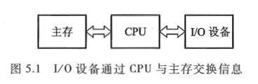

这种交换方式延续了相当长的时间。当时的 I/O 设备具有以下几个特点。

- 每个 I/O 设备都必须配有一套独立的逻辑电路与 CPU 相连，用来实现 I/O 设备与主机之间的信息交换，因此线路十分散乱、庞杂。
- 输入输出过程是穿插在 CPU 执行程序过程之中进行的，当 I/O 设备与主机交换信息时，CPU 不得不停止各种运算，因此，I/O 设备与 CPU 是按串行方式工作的，极浪费时间。
- 每个 I/O 设备的逻辑控制电路与 CPU 的控制器紧密构成一个不可分割的整体，它们彼此依赖，相互牵连，因此，欲增添、撤减或更换 I/O 设备是非常困难的。

在这个阶段中, 计算机系统硬件价格十分昂贵, 机器运行速度不高, 配置的 I/O 设备不多, 主机与 I/O 设备之间交换的信息量也不大, 计算机应用尚未普及。

### 2. 接口模块和 DMA 阶段

这个阶段 I/O 设备通过接口模块与主机连接, 计算机系统采用了总线结构, 如图 5.2 所示。

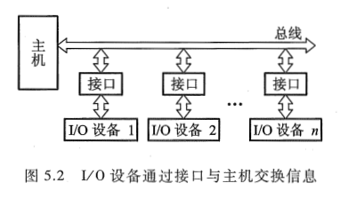

通常，在接口中都设有数据通路和控制通路。数据经过接口既起到缓冲作用，又可完成串-并变换。控制通路用以传送 CPU 向 I/O 设备发出的各种控制命令，或使 CPU 接受来自 I/O 设备的反馈信号。许多接口还能满足中断请求处理的要求，使 I/O 设备与 CPU 可按并行方式工作，大大地提高了 CPU 的工作效率。采用接口技术还可以使多台 I/O 设备分时占用总线，使多台 I/O 设备互相之间也可实现并行工作方式，有利于整机工作效率的提高。

虽然这个阶段实现了 CPU 和 I/O 设备并行工作，但是在主机与 I/O 设备交换信息时，CPU 要中断现行程序，即 CPU 与 I/O 设备还不能做到绝对的并行工作。

为了进一步提高 CPU 的工作效率，又出现了直接存储器存取（Direct Memory Access，DMA）技术，其特点是 I/O 设备与主存之间有一条直接数据通路，I/O 设备可以与主存直接交换信息，使 CPU 在 I/O 设备与主存交换信息时能继续完成自身的工作，故资源利用率得到了进一步提高。

### 3. 具有通道结构的阶段

在小型和微型计算机中，采用 DMA 方式可实现高速 I/O 设备与主机之间成组数据的交换，但在大中型计算机中，I/O 设备配置繁多，数据传送频繁，若仍采用 DMA 方式会出现一系列问题。

① 如果每台 I/O 设备都配置专用的 DMA 接口，不仅增加了硬件成本，而且为了解决众多 DMA 接口同时访问主存的冲突问题，会使控制变得十分复杂。

②CPU 需要对众多的 DMA 接口进行管理，同样会占用 CPU 的工作时间, 而且因频繁地进入周期挪用阶段, 也会直接影响 CPU 的整体工作效率(详见 5.6 节)。

因此在大中型计算机系统中, 采用 I/O 通道的方式来进行数据交换。图 5.3 所示为具有通道结构的计算机系统。

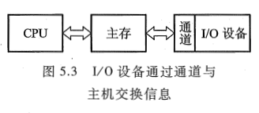

通道是用来负责管理 I/O 设备以及实现主存与 I/O 设备之间交换信息的部件, 可以视为一种具有特殊功能的处理器。通道有专用的通道指令, 能独立地执行用通道指令所编写的输入输出程序, 但不是一个完全独立的处理器。它依据 CPU 的 I/O 指令进行启动、停止或改变工作状态, 是从属于 CPU 的一个专用处理器。依赖通道管理的 I/O 设备在与主机交换信息时, CPU 不直接参与管理, 故提高了 CPU 的资源利用率。

### 4. 具有 I/O 处理机的阶段

输入输出系统发展到第四阶段, 出现了 I/O 处理机。I/O 处理机又称为外围处理机(Peripheral Processor), 它基本独立于主机工作, 既可完成 I/O 通道要完成的 I/O 控制, 又可完成码制变换, 格式处理, 数据块检错、纠错等操作。具有 I/O 处理机的输入输出系统与 CPU 工作的并行性更高, 这说明 I/O 系统对主机来说具有更大的独立性。

本章主要介绍第二阶段的输入输出系统, 有关通道及 I/O 处理机管理 I/O 系统的内容将在 "计算机体系结构" 课程中讲述。

## 二、输入输出系统的组成

输入输出系统由 I/O 软件和 I/O 硬件两部分组成。

### 1. I/O 软件

输入输出系统软件的主要任务如下：

① 将用户编制的程序（或数据）输入主机内。

② 将运算结果输送给用户。

③ 实现输入输出系统与主机工作的协调等。

不同结构的输入输出系统所采用的软件技术差异很大。一般而言，当采用接口模块方式时，应用机器指令系统中的 I/O 指令及系统软件中的管理程序便可使 I/O 设备与主机协调工作。当采用通道管理方式时，除 I/O 指令外，还必须有通道指令及相应的操作系统。即使都采用操作系统，不同的机器其操作系统的复杂程度差异也是很大的。

（1）I/O 指令

I/O 指令是机器指令的一类，其指令格式与其他指令既有相似之处，又有所不同。I/O 指令可以和其他机器指令的字长相等，但它还应该能反映 CPU 与 I/O 设备交换信息的各种特点, 如它必须反映出对多台 I/O 设备的选择, 以及在完成信息交换过程中, 对不同设备应做哪些具体操作等。图 5.4 示意了 I/O 指令的一般格式。

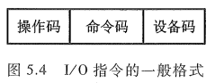

图中的操作码字段可作为 I/O 指令与其他指令（如访存指令、算逻指令、控制指令等）的判别代码；命令码体现 I/O 设备的具体操作；设备码是多台 I/O 设备的选择码。

I/O 指令的命令码一般可表述如下几种情况。

- 将数据从 I/O 设备输入主机。例如，将某台设备接口电路的数据缓冲寄存器中的数据读入 CPU 的某个寄存器(如累加器 ACC)。
- 将数据从主机输出至 I/O 设备。例如, 将 CPU 的某个寄存器(如 ACC)中的数据写入某台设备接口电路的数据缓冲寄存器内。
- 状态测试。利用命令码检测各个 I/O 设备所处的状态是 "忙"(Busy)还是 "准备就绪"(Ready), 以便决定下一步是否可进入主机与 I/O 设备交换信息的阶段。
- 形成某些操作命令。不同 I/O 设备与主机交换信息时, 需要完成不同的操作。例如, 磁带机需要正转、反转、读、写、写文件结束等; 对于磁盘驱动器, 需要读扇区、写扇区、找磁道、扫描记录标识符等。这里值得注意的是, 在第 4 章中, 按磁盘机和磁带机的功能来看, 它们都被视为存储系统的一部分; 但从管理角度来看, 调用这些设备与调用其他 I/O 设备又有共同之处。因此, 本章又将它们视为 I/O 设备。

I/O 指令的设备码相当于设备的地址。只有对繁多的 I/O 设备赋以不同的编号, 才能准确选择某台设备与主机交换信息。

（2）通道指令

通道指令是对具有通道的 I/O 系统专门设置的指令, 这类指令一般用以指明参与传送(写入或读取)的数据组在主存中的首地址; 指明需要传送的字节数或所传送数据组的末地址; 指明所选设备的设备码及完成某种操作的命令码。这类指令的位数一般较长, 如 IBM370 机的通道指令为 64 位。

通道指令又称为通道控制字(Channel Control Word, CCW), 它是通道用于执行 I/O 操作的指令, 可以由管理程序存放在主存的任何地方, 由通道从主存中取出并执行。通道程序即由通道指令组成, 它完成某种外围设备与主存之间传送信息的操作。例如, 将磁带记录区的部分内容送到指定的主存缓冲区内。

通道指令是通道自身的指令, 用来执行 I/O 操作, 如读、写、磁带走带及磁盘找道等。而 I/O 指令是 CPU 指令系统的一部分, 是 CPU 用来控制输入输出操作的指令, 由 CPU 译码后执行。在具有通道结构的计算机中, I/O 指令不实现 I/O 数据传送, 主要完成启、停 I/O 设备, 查询通道和 I/O 设备的状态及控制通道所做的其他操作。具有通道指令的计算机, 一旦 CPU 执行了启动 I/O 设备的指令, 就由通道来代替 CPU 对 I/O 设备的管理。

### 2. I/O 硬件

输入输出系统的硬件组成是多种多样的, 在带有接口的 I/O 系统中, 一般包括接口模块及 I/O 设备两大部分。图 5.2 中的接口电路实际上包含许多数据传送通路和有关数据, 还包含控制信号通路及其相应的逻辑电路(详见 5.3 节)。

图 5.5 是具有通道的 I/O 系统的示意图。

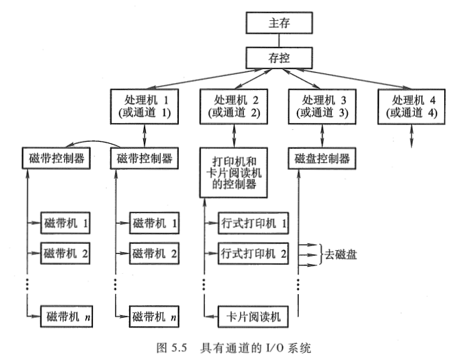

一个通道可以和一个以上的设备控制器相连, 一个设备控制器又可以控制若干台同一类型的设备。例如, IBM360 系统的一个通道可以连接 8 个设备控制器, 一个设备控制器又与 8 台设备相连, 因此, 一个通道可以管理 64 台设备。如果一台计算机有 6 个通道, 便可带动 384 台设备。当然, 实际上由于设备利用率和通道的频带影响, 主机不可能带动这么多的设备。

## 三、I/O 设备与主机的联系方式

I/O 设备与主机交换信息和 CPU 与主存交换信息相比, 有许多不同点。例如, CPU 如何对 I/O 设备编址; 如何寻找 I/O 设备号; 信息传送是逐位串行还是多位并行; I/O 设备与主机以什么方式进行联络, 使它们彼此都知道对方处于何种状态; I/O 设备与主机是怎么连接的, 等等。这一系列问题统称为 I/O 设备与主机的联系方式。

### 1. I/O 设备编址方式

通常将 I/O 设备码看作地址码, 对 I/O 地址码的编址可采用两种方式: **统一编址** 或 **不统一编址**。

统一编址就是将 I/O 地址看作存储器地址的一部分。例如, 在 64K 地址的存储空间中, 划出 8K 地址作为 I/O 设备的地址, 凡是在这 8K 地址范围内的访问, 就是对 I/O 设备的访问, 所用的指令与访存指令相似。不统一编址就是指 I/O 地址和存储器地址是分开的, 所有对 I/O 设备的访问必须有专用的 I/O 指令。显然统一编址占用了存储空间, 减少了主存容量, 但无须专用的 I/O 指令。不统一编址由于不占用主存空间, 故不影响主存容量, 但需设 I/O 专用指令。因此, 设计机器时, 需根据实际情况权衡考虑选取何种编址方式。

当设备通过接口与主机相连时, CPU 可以通过接口地址来访问 I/O 设备。

### 2. 设备寻址

由于每台设备都赋予一个设备号, 因此, 当要启动某一设备时, 可由 I/O 指令的设备码字段直接指出该设备的设备号。通过接口电路中的设备选择电路，便可选中要交换信息的设备。

### 3. 传送方式

在同一瞬间，n 位信息同时从 CPU 输出至 I/O 设备，或由 I/O 设备输入 CPU，这种传送方式称为 **并行传送**。其特点是传送速度较快，但要求数据线多。例如，16 位信息并行传送需要 16 根数据线。

若在同一瞬间只传送一位信息，在不同时刻连续逐位传送一串信息，这种传送方式称为 **串行传送**。其特点是传送速度较慢，但只需一根数据线和一根地线。当 I/O 设备与主机距离很远时，采用串行传送较为合理，例如远距离数据通信。

不同的传送方式需配置不同的接口电路，如并行传送接口、串行传送接口或串并联用的传送接口等。用户可按需要选择合适的接口电路。

### 4. 联络方式

不论是串行传送还是并行传送，I/O 设备与主机之间必须互相了解彼此当时所处的状态，如是否可以传送、传送是否已结束等。这就是 I/O 设备与主机之间的联络问题。按 I/O 设备工作速度的不同，可分为三种联络方式。

（1）立即响应方式

对于一些工作速度十分缓慢的 I/O 设备，如指示灯的亮与灭、开关的通与断、A/D 转换器缓变信号的输入等，当它们与 CPU 发生联系时，通常都已使其处于某种等待状态，因此，只要 CPU 的 I/O 指令一到，它们便立即响应，故这种设备无须特殊联络信号，称为立即响应方式。

（2）异步工作采用应答信号联络

当 I/O 设备与主机工作速度不匹配时，通常采用异步工作方式。这种方式在交换信息前，I/O 设备与 CPU 各自完成自身的任务，一旦出现联络信号，彼此才准备交换信息。图 5.6 示意了并行传送的异步联络方式。

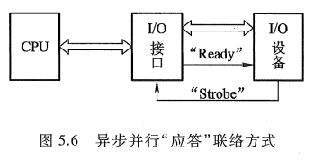

如图 5.6 所示，当 CPU 将数据输出到 I/O 接口后，接口立即向 I/O 设备发出一个 "Ready"（准备就绪）信号，告诉 I/O 设备可以从接口内取数据。I/O 设备收到 "Ready" 信号后，通常便立即从接口中取出数据，接着便向接口回发一个 "Strobe" 信号，并让接口转告 CPU，接口中的数据已被取走，CPU 还可继续向此接口送数据。同理，倘若 I/O 设备需向 CPU 传送数据，则先由 I/O 设备向接口送数据，并向接口发 "Strobe" 信号，表明数据已送出。接口接到联络信号后便通知 CPU 可以取数，一旦数据被取走，接口便向 I/O 设备发 "Ready" 信号，通知 I/O 设备，数据已被取走，尚可继续送数据。这种一应一答的联络方式称为异步联络。

图 5.7 示意了串行传送的异步联络方式。

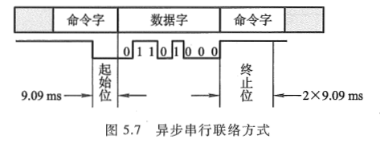

I/O 设备与 CPU 双方设定一组特殊标记，用 "起始" 和 "终止" 来建立联系。图中 9.09ms 的低电平表示 "起始"，又用 2x9.09ms 的高电平表示 "终止"。

（3）同步工作采用同步时标联络

同步工作要求 I/O 设备与 CPU 的工作速度完全同步。例如，在数据采集过程中，若外部数据以 2400bps 的速率传送至接口，则 CPU 也必须以 1/2400s 的速率接收每一位数。这种联络互相之间还得配有专用电路，用以产生同步时标来控制同步工作。

### 5. I/O 设备与主机的连接方式

I/O 设备与主机的连接方式通常有两种：辐射式和总线式。图 5.8 和图 5.2 分别示意了这两种方式。

<table style="border: none;">
  <tbody>
	<tr style="border: none;">
	<td width="50%" align="center" style="border: none;">  </td> <td width="50%" align="center" style="border: none; "> 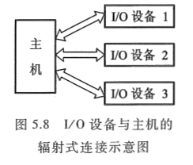 </td>
	</tr>
  </tbody>
</table>

采用辐射式连接方式时，要求每台 I/O 设备都有一套控制线路和一组信号线，因此所用的器件和连线较多，对 I/O 设备的增删都比较困难。这种连接方式大多出现在计算机发展的初级阶段。

图 5.2 所示的是总线连接方式，通过一组总线（包括地址线、数据线、控制线等），将所有的 I/O 设备与主机连接。这种连接方式是现代大多数计算机系统所采用的方式。

## 四、I/O 设备与主机信息传送的控制方式

I/O 设备与主机交换信息时, 共有 5 种控制方式: 程序查询方式、程序中断方式、直接存储器存取方式(DMA)、I/O 通道方式、I/O 处理机方式。本节主要介绍前 3 种方式, 后两种方式在 5.1.1 节已进行了一般介绍, 更详尽的内容将由 "计算机体系结构" 课程讲述。

### 1. 程序查询方式

程序查询方式是由 CPU 通过程序不断查询 I/O 设备是否已做好准备, 从而控制 I/O 设备与主机交换信息。采用这种方式实现主机和 I/O 设备交换信息, 要求 I/O 接口内设置一个能反映 I/O 设备是否准备就绪的状态标记, CPU 通过对此标记的检测, 可得知 I/O 设备的准备情况。图 5.9 所示为 CPU 从某一 I/O 设备读数据块(例如从磁带上读一记录块)至主存的查询方式流程。

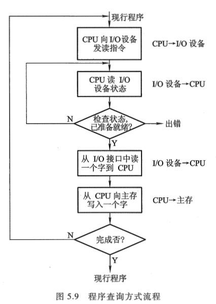

当现行程序需启动某 I/O 设备工作时, 即将此程序流程插入运行的程序中。由图中可知, CPU 启动 I/O 设备后便开始对 I/O 设备的状态进行查询。若查得 I/O 设备未准备就绪, 就继续查询; 若查得 I/O 设备准备就绪, 就将数据从 I/O 接口送至 CPU, 再由 CPU 送至主存。这样一个字一个字地传送, 直至这个数据块的数据全部传送结束, CPU 又重新回到原现行程序。

由这个查询过程可见, 只要一启动 I/O 设备, CPU 便不断查询 I/O 设备的准备情况, 从而终止了原程序的执行。CPU 在反复查询过程中, 犹如就地 "踏步"。另一方面, I/O 设备准备就绪后, CPU 要一个字一个字地从 I/O 设备取出, 经 CPU 送至主存, 此刻 CPU 也不能执行原程序, 可见这种方式使 CPU 和 I/O 设备处于串行工作状态, CPU 的工作效率不高。

### 2. 程序中断方式

倘若 CPU 在启动 I/O 设备后, 不查询设备是否已准备就绪, 继续执行自身程序, 只是当 I/O 设备准备就绪并向 CPU 发出中断请求后才予以响应, 这将大大提高 CPU
的工作效率。图 5.10 示意了这种方式。

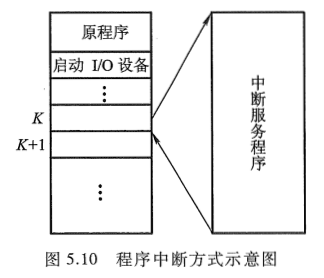

由图中可见, CPU 启动 I/O 设备后仍继续执行原程序, 在第 K 条指令执行结束后, CPU 响应了 I/O 设备的请求，中断了现行程序，转至中断服务程序，待处理完后又返回到原程序断点处，继续从第 K+1 条指令往下执行。由于这种方式使原程序中断了运行，故称为程序中断方式。

图 5.11 示意了采用程序中断方式从 I/O 设备读数据块到主存的程序流程。

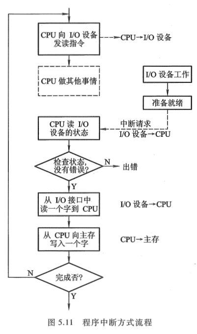

由图中可见, CPU 向 I/O 设备发读指令后, 仍在处理其他事情(如继续在算题), 当 I/O 设备向 CPU 发出请求后, CPU 才从 I/O 接口读一个字经 CPU 送至主存(这是通过执行中断服务程序完成的)。如果 I/O 设备的一批数据(一个数据块的全部数据)尚未传送结束时, CPU 再次启动 I/O 设备, 命令 I/O 设备再做准备, 一旦又接收到 I/O 设备中断请求时, CPU 重复上述中断服务过程, 这样周而复始, 直至一批数据传送完毕。

显然, 程序中断方式在 I/O 设备进行准备时, CPU 不必时刻查询 I/O 设备的准备情况, 不出现 "踏步" 现象, 即 CPU 执行程序与 I/O 设备做准备是同时进行的, 这种方式和 CPU 与 I/O 设备是串行工作的程序查询方式相比, CPU 的资源得到了充分的利用。图 5.12(a)、(b)分别示意了这两种方式 CPU 的工作效率。

当然, 采用程序中断方式, CPU 和 I/O 接口不仅在硬件方面需增加相应的电路, 而且在软件方面还必须编制中断服务程序, 这方面内容将后面继续学习。

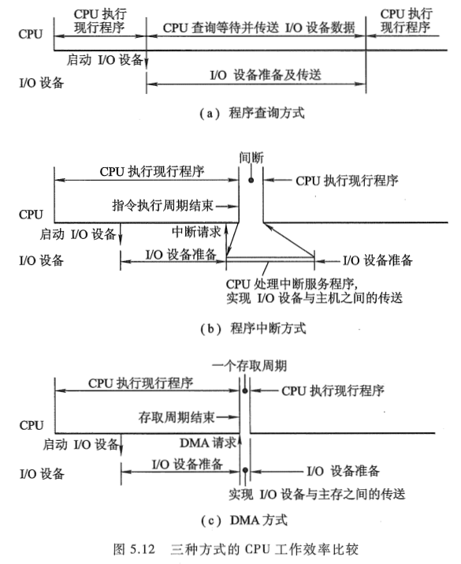

### 3. DMA 方式
虽然程序中断方式消除了程序查询方式的 "踏步" 现象，提高了 CPU 资源的利用率，但是 CPU 在响应中断请求后，必须停止现行程序而转入中断服务程序，并且为了完成 I/O 设备与主存交换信息，还不得不占用 CPU 内部的一些寄存器，这同样是对 CPU 资源的消耗。如果 I/O 设备能直接与主存交换信息而不占用 CPU，那么，CPU 的资源利用率显然又可进一步提高，这就出现了直接存储器存取（DMA）的方式。

在 DMA 方式中，主存与 I/O 设备之间有一条数据通路，主存与 I/O 设备交换信息时，无须调用中断服务程序。若出现 DMA 和 CPU 同时访问主存，CPU 总是将总线占有权让给 DMA，通常把 DMA 的这种占有称为窃取或挪用。窃取的时间一般为一个存取周期，故又把 DMA 占用的存取周期窃取周期或挪用周期。而且，在 DMA 窃取存取周期时，CPU 尚能继续做内部操作（如乘法运算）。可见，与程序查询和程序中断方式相比，DMA 方式进一步提高了 CPU 的资源利用率。

图 5.12（c）示意了 DMA 方式的 CPU 效率。当然，采用 DMA 方式时，也需要增加必要的 DMA 接口电路。有关 DMA 方式的详细内容将在后面继续学习。
