<!-- more -->

## 一、概述

中央处理器和主存构成了主机, 除主机外的大部分硬件设备都可称为 I/O 设备或外部设备, 或外围设备, 简称 **外设**。计算机系统没有输入输出设备, 就如计算机系统没有软件一样, 是毫无意义的。

随着计算机技术的发展, I/O 设备在计算机系统中的地位越来越重要, 其成本在整个系统中所占的比重也越来越大。早期的计算机系统主机结构简单、速度慢、应用范围窄, 配置的 I/O 设备种类有限, 数量不多, I/O 设备价格仅占整个系统价格的几个百分点。现代的计算机系统 I/O 设备向多样化、智能化方向发展, 品种繁多, 性能良好, 其价格往往已占到系统总价的 80%左右。

I/O 设备的组成通常可用图 5.13 点画线框内的结构来描述。

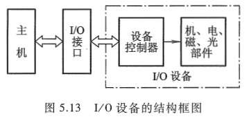

图 5.13 中的设备控制器用来控制 I/O 设备的具体动作, 不同的 I/O 设备完成的控制功能也不同。机、电、磁、光部件与具体的 I/O 设备有关, 即 I/O 设备的具体结构大致与机、电、磁、光的工作原理有关。这一小节主要介绍有关设备控制器的内容, 要求读者能理解 I/O 设备的工作原理。现代的 I/O 设备一般还通过接口与主机联系, 至于接口的详细内容将在 [LV002-IO 设备](/sdoc/principle-of-computer/hardware-structure/io-system/126b0edbe66a3d1291210572) 节中讲述。

I/O 设备大致可分为三类。

（1）人机交互设备

它是实现操作者与计算机之间互相交流信息的设备, 能将人体五官可识别的信息转换成机器可识别的信息, 如键盘、鼠标、手写板、扫描仪、摄像机、语音识别器等。反之, 另一类是将计算机的处理结果信息转换为人们可识别的信息, 如打印机、显示器、绘图仪、语音合成器等。

（2）计算机信息的存储设备

系统软件和各种计算机的有用信息, 其信息量极大, 需存储保留起来。存储设备多数可作为计算机系统的辅助存储器, 如磁盘、光盘、磁带等。

（3）机-机通信设备

它是用来实现一台计算机与其他计算机或与其他系统之间完成通信任务的设备。例如, 两台计算机之间可利用电话线进行通信, 它们可以通过调制解调器(Modem)完成。用计算机实现实时工业控制, 可通过 D/A、A/D 转换设备来完成。计算机与计算机及其他系统还可通过各种设备实现远距离的信息交换。

表 5.1 列出了现代常用的 I/O 设备的名称及用途。

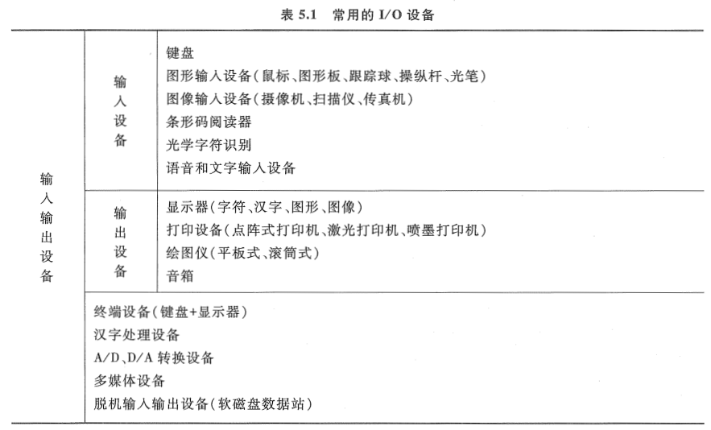

本节主要介绍人机交互设备, 可分为输入设备和输出设备两种, 并且有的设备既具有输入功能, 又具有输出功能。关于存储设备已在第 4 章介绍过, 有关机-机通信设备将在 "计算机网络" 课程中讲述。

## 二、输入设备

**输入设备完成输入程序、数据和操作命令等功能**。当实现人工输入时, 往往与显示器联用, 以便检查和修正输入时的错误。也可以利用软盘、磁带等脱机录入的介质进行输入。目前已可以实现语音直接输入。

### 1. 键盘

键盘是应用最普遍的输入设备。可以通过键盘上的各个键，按某种规范向主机输入各种信息, 如汉字、外文、数字等。键盘由一组排列成阵列形式的按键开关组成, 如图 5.14 所示。键盘上的按键分字符键和控制功能键两类。字符键包括字母、数字和一些特殊符号键; 控制功能键是产生控制字符的键(由软件系统定义功能), 还有控制光标移动的光标控制键以及用于插入或消除字符的编辑键等。

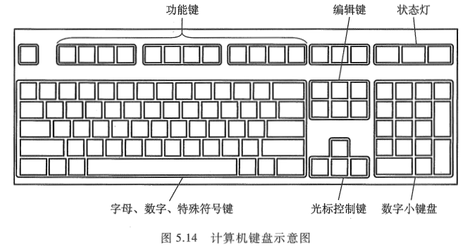

键盘输入信息分为以下 3 个步骤。

① 按下一个键。

② 查出按下的是哪个键。

③ 将此键翻译成 ASCII 码（参见附录 5A），由计算机接收。

按键是由人工操作的，确认按下的是哪一个键可用硬件或软件的方法来实现。

采用硬件确认哪个键被按下的方法称为编码键盘法，它由硬件电路形成对应被按键的唯一编码信息。为了便于理解，下面以 8x8 键盘为例，说明硬件编码键盘法是如何通过对键盘扫描来识别按键所对应的 ASCII 码的，其原理如图 5.15 所示。

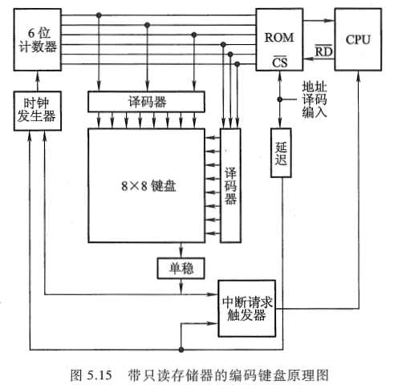

图 5.15 中的 6 位计数器经两个八选一的译码器对键盘扫描。若键未按下，则扫描将随着计数器的循环计数而反复进行。一旦扫描发现某键被按下，则键盘通过一个单稳电路产生一个脉冲信号。该信号一方面使计数器停止计数，用以终止扫描，此刻计数器的值便与所按键的位置相对应，该值可作为只读存储器（ROM）的输入地址，而该地址中的内容即为所按键的 ASCII 码。可见只读存储器存储的内容便是对应各个键的 ASCII 码。另一方面，此脉冲经中断请求触发器向 CPU 发中断请求，CPU 响应请求后便转入中断服务程序，在中断服务程序的执行过程中，CPU 通过执行读入指令，将计数器所对应的 ROM 地址中的内容，即所按键对应的 ASCII 码送入 CPU 中。CPU 的读入指令既可作为读出 ROM 内容的片选信号，而且经一段延迟后，又可用来清除中断请求触发器，并重新启动 6 位计数器开始新的扫描。

采用软件判断键是否按下的方法称为 **非编码键盘法**，这种方法利用简单的硬件和一套专用键盘编码程序来判断按键的位置，然后由 CPU 将位置码经查表程序转换成相应的编码信息。这种方法结构简单，但速度比较慢。

在按键时往往会出现键的机械抖动, 容易造成误动。为了防止形成误判, 在键盘控制电路中专门设有硬件消抖电路, 或采取软件技术, 以便有效地消除因键的抖动而出现的错误。

此外, 为了提高传输的可靠性, 可采用奇偶校验码(见附录 5C)来验证信息的准确性。随着大规模集成电路技术的发展, 厂商已提供了许多种可编程键盘接口芯片, 如 Intel 8279 就是可编程键盘/显示接口芯片, 用户可以随意选择。近年来又出现了智能键盘, 如 IBMPC 的键盘内装有 Intel 8048 单片机, 用它可完成键盘扫描、键盘监测、消除重键、自动重发、扫描码的缓冲以及与主机之间的通信等任务。

### 2. 鼠标

鼠标(Mouse)是一种手持式的定位设备, 由于它拖着一根长线与接口相连, 外形有点像老鼠, 故取名为鼠标。常用的鼠标有两种: 一种是机械式的, 它的底座装有一个金属球, 球在光滑表面上摩擦使球转动, 球与 4 个方向的电位器接触, 可测得上下左右 4 个方向的相对位移量, 通过显示器便可确定欲寻求的方位。另一种是光电式鼠标, 它需要与一块画满小方格的长方形金属板配合使用。安装在鼠标底部的光电转换器可以确定坐标点的位置, 同样由显示器显示器所寻找的方位。光电式鼠标比机械式鼠标可靠性高, 但需要增加一块金属板。机械式鼠标可以直接在光滑的桌面上摩擦, 但往往因桌面上的灰尘随金属球滚动带入鼠标内, 致使金属球转动不灵。

### 3. 触摸屏

触摸屏是一种对物体的接触或靠近能产生反应的定位设备。按原理的不同，触摸屏大致可分为 5 类：电阻式、电容式、表面超声波式、扫描红外线式和压感式。

电阻式触摸屏由显示屏上加一个两层高透明度的、并涂有导电物质的薄膜组成。在两层薄膜之间由绝缘支点隔开, 其间隙为 0.0001 英寸, 如图 5.16 所示。

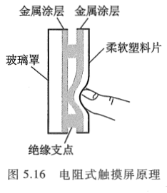

当用户触摸塑料薄膜片时, 涂有金属导电物质的第一层塑料片与挨着玻璃罩上的第二层塑料片(也涂有金属导电物质)接触, 这样根据其接触电阻的大小求得触摸点所在的 x 和 y 坐标位置。

电容式触摸屏是在显示屏幕上加一个内部涂有金属层的玻璃罩。当用户触摸此罩表面时, 与电场建立了电容耦合, 在触摸点产生小电流到屏幕 4 个角, 然后根据 4 个电流大小计算出触摸点的位置。

表面超声波式触摸屏是由一个透明的玻璃罩组成的。在罩的 x 和 y 轴方向都有一个发射和接收压电转换器和一组反射器条, 触摸屏还有一个控制器发送 5MHz 的触发信号给发射、接收转换器, 让它转换成表面超声波, 此超声波在屏幕表面传播。当用手指触摸屏幕时, 在触摸位置上的超声波被吸收, 使接收信号发生变化, 经控制分析和数字转换为 x 和 y 的坐标值。

可见, 任何一种触摸屏都是通过某种物理现象来测得人手触及屏幕上各点的位置, 从而通过 CPU 对此做出响应, 由显示屏再现所需的位置。由于物理原理不同, 体现出各类触摸屏的不同特点及其适用的场合。例如, 电阻式能防尘、防潮, 并可戴手套触摸, 适用于饭店、医院等。电容式触摸屏亮度高, 清晰度好, 也能防尘、防潮, 但不可戴手套触摸, 并且易受温度、湿度变化的影响, 因此, 它适合于游戏机及供公共信息查询系统使用。表面超声波式触摸屏透明、坚固、稳定, 不受温度、湿度变化的影响, 是一种抗恶劣环境的设备。

### 4. 其他输入设备  

在此主要介绍图形、图像的输入设备，有关语音和文字的输入设备不做介绍。
（1）光笔

光笔（Light Pen）的外形与钢笔相似，头部装有一个透镜系统，能把进入的光会聚成一个光点。光笔的后端用导线连到计算机输入电路上。光笔头部附有开关，当按下开关时，进行光检测，光笔便可拾取显示屏上的绝对坐标。光笔与屏幕的光标配合，可使光标跟踪光笔移动，在屏幕上画出图形或修改图形，类似人们用钢笔画图的过程。

（2）画笔与图形板

画笔（Stylus）同样为笔状，但必须配合图形板（Tablet）使用。当画笔接触到图形板上的某一位置时，画笔在图形板上的位置坐标就会自动传送到计算机中，随着画笔在板上的移动可以画出图形。图形板和画笔构成二维坐标的输入设备，主要用于输入工程图等。将图纸贴在图形板上，画笔沿着图纸上的图形移动，即可输入工程图。

图形板是一种二维的 A/D 变换器, 又称为数字化板。坐标的测量方法有电阻式、电容式、电磁感应式和超声波式几种。

画笔与光笔都是输入绝对坐标, 而鼠标只能输入相对坐标。

（3）图像输入设备

最直接的图像输入设备是摄像机(Camera), 它能摄取任何地点、任何环境下的自然景物和各类物体, 经数字量化后变成数字图像存入磁带或磁盘。

如果图像已记录在某种介质上, 则可用读出装置来读出图像。例如, 记录在录像带上的图像可用录放机读出, 再将视频信号经图像板量化输入计算机中。记录在数字磁带上的遥感图像可直接从磁带输入计算机中。如果把纸上的图像输入计算机内, 则可用摄像机直接摄入, 或用装有 CCD(电荷耦合器件)的图文扫描仪(Scanner)或图文传真机送人计算机。还有一种专用的光机扫描鼓, 也可把纸上的图像直接转换成数字图像存入计算机。

## 三、输出设备

### 1. 显示设备

#### 1.1 概述

以可见光的形式传递和处理信息的设备称为显示设备。它是应用最广的人机通信设备。显示设备种类繁多，按显示器件划分，有阴极射线管（Cathode RayTube，CRT）显示器、液晶显示器（Liquid Crystal Display，LCD）、等离子显示器（PD）等；按显示内容分有字符显示器、图形显示器和图像显示器；按显示器功能分有普通显示器和显示终端（终端是由显示器和键盘组成的一套独立完整的输入输出设备，它可以通过标准接口连接到远程主机，其结构比显示器复杂得多）两类。在 CRT 显示器中，按扫描方式不同，可分为光栅扫描和随机扫描两种；按分辨率不同，又可分为高分辨率和低分辨率的显示器。

CRT 是目前应用最广泛的显示器件，既可作为字符显示器，又可作为图像、图形显示器。

CRT 是一个漏斗形的电真空器件，由电子枪、荧光屏及偏转装置组成，如图 5.17 所示。

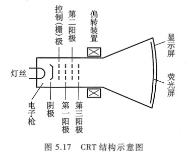

电子枪包括灯丝、阴极、控制(栅)极、第一阳极(加速阳极)、第二阳极(聚焦极)和第三阳极。当灯丝加热后, 阴极受热而发射电子, 电子的发射量和发射速度受控制极控制。电子经加速、聚焦而形成电子束, 在第三阳极形成的均匀空间电位作用下, 使电子束高速射到荧光屏上, 荧光屏上的荧光粉受电子束的轰击产生亮点, 其亮度取决于电子束的轰击速度、电子束电流强度和荧光粉的发光效率。电子束在偏转系统控制下, 可在荧光屏的不同位置产生光点, 由这些光点可以组成各种所需的字符、图形和图像。

彩色 CRT 的原理与单色 CRT 的原理是相似的, 只是对彩色 CRT 而言, 通常用 3 个电子枪发射的电子束, 经定色机构, 分别触发红、绿、蓝三种颜色的荧光粉发光, 按三基色迭加原理形成彩色图像。

CRT 荧光屏尺寸大小是按屏幕对角线长度表示, 普通字符显示器的 CRT 有 12 英寸和 14 英寸两种, 图形、图像显示器的 CRT 有 15 英寸、17 英寸和 19 英寸, 目前还出现了 21 英寸大屏幕 CRT。

分辨率和灰度等级是 CRT 的两个重要技术指标。分辨率是指显示屏面能表示的像素点数, 分辨率越高, 图像越清晰。灰度等级是指显示像素点相对亮暗的级差, 在彩色显示器中它还表现为色彩的差别。

CRT 荧光屏发光是由电子束轰击荧光粉产生的，其发光亮度一般只能维持几十毫秒。为了使人眼能看到稳定的图像，电子束必须在图像变化前不断地进行整个屏幕的重复扫描，这个过程称为刷新。每秒刷新的次数称为刷新频率，一般刷新频率大于 30 次/秒时，人眼就不会感到闪烁。在显示设备中，通常都采用电视标准，每秒刷新 50 帧（Frame）图像。

为了不断地刷新，必须把瞬时图像保存在存储器中，这种存储器称为 **刷新存储器**，又称帧存储器或视频存储器（VRAM）。刷新存储器的容量由图像分辨率和灰度等级决定。分辨率越高，灰度等级越多，需要的刷新存储器容量就越大。例如，分辨率为 512x512 像素，灰度等级为 256 的图像，其刷新存储器的容量需达 512x512x8b，即为 256KB。此外，刷新存储器的存取周期必须与刷新频率相匹配。

计算机的显示器大多采用光栅扫描方式。所谓 **光栅扫描**，是指电子束在荧光屏上按某种轨迹运动，光栅扫描是从上至下顺序扫描，可分为逐行扫描和隔行扫描两种。一般 CRT 都采用与电视相同的隔行扫描，即把一帧图像分为奇数场（由 1、3、5 等奇数行组成）和偶数场（由 0、2、4、6 等偶数行组成），一帧图像需扫描 625 行，则奇数场和偶数场各扫描 312.5 行。扫描顺序是先扫描偶数场，再扫描奇数场，交替进行，每秒显示 50 场。

#### 1.2 字符显示器

字符显示器是计算机系统中最基本的输出设备，它通常由 CRT 控制器和显示器（CRT）组成，图 5.18 示意了它的原理框图。

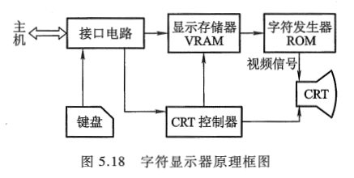

1）显示存储器（刷新存储器）VRAM

显示存储器存放欲显示字符的 ASCII 码，其容量与显示屏能显示的字符个数有关。如显示屏上能显示 80 列 x25 行 = 2000 个字符，则显示存储器的容量应为 2000x8（字符编码 7 位，闪烁 1 位), 每个字符所在存储单元的地址与字符在荧光屏上的位置一一对应, 即显示存储器单元的地址顺序与屏面上每行从左到右, 按行从上到下的显示器位置对应。

2）字符发生器

由于荧光屏上的字符由光点组成, 而显示存储器中存放的是 ASCII 码, 因此, 必须有一个部件能将每个 ASCII 码转变为一组 5x7 或 7x9 的光点矩阵信息。具有这种变换功能的部件称为 **字符发生器**, 它实质是一个 ROM。图 5.19 是一个对应 7x9 光点矩阵的字符发生器原理框图。

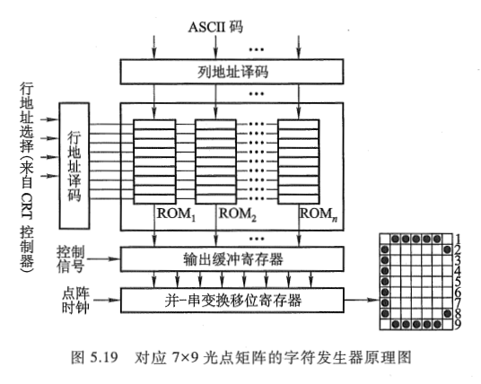

图中 ROMi 的个数与显示器所能显示的字符种类有关, 例如, 能显示 97 个字符, 则 i = 1~97。每个 ROMi 共有 9 个单元(对应 9 行), 每个单元中存放 7 位光点代码。如 "C" 的 9 个单元中, 所存储的 9 组光点代码分别为 0111110、1000001、1000000、1000000、1000000、1000000、1000000、1000001、0111110(设 "1" 对应亮点, "0" 对应暗点)。字符发生器工作时, 由显示存储器输出的 ASCII 码作为 ROM 的高位地址(列地址), 而 ROM 的低位地址(行地址)来自 CRT 控制器的光栅地址计数器。ROM 的输出并行加载到移位寄存器中, 然后在点阵时钟控制下, 移位输出形成视频信号，作为 CRT 的亮度控制信号。显示器在水平同步、垂直同步（来自 CRT 控制器）和视频信
号（来自字符发生器）的共同作用下，连续不断地进行屏幕刷新，就能显示稳定而不消失的字符图像。

3）CRT 控制器

CRT 控制器通常都做成专用芯片, 它可接收来自 CPU 的数据和控制信号, 并给出访问显示存储器的地址和访问字符发生器的光栅地址, 还能给出 CRT 所需的水平同步和垂直同步信号等。该芯片的定时控制电路要对显示每个字符的点(光点)数、每排(字符行)字(7x9 点阵)数、每排行(光栅行)数和每场排数计数。因此, 芯片中需配置点计数器、字计数器(水平地址计数器)、行计数器(光栅地址计数器)和排计数器(垂直地址计数器), 这些计数器用来控制显示器的逐点、逐行、逐排、逐屏的刷新显示, 还可以控制对显示存储器的访问和屏幕间扫描的同步。

点计数器记录每个字的横向光点, 因每个字符占 7 个光点, 字符间留一个光点作间隙, 共占 8 个光点, 故点计数器为模 8 计数器, 计满 8 个点向字计数器进位。字计数器用来记录屏幕上每排的字数, 若每排能显示 80 个字, 考虑到屏幕两边失真较大, 各空出 5 个字符位置, 再加上光栅回扫消隐时间(此段时间屏幕不显示)的需要, 占 20 个显示字符的时间, 总共 80+10+20 = 110, 则字计数器计满 110 就归零, 并向行计数器进位。行计数器用来记录每个字(7x9 点阵)的 9 行光栅地址, 外加每排字的 3 行间隔, 总共 9+3 = 12, 即行计数器计满 12 归零, 并向排计数器进位。排计数器用来记录每屏字符的排数, 若能显示 25 排, 再考虑到屏幕上下失真空一排, 则共 26 排, 即排计数器计满 26 归零, 表示一场扫描结束。

字计数器反映了光栅扫描的水平方向, 排计数器反映了光栅扫描的垂直方向, 将这两个方向的同步信号输至 CRT 的 x 和 y 偏转线圈, 便可达到按指定位置进行显示的要求。值得注意的是, CRT 的扫描方式不是一个字符一个字符地扫描, 而是每次对一排字符中所有字符的同一行进行扫描, 并显示亮点。例如, 某排字符为 WELCOME, 其显示次序是: 先从显示存储器中读出 "W" 字符, 送至字符发生器, 并从字符发生器中扫描选出 "W" 字符的第一行光点代码, 于是屏幕上显示出 "W" 字符第一行的 7 个光点代码; 再从显示存储器中读出 "E" 字符并送字符发生器, 又选出 "E" 字符的第一行 7 个光点代码……直到最后一个字符 "E" 的第一行 7 个光点代码显示完毕。接着进行每个字符点阵的第二行 7 个光点代码的扫描……直到该排每个字符的第 9 行光点代码扫描完毕, 则屏幕上完整地显示出 WELCOME 字符。

#### 1.3 图形显示器

图形显示器是用点、线(直线和曲线)、面(平面和曲面)组合成平面或立体图形的显示设备, 并可作平移、比例变化、旋转、坐标变换、投影变换(把三维图形变为二维图形)、透视变换(由一个三维空间向另一个三维空间变换)、透视投影(把透视变换和投影变换结合在一起)、轴侧投影(三面图)、单点透视、两点或三点透视以及隐线处理(观察物体时把看不见的部分去掉)等操作。主要用于计算机辅助设计(CAD)和计算机辅助制造(CAM), 如汽车、飞机、舰船、土建以及大规模集成电路板等的设计制造。

图形显示器经常配有键盘、光笔、鼠标及绘图仪等。

利用 CRT 显示器产生图形有两种方法: 一种是 **随机扫描法**, 另一种是 **光栅扫描法**。

**随机扫描法** 在随机扫描时, 电子束产生图形的过程和人用笔在纸上画图的过程相似, 任何图形的线条都被认为是由许多微小的首尾相接的线段来逼近的, 这些微小的线段称为矢量, 故这种方法又称为矢量法。与此法相对应的显示器称为随机扫描图形显示器, 其缺点是在显示复杂图形时, 会出现闪烁现象。

与 **光栅扫描法** 对应的显示器称为光栅扫描图形显示器。其特点是把对应于屏幕上的每个像素信息都存储在刷新存储器中。光栅扫描时, 读出这些像素来调制 CRT 的灰度, 以便控制屏幕上像素的亮度。同样也需不断地对屏幕进行刷新, 使图形稳定显示。图 5.20 示意了光栅扫描图形显示器的硬件结构框图。

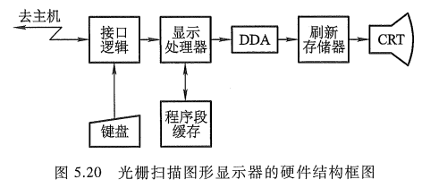

图 5.20 中的程序段缓存用来存储计算机送来的显示文件和图形操作命令, 如图形的局部放大、平移、旋转、比例变换以及图形的检索等。这些操作直接由显示处理器完成。刷新存储器存放一帧图形的形状信息, 它与屏幕上的像素一一对应。例如, 屏幕的分辨率为 1024x1024 像素, 且像素的灰度为 256 级, 则刷新存储器就需要有 1024x1024 个单元, 每个单元的字长为 8 位。可见刷新存储器的容量与分辨率、灰度都有关。

图 5.20 中的 DDA(Difgital Difference Analyses)是数字差分分析器, 它能将显示文件变换成图形形状, 是一种完成数据插补的部件, 能够根据显示文件给出的曲线类型和坐标值, 生成直线、圆、抛物线甚至更复杂的曲线。插补后的数据存入刷新存储器用于显示。此外, 对于数字化的图像数据也可直接输入刷新存储器, 不经 DDA 等图形控制部分便可用来显示图像。

光栅扫描显示器的通用性强, 灰度层次多, 色调丰富, 显示复杂图形时无闪烁, 所形成的图形可以有消除隐藏面、阴影效应和涂色等功能。

#### 1.4 图像显示器  

图形显示器所显示的图形是由计算机用一定的算法形成的点、线、面、阴影等，来自主观世界，故又称为主观图像或计算机图像。

图像显示器所显示的图像（如遥感图像、医学图像、自然景物、新闻照片等）通常来自客观世界，故又称为客观图像。图像显示器是把由计算机处理后的图像（称为数字图像）以点阵的形式显示出来。通常采用光栅扫描方式，其分辨率为 256x256 像素或 512x512 像素，也可与图形显示器兼容, 其分辨率可达 1024x1024 像素, 灰度等级可达 64 至 256 级。

图像显示器除了能存储从计算机输入的图像并在显示屏幕上显示外, 还具有灰度变换、窗口技术、真彩色和伪彩色显示等图像增强技术功能。

- 灰度变换: 可使原始图像的对比度增强或改变。
- 窗口技术: 在图像存储器中, 每个像素有 2048 级灰度值, 而人的肉眼只能分辨到 40 级。如果从 2048 级中开一个小窗口, 并把这窗口范围内的灰度级取出, 使之变换为 64 级显示灰度, 就可以使原来被掩盖的灰度细节充分显示出来。
- 真彩色和伪彩色: 真彩色是指真实图像色彩显示, 采用色还原技术, 如彩色电视; 伪彩色处理是一种图像增强技术。通常肉眼能分辨黑白色只有几十级灰度, 但却能分辨出上千种色彩。利用伪彩色技术可以人为地对黑白图像进行染色, 例如, 把水的灰度染成蓝色, 把植物的灰度染成绿色, 把土地的灰度染成黄色等。

此外, 图像显示器还具有几何处理功能, 如图像放大(按 2、4、8 倍放大)、图像分割或重叠、图像滚动等。

图 5.21 示意了一种简单的图像显示器原理框图。

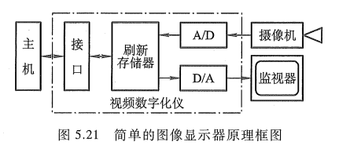

简单的图像显示器只显示由计算机送来的数字图像，图像处理操作在主机中完成，显示器不做任何处理。其中 I/O 接口、刷新存储器、A/D、D/A 转换等组成单独的一部分，称为视频数字化仪（Video Digitizer）或图像输入控制板（简称图像板），其功能是实现连续的视频信号与离散的数字量之间的转换。视频数字化仪接收摄像机的视频输入信号，经 A/D 变换为数字量存入刷新存储器用于显示，并可传送到主机进行图像处理操作。操作后的结果送回刷新存储器，又经 D/A 变为视频信号输出，由监视器（Monitor）显示输出。监视器只包括扫描、视频放大等有关的显示电路和显像管。也可接至电视机的视频输入端，用电视机代替监视器。一般通用计算机配置一块图像板和监视器便能组成一个图像处理系统。

#### 1.5 IBMPC 系列微型计算机的显示标准

IBMPC 系列微型计算机配套的显示系统有两大类。一类是基本显示系统，用于字符/图形显示；另一类是专用显示系统，用于高分辨率图形或图像显示。这里仅介绍几种显示标准。

1）**MDA（Monochrome Display Adapter）标准**

MDA 是单色字符显示标准，采用 9x14 点阵的字符窗口，满屏显示 80 列、25 行字符，对应分辨率为 720x350 像素。MDA 不能兼容图形显示。

2）**CGA(Color Graphics Adapter)标准**

CGA 是彩色图形/字符显示标准, 可兼容字符和图形两种显示方式。在字符方式下, 字符窗口为 8x8 点阵, 故字符质量不如 MDA, 但字符的背景可以选择颜色。在图形方式下, 可以显示 640x200 两种颜色或 320x200 四种颜色的图形。

3） **EGA(Enhanced Graphics Adapter)标准**

EGA 标准集中了 MDA 和 CGA 两个显示标准的优点, 并有所增强。其字符窗口为 8x14 点阵, 字符显示质量优于 CGA 而接近 MDA。图形方式下分辨率为 640x350 像素, 有 16 种颜色, 彩色图形的质量优于 CGA, 且兼容原 CGA 和 MDA 的各种显示方式。

4）**VGA(Video Graphics Array)标准**

VGA 标准在字符方式下, 字符窗口为 9x16 点阵, 在图形方式下分辨率为 640x480 像素、16 种颜色, 或 320x200 像素、256 种颜色, 还有 720x400 像素的文本模式。

近年来显示标准有了很大发展, 改进型的 VGA, 如 SVGA(Super VGA)标准, 分辨率为 800x600 像素、16 种颜色(每像素 4 位)。XGA(Extended Graphics Array)支持 1024x768 像素的分辨率、256 种颜色(每像素 8 位), 或者 640x480 像素的分辨率(每像素 16 位, 或称高色)。XGA-2 进一步支持 1024x768 像素的分辨率(高色, 更高视频)和 1360x1024 像素的分辨率(每像素 4 位,16 种颜色可选)。SXGA(Super XGA)分辨率达 1280x1024 像素, 每个像素用 32 位表示(本色)。 UXGA(Ultra XGA)分辨率已达 1600x1 200 像素, 每个像素 32 位表示(本色)。

最近笔记本计算机开始流行显示纵横比为 16:9 的 XGA 格式, 又称为 WXGA(Wide XGA)标准, 其分辨率为 1280x720 像素。而 WUXGA(Wide Ultra XGA)标准是一种分辨率为 1920x1200 像素、纵横比为 16:10 的 UXGA 格式, 这种纵横比在高档 15 英寸和 17 英寸笔记本计算机上越来越流行。

### 2. 打印设备

打印设备可将计算机运行结果输出到纸介质上, 并能长期保存, 是一种硬拷贝设备。相比之下, 显示器在屏幕上的信息是无法长期保存的, 故它不属于硬拷贝设备。

#### 2.1 打印设备的分类

打印设备的种类有很多种划分方法。

按印字原理划分, 有击打式和非击打式两大类。击打式打印机是利用机械动作使印字机构与色带和纸相撞击而打印字符, 其特点是设备成本低、印字质量较好, 但噪声大、速度慢。击打式打印机又分为活字打印机和点阵针式打印机两种。活字打印机是将字符刻在印字机构的表面上, 印字机构的形状有圆柱形、球形、菊花瓣形、鼓轮形、链形等, 现在用得越来越少。点阵打印机的字符是点阵结构, 它利用钢针撞击的原理印字, 目前仍用得较普遍。非击打式打印机采用电、磁、光、喷墨等物理和化学方法来印刷字符, 如激光打印机、静电打印机、喷墨打印机等, 它们速度快, 噪声低, 印字质量比击打式的好, 但价格比较贵, 有的设备需用专用纸张进行打印。

按工作方式分, 有串行打印机和行式打印机两种。前者是逐字打印, 后者是逐行打印, 故行式打印机比串行打印机速度快。

#### 2.2 点阵针式打印机

点阵针式打印机结构简单、体积小、重量轻、价格低、字符种类不受限制、较易实现汉字打印, 还可打印图形和图像, 是目前应用最广泛的一种打印设备。一般在微型、小型计算机中都配有这类打印机。

点阵针式打印机的印字原理是由打印针(钢针)印出 nxm 个点阵来组成字符或图形。点越多、越密, 字形质量越高。西文字符点阵通常采用 5x7、7x7、7x9、9x9 几种, 汉字的点阵采用 16x16、24x24、32x32 和 48x48 多种。图 5.22 是 7x9 点阵字符的打印格式和打印头的示意图。

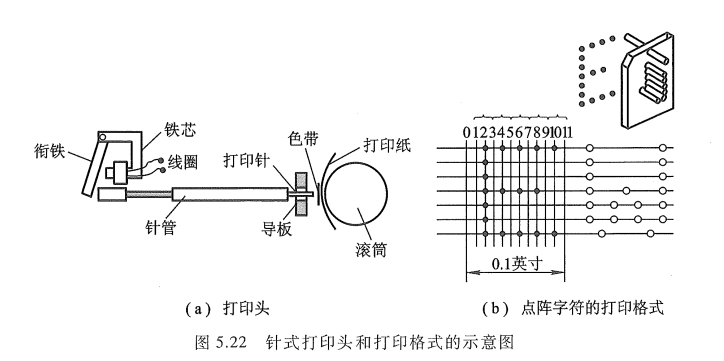

打印头中的钢针数与打印机型号有关, 有 7 针、9 针, 也有双列 14(2x7)针或双列 24(2x12)针。打印头固定在托架上, 托架可横向移动。图 5.22 中为 7 根钢针, 对应垂直方向的 7 点, 由于受机械安装的限制, 这 7 点之间有一定的间隙。水平方向各点的距离取决于打印头移动的位置, 故可密集些, 这对形成斜形或弧形笔画非常有利。字符的形成是按字符中各列所包含的点逐列形成的。例如, 对于字符 E, 先打印第 2 列的 1~7 个点, 再打印第 4、6、8 列的第 1、4、7 三点, 最后打第 10 列的 1、7 两个点。可见每根针可以单独驱动。打印一个字符后, 空出 3 列(第 11、0、1 列)作为间隙。

针式打印机由打印头、横移机构、输纸机构、色带机构和相应的控制电路组成, 如图 5.23 所示。

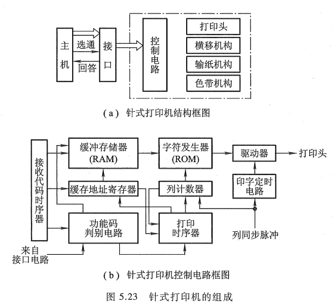

打印机被 CPU 启动后, 在接收代码时序器控制下, 功能码判别电路开始接收从主机送来的欲打印字符的字符代码(ASCII 码)。首先判断该字符是打印字符码还是控制功能码(如回车、换行、换页等), 若是打印字符码, 则送至缓冲存储器, 直到把缓冲存储器装满为止; 若是控制功能码, 则打印控制器停止接收代码并转入打印状态。打印时首先启动打印时序器, 并在它控制下, 从缓冲存储器中逐个读出打印字符码, 再以该字符码作为字符发生器 ROM 的地址码, 从中选出对应的字符点阵信息（字符发生器可将 ASCII 码转换成打印字符的点阵信息）。然后在列同步脉冲计数器控制下，将一列列读出的字符点阵信息送至打印驱动电路，驱动电磁铁带动相应的钢针进行打印。每打印一列，固定钢针的托架就要横移一列距离，直到打印完最后一列，形成 nxm 点阵字符。当一行字符打印结束或换行打印或缓存内容已全部打印完毕时，托架就返回到起始位置，并向主机报告，请求打印新的数据。

图 5.23（a）中的输纸机构受步进电机驱动，每打印完一行字符，按给定要求走纸。色带的作用是供给色源，如同复写纸的作用。如图 5.22（a）所示，钢针撞击在色带上，就可将颜色印在纸上，色带机构可使色带不断移动，以改变受击打的位置，避免色带的破损。有的点阵针式打印机内部配有一个独立的微处理器，用来产生各种控制信号，完成复杂的打印任务。

上面介绍的针式打印机是串行点阵针式打印机，打印速度每秒 100 个字符左右，在微型计算机系统广泛采用。在大型、中型通用计算机系统中；为提高打印速度，通常配备行式点阵打印机，它是将多根打印针沿横向排成一行，安装在一块形似梳齿状的梳形板上，每根针各由一个电磁铁驱动。打印时梳形板可向左右移动，每移动一次印出一行印点。当梳形板改变移动方向时，走纸机构使纸移动一个印点间距，如此重复多次即可打印出一行字符。例如，44 针行式打印，沿水平方向均匀排列 44 根打印针，每根针负责打印 3 个字符，打印行宽为 44x3 = 132 列字符。如果每根针负责打印两个字符，则可采用 66 针结构。

#### 2.3 激光打印机

激光打印机采用了激光技术和照相技术,由于它的印字质量好,在各种计算机系统中广泛采用。激光打印机的工作原理如图5.24所示。

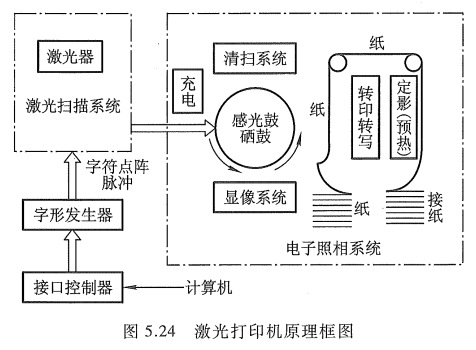

基本原理参考《[计算机原理 第三版 唐朔飞](https://gitee.com/docs-site/computer-reference-guide/raw/master/10-%E8%AE%A1%E7%AE%97%E6%9C%BA%E7%BB%84%E6%88%90%E5%8E%9F%E7%90%86/%E8%AE%A1%E7%AE%97%E6%9C%BA%E7%BB%84%E6%88%90%E5%8E%9F%E7%90%86%E7%AC%AC3%E7%89%88%E5%94%90%E6%9C%94%E9%A3%9E.pdf)》的 5.2.3 节（3）激光打印机。

#### 2.4 喷墨打印机

喷墨打印机是串行非击打式打印机,印字原理是将墨水喷射到普通打印纸上。若采用红、绿、蓝三色喷墨头,便可实现彩色打印。随着喷墨打印技术的不断提高,其输出效果接近于激光打印机,而价格又与点阵针式打印机相当,因此也得到广泛应用。

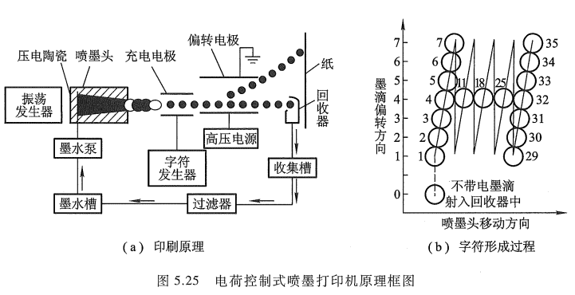

图5.25(a)是一种电荷控制式喷墨打印机的原理框图,主要由喷头、充电电极、墨水供应、过滤回收系统及相应的控制电路组成。

基本原理参考《[计算机原理 第三版 唐朔飞](https://gitee.com/docs-site/computer-reference-guide/raw/master/10-%E8%AE%A1%E7%AE%97%E6%9C%BA%E7%BB%84%E6%88%90%E5%8E%9F%E7%90%86/%E8%AE%A1%E7%AE%97%E6%9C%BA%E7%BB%84%E6%88%90%E5%8E%9F%E7%90%86%E7%AC%AC3%E7%89%88%E5%94%90%E6%9C%94%E9%A3%9E.pdf)》的 5.2.3 节（4）喷墨打印机。

#### 2.5 几种打印机比较

以上介绍的三种打印机都配有一个字符发生器，它们的共同点是都能将字符编码信息变为点阵信息,不同的是这些点阵信息的控制对象不同。点阵针式打印机的字符点阵用于控制打印针的驱动电路;激光打印机的字符点阵脉冲信号用于控制激光束;喷墨打印机的字符点阵信息控制墨滴的运动轨迹。

此外,点阵针式打印机属于击打式打印机,可以逐字打印,也可以逐行打印;喷墨打印机只能逐字打印;激光打印机属于页式输出设备。后两种都属于非击打式打印机。

不同种类的打印机性能和价格差别很大,用户可根据不同需要合理选用。要求印字质量高的场合可选用激光打印机;要求价格便宜的或只需具有文字处理功能的个人用计算机,可配置串行点阵针式打印机;要求处理的信息量很大,速度又要快,应该配行式打印机或高速激光打印机。

## 四、其他IO设备

计算机的I/O设备中有一类既是输入设备，又是输出设备，如磁盘、终端、A/D或D/A转换器以及汉字处理设备等。

## 五、多媒体技术

参考《[计算机原理 第三版 唐朔飞](https://gitee.com/docs-site/computer-reference-guide/raw/master/10-%E8%AE%A1%E7%AE%97%E6%9C%BA%E7%BB%84%E6%88%90%E5%8E%9F%E7%90%86/%E8%AE%A1%E7%AE%97%E6%9C%BA%E7%BB%84%E6%88%90%E5%8E%9F%E7%90%86%E7%AC%AC3%E7%89%88%E5%94%90%E6%9C%94%E9%A3%9E.pdf)》的 5.2.5 多媒体技术。
