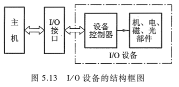
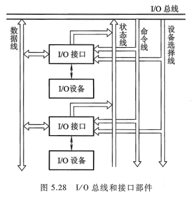
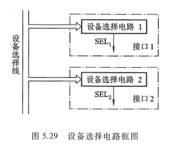
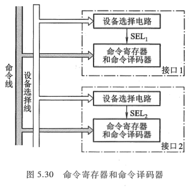
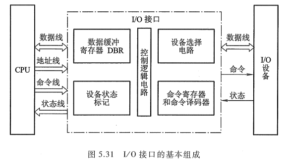

<!-- more -->

## 一、概述

接口可以看作两个系统或两个部件之间的交接部分，它既可以是两种硬设备之间的连接电路，也可以是两个软件之间的共同逻辑边界。I/O 接口通常是指主机与 I/O 设备之间设置的一个硬件电路及其相应的软件控制。

由图 5.13 可知，不同的 I/O 设备都有其相应的设备控制器，而它们往往都是通过 I/O 接口与主机取得联系的。主机与 I/O 设备之间设置接口的理由如下：

① 一台机器通常配有多台 I/O 设备，它们各自有其设备号（地址），通过接口可实现 I/O 设备的选择。

②I/O 设备种类繁多，速度不一，与 CPU 速度相差可能很大，通过接口可实现数据缓冲，达到速度匹配。

③ 有些 I/O 设备可能串行传送数据，而 CPU 一般为并行传送，通过接口可实现数据串-并格式的转换。

④I/O 设备的输入输出电平可能与 CPU 的输入输出电平不同，通过接口可实现电平转换。

⑤CPU 启动 I/O 设备工作，要向 I/O 设备发各种控制信号，通过接口可传送控制命令。

⑥I/O 设备需将其工作状态（如 "忙" "就绪" "错误" "中断请求" 等）及时向 CPU 报告，通过接口可监视设备的工作状态，并可保存状态信息，供 CPU 查询。

值得注意的是，接口（Interface）和端口（Port）是两个不同的概念。端口是指接口电路中的一些寄存器，这些寄存器分别用来存放数据信息、控制信息和状态信息，相应的端口分别称为数据端口、控制端口和状态端口。若干个端口加上相应的控制逻辑才能组成接口。CPU 通过输入指令, 从端口读入信息, 通过输出指令, 可将信息写入端口中。

## 二、接口的功能和组成

### 1. 总线连接方式的 I/O 接口电路

图 5.28 所示为总线结构的计算机，每一台 I/O 设备都是通过 I/O 接口挂到系统总线上的。图中的 I/O 总线包括数据线、设备选择线、命令线和状态线。

（1）数据线

数据线是 I/O 设备与主机之间数据代码的传送线，其根数一般等于存储字长的位数或字符的位数，它通常是双向的，也可以是单向的。若采用单向数据总线，则必须用两组才能实现数据的输入和输出功能，而双向数据总线只需一组即可。

（2）设备选择线

设备选择线是用来传送设备码的，它的根数取决于 I/O 指令中设备码的位数。如果把设备码看作地址号，那么设备选择线又可称为地址线。设备选择线可以有一组，也可以有两组，其中一组用于主机向 I/O 设备发送设备码，另一组用于 I/O 设备向主机回送设备码。当然设备选择线也可采用一组双向总线代替两组单向总线。

（3）命令线

命令线主要用以传输 CPU 向设备发出的各种命令信号，如启动、清除、屏蔽、读、写等。它是一组单向总线，其根数与命令信号多少有关。

（4）状态线

状态线是将 I/O 设备的状态向主机报告的信号线, 例如, 设备是否准备就绪, 是否向 CPU 发出中断请求等。它也是一组单向总线。现代计算机中大多采用 **三态逻辑电路** 来构成总线。

### 2. 接口的功能和组成

根据上述设置接口的理由，可归纳出接口通常应具有以下几个功能以及相应的硬件配置。

（1）选址功能

由于 I/O 总线与所有设备的接口电路相连，但 CPU 究竟选择哪台设备，还得通过设备选择线上的设备码来确定。该设备码将送至所有设备的接口，因此，要求每个接口都必须具有选址功能，即当设备选择线上的设备码与本设备码相符时，应发出设备选中信号 SEL，这种功能可通过接口内的设备选择电路来实现。

图 5.29 所示为接口 1 和接口 2 的设备选择电路。这两个电路的具体线路可以不同，它们分别能识别出自身的设备码，一旦某接口设备选择电路有输出时，它便可控制这个设备通过命令线、状态线和数据线与主机交换信息。

（2）传送命令的功能

当 CPU 向 I/O 设备发出命令时，要求 I/O 设备能做出响应，如果 I/O 接口不具备传送命令信息的功能，那么设备将无法响应，故通常在 I/O 接口中设有存放命令的命令寄存器以及命令译码器，如图 5.30 所示。

命令寄存器用来存放 I/O 指令中的命令码, 它受设备选中信号控制。命令线和所有接口电路的命令寄存器相连, 只有被选中设备的 SEL 信号有效, 命令寄存器才可接受命令线上的命令码。

（3）传送数据的功能

既然接口处于主机与 I/O 设备之间, 因此数据必须通过接口才能实现主机与 I/O 设备之间的传送。这就要求接口中具有数据通路, 完成数据传送。这种数据通路还应具有缓冲能力, 即能将数据暂存在接口内。 接口中通常设有 **数据缓冲寄存器**(Data Buffer Register, DBR), 它用来暂存 I/O 设备与主机准备交换的信息, 与 I/O 总线中的数据线是相连的。

每个接口中的数据缓冲寄存器的位数可以各不相同, 这取决于各类 I/O 设备的不同需要。例如, 键盘接口的 DBR 定为 8 位, 因为 ASCII 码为 7 位(见附录 5A), 再加一位奇偶校验位, 故为 8 位。又如磁盘这类外设, 其 DBR 的位数通常与存储字长的位数相等, 而且还要求具有串-并转换能力, 既可将从磁盘中串行读出的信息并行送至主存, 又可将从主存中并行读出的信息串行输至磁盘。

（4）反映 I/O 设备工作状态的功能

为了使 CPU 能及时了解各 I/O 设备的工作状态，接口内必须设置一些反映设备工作状态的触发器。例如，用完成触发器 D 和工作触发器 B 来标志设备所处的状态。

当 D = 0，B = 0 时，表示 I/O 设备处于暂停状态。

当 D = 1，B = 0 时，表示 I/O 设备已经准备就绪。

当 D = 0，B = 1 时，表示 I/O 设备正处于准备状态。

由于现代计算机系统中大多采用中断技术，因此接口电路中一般还设有 **中断请求触发器 INTR**，当其为 "1" 时，表示该 I/O 设备向 CPU 发出中断请求。接口内还有屏蔽触发器 MASK，它与中断请求触发器配合使用，完成设备的屏蔽功能（有关内容将在 8.4 节讲述）。

所有的状态标志触发器都与 I/O 总线中的状态线相连。此外，不同的 I/O 设备的接口电路中还可根据需要增设一些其他状态标志触发器，如 "出错" 触发器、"数据迟到" 触发器，或配置一些奇偶校验电路、循环码校验电路等。随着大规模集成电路制作工艺的不断进步，目前大多数 I/O 设备所共用的电路都制作在一个芯片内，作为通用接口芯片。另一些 I/O 设备专用的电路，制作在 I/O 设备的设备控制器中。本节所讲述的接口功能及组成均是指通用接口所具备的。图 5.31 所示为 I/O 接口的基本组成。

## 三、接口类型

I/O 接口按不同方式分类有以下几种。

① 按数据传送方式分类，有并行接口和串行接口两类。并行接口是将一个字节（或一个字）的所有位同时传送（如 Intel8255）；串行接口是在设备与接口间一位一位传送（如 Intel8251）。由于接口与主机之间是按字节或字并行传送，因此对串行接口而言，其内部还必须设有串-并转换装置。

② 按功能选择的灵活性分类，有可编程接口和不可编程接口两种。可编程接口的功能及操作方式可用程序来改变或选择（如 Intel8255、Intel8251）；不可编程接口不能由程序来改变其功能, 但可通过硬连线逻辑来实现不同的功能(如 Intel 8212)。

③ 按通用性分类有通用接口和专用接口。通用接口可供多种 I/O 设备使用, 如 Intel 8255、Intel 8212; 专用接口是为某类外设或某种用途专门设计的, 如 Intel 8279 可编程键盘/显示器接口; Intel 8275 可编程 CRT 控制器接口等。

④ 按数据传送的控制方式分类, 有程序型接口和 DMA 型接口。程序型接口用于连接速度较慢的 I/O 设备, 如显示终端、键盘、打印机等。现代计算机一般都可采用程序中断方式实现主机与 I/O 设备之间的信息交换, 故都配有这类接口, 如 Intel 8259。DMA 型接口用于连接高速 I/O 设备, 如磁盘、磁带等, 如 Intel8237。有关这两类接口, 将在《[计算机原理 第三版 唐朔飞](https://gitee.com/docs-site/computer-reference-guide/raw/master/10-%E8%AE%A1%E7%AE%97%E6%9C%BA%E7%BB%84%E6%88%90%E5%8E%9F%E7%90%86/%E8%AE%A1%E7%AE%97%E6%9C%BA%E7%BB%84%E6%88%90%E5%8E%9F%E7%90%86%E7%AC%AC3%E7%89%88%E5%94%90%E6%9C%94%E9%A3%9E.pdf)》的 5.5 和 5.6 节中讲述它们的基本组成原理。

