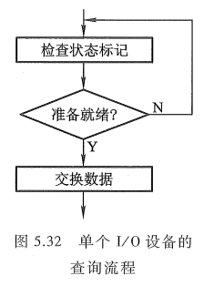
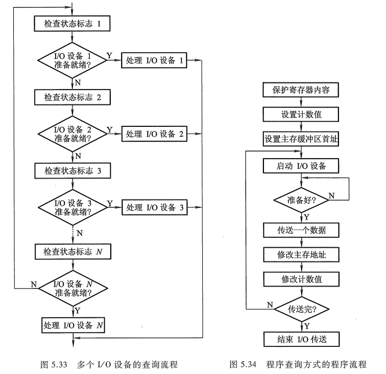
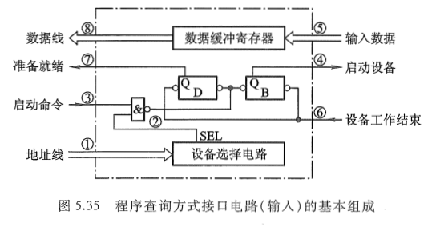

<!-- more -->

## 一、程序查询流程

由《[计算机原理 第三版 唐朔飞](https://gitee.com/docs-site/computer-reference-guide/raw/master/10-%E8%AE%A1%E7%AE%97%E6%9C%BA%E7%BB%84%E6%88%90%E5%8E%9F%E7%90%86/%E8%AE%A1%E7%AE%97%E6%9C%BA%E7%BB%84%E6%88%90%E5%8E%9F%E7%90%86%E7%AC%AC3%E7%89%88%E5%94%90%E6%9C%94%E9%A3%9E.pdf)》的 5.1.4 节已知, 程序查询方式的核心问题在于每时每刻需不断查询 I/O 设备是否准备就绪。图 5.32 是单个 I/O 设备的查询流程。当 I/O 设备较多时, CPU 需按各个 I/O 设备在系统中的优先级别进行逐级查询, 其流程图如 5.33 所示。图中设备的优先顺序按 1 至 N 降序排列。为了正确完成这种查询, 通常要执行如下 3 条指令。

① 测试指令, 用来查询 I/O 设备是否准备就绪。

② 传送指令, 当 I/O 设备已准备就绪时, 执行传送指令。

③ 转移指令, 若 I/O 设备未准备就绪, 执行转移指令, 转至测试指令, 继续测试 I/O 设备的状态。

图 5.34 所示为单个 I/O 设备程序查询方式的程序流程。当需要启动某一 I/O 设备时, 必须将该程序插入现行程序中。该程序包括如下几项, 其中 ①~③ 为准备工作。

① 由于这种方式传送数据时要占用 CPU 中的寄存器, 故首先需将寄存器原内容保护起来(若该寄存器中存有有用信息)。

② 由于传送往往是一批数据, 因此需先设置 I/O 设备与主机交换数据的计数值。

③ 设置欲传送数据在主存缓冲区的首地址。

④CPU 启动 I/O 设备。

⑤ 将 I/O 接口中的设备状态标志取至 CPU 并测试 I/O 设备是否准备就绪。如果未准备就绪，则等待，直到准备就绪为止。当准备就绪时，接着可实现传送。对输入而言，准备就绪意味着接口电路中的数据缓冲寄存器已装满欲传送的数据，称为输入缓冲满，CPU 即可取走数据；对输出而言，准备就绪意味着接口电路中的数据已被设备取走，故称为输出缓冲空，这样 CPU 可再次将数据送到接口，设备可再次从接口接收数据。

⑥CPU 执行 I/O 指令，或从 I/O 接口的数据缓冲寄存器中读出一个数据，或把一个数据写入 I/O 接口中的数据缓冲寄存器内，同时将接口中的状态标志复位。

⑦ 修改主存地址。

⑧ 修改计数值，若原设置计数值为原码，则依次减 1；若原设置计数值为负数的补码，则依次加 1（有关原码、补码的概念可参阅《[计算机原理 第三版 唐朔飞](https://gitee.com/docs-site/computer-reference-guide/raw/master/10-%E8%AE%A1%E7%AE%97%E6%9C%BA%E7%BB%84%E6%88%90%E5%8E%9F%E7%90%86/%E8%AE%A1%E7%AE%97%E6%9C%BA%E7%BB%84%E6%88%90%E5%8E%9F%E7%90%86%E7%AC%AC3%E7%89%88%E5%94%90%E6%9C%94%E9%A3%9E.pdf)》的 6.1 节）。

⑨ 判断计数值。若计数值不为 0，表示一批数据尚未传送完，重新启动外设继续传送；若计数值为 0，则表示一批数据已传送完毕。

⑩ 结束 I/O 传送，继续执行现行程序。

## 二、程序查询方式的接口电路

由程序查询流程和《[计算机原理 第三版 唐朔飞](https://gitee.com/docs-site/computer-reference-guide/raw/master/10-%E8%AE%A1%E7%AE%97%E6%9C%BA%E7%BB%84%E6%88%90%E5%8E%9F%E7%90%86/%E8%AE%A1%E7%AE%97%E6%9C%BA%E7%BB%84%E6%88%90%E5%8E%9F%E7%90%86%E7%AC%AC3%E7%89%88%E5%94%90%E6%9C%94%E9%A3%9E.pdf)》5.3.2 节所述的接口功能及组成, 得出程序查询方式接口电路的基本组成, 如图 5.35 所示。

图中设备选择电路用以识别本设备地址，当地址线上的设备号与本设备号相符时，SEL 有效，可以接收命令；数据缓冲寄存器用于存放欲传送的数据；D 是完成触发器，B 是工作触发器，其功能如 5.3.2 节所述。

>当 D = 0，B = 0 时，表示 I/O 设备处于暂停状态。
>
>当 D = 1，B = 0 时，表示 I/O 设备已经准备就绪。
>
>当 D = 0，B = 1 时，表示 I/O 设备正处于准备状态。

以输入设备为例，该接口的工作过程如下：

① 当 CPU 通过 I/O 指令启动输入设备时，指令的设备码字段通过地址线送至设备选择电路。

② 若该接口的设备码与地址线上的代码吻合，其输出 SEL 有效。

③I/O 指令的启动命令经过 "与非" 门将工作触发器 B 置 "1"，将完成触发器 D 置 "0"。

④ 由 B 触发器启动设备工作。

⑤ 输入设备将数据送至数据缓冲寄存器。

⑥ 由设备发设备工作结束信号，将 D 置 "1"，B 置 "0"，表示外设准备就绪。

⑦D 触发器以 "准备就绪" 状态通知 CPU，表示 "数据缓冲满"。

⑧CPU 执行输入指令，将数据缓冲寄存器中的数据送至 CPU 的通用寄存器，再存入主存相关单元。

【例 5.1】在程序查询方式的输入输出系统中,假设不考虑处理时间,每一次查询操作需要100个时钟周期,CPU的时钟频率为50MHz。现有鼠标和硬盘两个设备,而且CPU必须每秒对鼠标进行30次查询,硬盘以32位字长为单位传输数据,即每32位被CPU查询一次,传输率为2MBps。求CPU对这两个设备查询所花费的时间比率,由此可得出什么结论?

【解】:

（1）CPU每秒对鼠标进行30次查询,所需的时钟周期数为
$$
100*30=3000
$$

根据CPU的时钟频率为50MHz，即每秒$50*10^6$个时钟周期，故对鼠标的查询占用CPU的时间比率为
$$
[3000/(50*10^6)]*100\%=0.006\%
$$
可见，对鼠标的查询基本不影响CPU的性能。

（2）对于硬盘，每32位被CPU查询一次，故每秒查询
$$
\frac{2MB}{4B}=512K次
$$
则每秒查询的时钟周期数为
$$
100*512*1024=52.4*10^6
$$

故对磁盘的查询占用CPU的时间比率为
$$
\frac{52.4*10^6}{50*10^6}*100\%=105\%
$$

可见，即使CPU将全部时间都用于对硬盘的查询也不能满足磁盘传输的要求，因此CPU一般不采用程序查询方式与磁盘交换信息。
