<!-- more -->

## 一、中断的概念

计算机在执行程序的过程中，当出现异常情况或特殊请求时，计算机停止现行程序的运行，转向对这些异常情况或特殊请求的处理，处理结束后再返回到现行程序的间断处，继续执行原程序, 这就是 "中断"(参见图 5.10)。中断是现代计算机能有效合理地发挥效能和提高效率的一个十分重要的功能。通常又把实现这种功能所需的软硬件技术统称为中断技术。

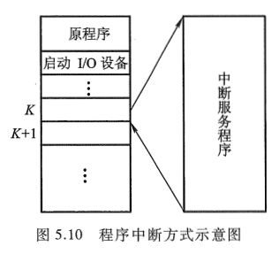

## 二、中断的产生

在 I/O 设备与主机交换信息时，由于设备本身机电特性的影响，其工作速度较低，与 CPU 无法匹配，因此，CPU 启动设备后，往往需要等待一段时间才能实现主机与 I/O 设备之间的信息交换。如果在设备准备的同时，CPU 不做无谓的等待，而继续执行现行程序，只有当 I/O 设备准备就绪向 CPU 提出请求后，再暂时中断 CPU 现行程序转入 I/O 服务程序，这便产生了 I/O 中断。

图 5.36 所示为由打印机引起的 I/O 中断时，CPU 与打印机并行工作的时间示意图。

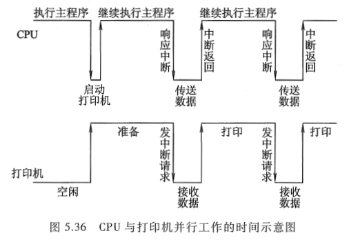

其实，计算机系统引入中断技术的原因不仅仅是为了适应 I/O 设备工作速度低的问题。例如，当计算机正在运行中，若出现突然掉电这种异常情况，将会导致 CPU 中的全部信息丢失。倘若能在突然掉电的瞬间立即启动另一个备份电源，并迅速进行一些必要的处理，例如，将有用信息送至不受电源影响的存储系统内，待电源恢复后接着使用，这种处理技术也要用中断技术来实现。又如，在实时控制领域中，要求 CPU 能即时响应外来信号的请求，并能完成相应的操作，也都要求采用中断技术。总之，为了提高计算机的整机效率，为了应付突发事件，为了实时控制的需要，在计算机技术的发展过程中产生了 "中断" 技术。为了实现 "中断"，计算机系统中必须配有相应的中断系统或中断机构。本节着重介绍 I/O 中断处理的相关内容，有关中断的其他内容将在《[计算机原理 第三版 唐朔飞](https://gitee.com/docs-site/computer-reference-guide/raw/master/10-%E8%AE%A1%E7%AE%97%E6%9C%BA%E7%BB%84%E6%88%90%E5%8E%9F%E7%90%86/%E8%AE%A1%E7%AE%97%E6%9C%BA%E7%BB%84%E6%88%90%E5%8E%9F%E7%90%86%E7%AC%AC3%E7%89%88%E5%94%90%E6%9C%94%E9%A3%9E.pdf)》第 8 章中讲述。

## 三、程序中断方式的接口电路

为处理 I/O 中断, 在 I/O 接口电路中必须配置相关的硬件线路。

### 1. 中断请求触发器和中断屏蔽触发器

每台外部设备都必须配置一个 **中断请求触发器 INTR**, 当其为 "1" 时, 表示该设备向 CPU 提出中断请求。但是设备欲提出中断请求时, 其设备本身必须准备就绪, 即接口内的完成触发器 D 的状态必须为 "1"。

由于计算机应用的范围越来越广泛, 向 CPU 提出中断请求的原因也越来越多, 除了各种 I/O 设备外, 还有其他许多突发性事件都是引起中断的因素, 为此, 把凡能向 CPU 提出中断请求的各种因素统称为 **中断源**。当多个中断源向 CPU 提出中断请求时, CPU 必须坚持一个原则, 即在任何瞬间只能接受一个中断源的请求。所以, 当多个中断源同时提出请求时, CPU 必须对各中断源的请求进行排队, 且只能接受级别最高的中断源的请求, 不允许级别低的中断源中断正在运行的中断服务程序。这样, 在 I/O 接口中需设置一个 **屏蔽触发器 MASK**, 当其为 "1" 时, 表示被屏蔽, 即封锁其中断源的请求。可见中断请求触发器和中断屏蔽触发器在 I/O 接口中是成对出现的。有关屏蔽的详细内容将在《[计算机原理 第三版 唐朔飞](https://gitee.com/docs-site/computer-reference-guide/raw/master/10-%E8%AE%A1%E7%AE%97%E6%9C%BA%E7%BB%84%E6%88%90%E5%8E%9F%E7%90%86/%E8%AE%A1%E7%AE%97%E6%9C%BA%E7%BB%84%E6%88%90%E5%8E%9F%E7%90%86%E7%AC%AC3%E7%89%88%E5%94%90%E6%9C%94%E9%A3%9E.pdf)》8.4.6 节中讲述。

此外, CPU 总是在统一的时间, 即每条指令执行阶段的最后时刻, 查询所有的设备是否有中断请求。

综合上述各因素, 可得出接口电路中的完成触发器 D、中断请求触发器 INTR、中断屏蔽触发器 MASK 和中断查询信号的关系如图 5.37 所示。可见, 仅当设备准备就绪(D = 1), 且该设备未被屏蔽(MASK = 0)时, CPU 的中断查询信号可将中断请求触发器置 "1"(INTR = 1)。

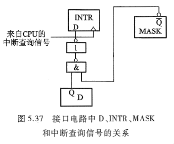

### 2. 排队器

如上所述, 当多个中断源同时向 CPU 提出请求时, CPU 只能按中断源的不同性质对其排队, 给予不同等级的优先权, 并按优先等级的高低予以响应。就 I/O 中断而言，速度越高的 I/O 设备，优先级越高，因为若 CPU 不及时响应高速 I/O 的请求，其信息可能会立即丢失。

设备优先权的处理可以采用硬件方法，也可采用软件方法（详见《[计算机原理 第三版 唐朔飞](https://gitee.com/docs-site/computer-reference-guide/raw/master/10-%E8%AE%A1%E7%AE%97%E6%9C%BA%E7%BB%84%E6%88%90%E5%8E%9F%E7%90%86/%E8%AE%A1%E7%AE%97%E6%9C%BA%E7%BB%84%E6%88%90%E5%8E%9F%E7%90%86%E7%AC%AC3%E7%89%88%E5%94%90%E6%9C%94%E9%A3%9E.pdf)》8.4.2 节）。硬件排队器的实现方法很多，既可在 CPU 内部设置一个统一的排队器，对所有中断源进行排队（详见图 8.25），也可在接口电路内分别设置各个设备的排队器，图 5.38 所示是设在各个接口电路中的排队器电路，又称为链式排队器。

<table style="border: none;">
  <tbody>
    <tr style="border: none;">
    <td width="50%" align="center" style="border: none;"> 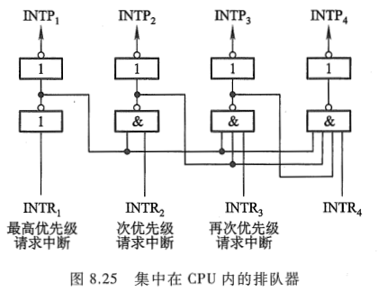 </td> <td width="50%" align="center" style="border: none;"> 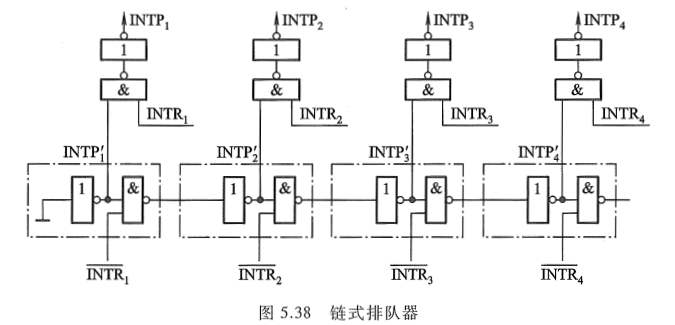 </td>
    </tr>
  </tbody>
</table>
图 5.38 中下面的一排门电路是链式排队器的核心。每个接口中有一个反相器和一个 "与非" 门(如图中点画线框内所示), 它们之间犹如链条一样串接在一起, 故称为链式排队器。该电路中级别最高的中断源是 1 号, 其次是 2 号、3 号、4 号。不论是哪个中断源(一个或多个)提出中断请求, 排队器输出端 $INTP_i$ 只有一个高电平。

当各中断源均无中断请求时，各个 $\overline{INTR_i}$ 为高电平，其 $INTP_{1}^{\prime}$、$INTP_{2}^{\prime}$、$INTP_{3}^{\prime}$ ... ...均为高电平。一旦某个中断源提出中断请求时，就迫使比其优先级低的中断源 $INTP_{i}^{\prime}$ 变为低电平，封锁其发中断请求。例如，当 2 号和 3 号中断源同时有请求时（$\overline{INTR_2}$ = 0，$\overline{INTR_3}$ = 0），经分析可知 $INTP_{1}^{\prime}$ 和 $INTP_{2}^{\prime}$ 均为高电平，$INTP_{3}^{\prime}$ 及往后各级的 $INTP_{i}^{\prime}$ 均为低电平。各个 $INTP_{i}^{\prime}$ 再经图中上面一排两个输入头的 "与非" 门，便可保证排队器只有 $INTP_{2}$ 为 高电平，表示 2 号中断源排队选中。

### 3. 中断向量地址形成部件（设备编码器）

CPU 一旦响应了 I/O 中断，就要暂停现行程序，转去执行该设备的中断服务程序。不同的设备有不同的中断服务程序，每个服务程序都有一个入口地址，CPU 必须找到这个入口地址。入口地址的寻找也可用硬件或软件的方法来完成，这里只介绍硬件向量法。所谓硬件向量法，就是通过向量地址来寻找设备的中断服务程序入口地址，而且向量地址是由硬件电路产生的，如图 5.39 所示。

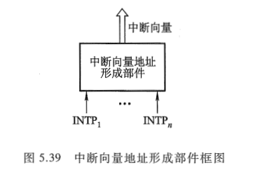

中断向量地址形成部件的输入是来自排队器的输出 $INTP_1$，$INTP_2$，…，$INTP_n$，它的输出是中断向量（二进制代码表示），其位数与计算机可以处理中断源的个数有关，即一个中断源对应一个向量地址。可见，该部件实质上是一个编码器。在 I/O 接口中的编码器又称为设备编码器。

这里必须分清向量地址和中断服务程序的入口地址是两个不同的概念，图 5.40 是通过向量地址寻找入口地址的一种方案。其中 12H、13H、14H 是向量地址，200、300 分别是打印机服务程序和显示器服务程序的入口地址。

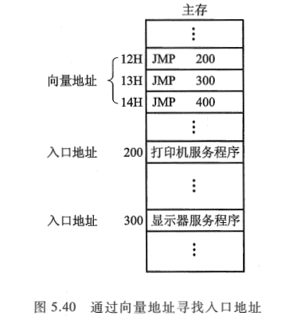

### 4. 程序中断方式接口电路的基本组成

综合《[计算机原理 第三版 唐朔飞](https://gitee.com/docs-site/computer-reference-guide/raw/master/10-%E8%AE%A1%E7%AE%97%E6%9C%BA%E7%BB%84%E6%88%90%E5%8E%9F%E7%90%86/%E8%AE%A1%E7%AE%97%E6%9C%BA%E7%BB%84%E6%88%90%E5%8E%9F%E7%90%86%E7%AC%AC3%E7%89%88%E5%94%90%E6%9C%94%E9%A3%9E.pdf)》5.3.2 节对一般接口电路的分析以及上述对实现程序中断方式所需增设硬件的介绍, 以输入设备为例, 程序中断方式接口电路的基本组成如图 5.41 所示。

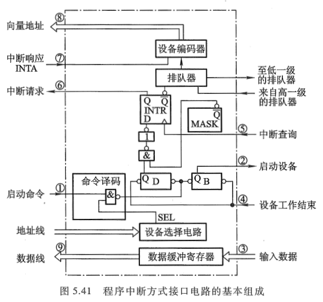

## 四、I/O 中断处理过程

### 1. CPU 响应中断的条件和时间

CPU 响应 I/O 设备提出中断请求的条件是必须满足 CPU 中的允许中断触发器 EINT 为 "1"。该触发器可用开中断指令置位(称为开中断); 也可用关中断指令或硬件自动使其复位(称为关中断)。

由图 5.37 分析可知, I/O 设备准备就绪的时间(即 D = 1)是随机的, 而 CPU 是在统一的时刻(每条指令执行阶段结束前)向接口发中断查询信号, 以获取 I/O 的中断请求。因此, CPU 响应中断的时间一定是在每条指令执行阶段的结束时刻。

### 2. I/O 中断处理过程

下面以输入设备为例, 结合图 5.41, 说明 I/O 中断处理的全过程。当 CPU 通过 I/O 指令的地址码选中某设备后, 则

① 由 CPU 发启动 I/O 设备命令, 将接口中的 B 置 "1", D 置 "0"。

② 接口启动输入设备开始工作。

③ 输入设备将数据送入数据缓冲寄存器。

④ 输入设备向接口发出 "设备工作结束" 信号, 将 D 置 "1", B 置 "0", 标志设备准备就绪。

⑤ 当设备准备就绪(D = 1), 且本设备未被屏蔽(MASK = 0)时, 在指令执行阶段的结束时刻, 由 CPU 发出中断查询信号。

⑥ 设备中断请求触发器 INTR 被置 "1", 标志设备向 CPU 提出中断请求。与此同时, INTR 送至排队器, 进行中断判优。

⑦ 若 CPU 允许中断(EINT = 1), 设备又被排队选中, 即进入中断响应阶段, 由中断响应信号 INTA 将排队器输出送至编码器形成向量地址。

⑧ 向量地址送至 PC, 作为下一条指令的地址。

⑨ 由于向量地址中存放的是一条无条件转移指令(参见图 5.40), 故这条指令执行结束后, 即无条件转至该设备的服务程序入口地址, 开始执行中断服务程序, 进入中断服务阶段, 通过输入指令将数据缓冲寄存器的输入数据送至 CPU 的通用寄存器, 再存入主存相关单元。

⑩ 中断服务程序的最后一条指令是中断返回指令, 当其执行结束时, 即中断返回至原程序的断点处。至此, 一个完整的程序中断处理过程即告结束。

综上所述, 可将一次中断处理过程简单地归纳为中断请求、中断判优、中断响应、中断服务和中断返回 5 个阶段。至于为什么能准确返回至原程序断点, CPU 在中断响应阶段除了将向量地址送至 PC 外, 还做了什么其他操作等问题, 将在《[计算机原理 第三版 唐朔飞](https://gitee.com/docs-site/computer-reference-guide/raw/master/10-%E8%AE%A1%E7%AE%97%E6%9C%BA%E7%BB%84%E6%88%90%E5%8E%9F%E7%90%86/%E8%AE%A1%E7%AE%97%E6%9C%BA%E7%BB%84%E6%88%90%E5%8E%9F%E7%90%86%E7%AC%AC3%E7%89%88%E5%94%90%E6%9C%94%E9%A3%9E.pdf)》8.4 节详细介绍。

## 五、中断服务程序流程

不同设备的服务程序是不相同的, 可它们的程序流程又是类似的, 一般中断服务程序的流程分四大部分: 保护现场、中断服务、恢复现场和中断返回。

### 1. 保护现场

保护现场有两个含义, 其一是保存程序的断点; 其二是保存通用寄存器和状态寄存器的内容。前者由中断隐指令完成(详见《[计算机原理 第三版 唐朔飞](https://gitee.com/docs-site/computer-reference-guide/raw/master/10-%E8%AE%A1%E7%AE%97%E6%9C%BA%E7%BB%84%E6%88%90%E5%8E%9F%E7%90%86/%E8%AE%A1%E7%AE%97%E6%9C%BA%E7%BB%84%E6%88%90%E5%8E%9F%E7%90%86%E7%AC%AC3%E7%89%88%E5%94%90%E6%9C%94%E9%A3%9E.pdf)》8.4.4 节), 后者由中断服务程序完成。具体而言, 可在中断服务程序的起始部分安排若干条存数指令, 将寄存器的内容存至存储器中保存, 或用进栈指令(PUSH)将各寄存器的内容推入堆栈保存, 即将程序中断时的 "现场" 保存起来。

### 2.中断服务(设备服务)

这是中断服务程序的主体部分, 对于不同的中断请求源, 其中断服务操作内容是不同的, 例如, 打印机要求 CPU 将需打印的一行字符代码, 通过接口送入打印机的缓冲存储器中(参见图 5.23)以供打印机打印。又如, 显示设备要求 CPU 将需显示的一屏字符代码通过接口送入显示器的显示存储器中(参见图 5.18)。

<table style="border: none;">
  <tbody>
    <tr style="border: none;">
    <td width="50%" align="center" style="border: none;"> 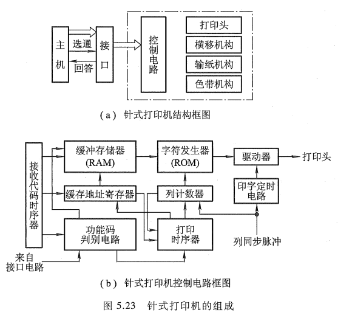 </td> <td width="50%" align="center" style="border: none;"> 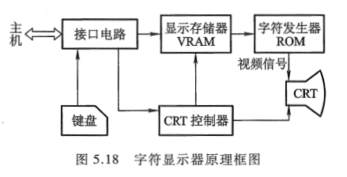 </td>
    </tr>
  </tbody>
</table>

### 3. 恢复现场

这是中断服务程序的结尾部分，要求在退出服务程序前，将原程序中断时的 "现场" 恢复到原来的寄存器中。通常可用取数指令或出栈指令（POP），将保存在存储器（或堆栈）中的信息送回到原来的寄存器中。

### 4. 中断返回

中断服务程序的最后一条指令通常是一条中断返回指令，使其返回到原程序的断点处，以便继续执行原程序。

计算机在处理中断的过程中，有可能出现新的中断请求，此时如果 CPU 暂停现行的中断服务程序，转去处理新的中断请求，这种现象称为中断嵌套，或多重中断。倘若 CPU 在执行中断服务程序时，对新的中断请求不予理睬，这种中断称为单重中断。这两种处理方式的中断服务程序略有区别。图 5.43（a）和图 5.43（b）分别为单重中断和多重中断服务程序流程。比较图 5.43（a）和图 5.43（b）可以发现，其区别在于 "开中断" 的设置时间不同。

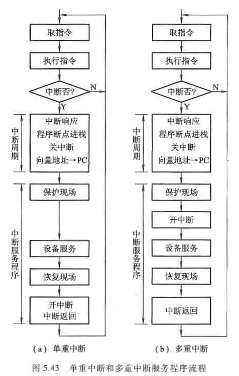

CPU 一旦响应了某中断源的中断请求后，便由硬件线路自动关中断，即中断允许触发器 EINT 被置 "0"（详见图 8.30）：以确保该中断服务程序的顺利执行。因此如果不用 "开中断" 指令将 EINT 置 "1"，则意味着 CPU 不能再响应其他任何一个中断源的中断请求。对于单重中断，开中断指令设置在最后 "中断返回" 之前，意味着在整个中断服务处理过程中，不能再响应其他中断源的请求。对于多重中断，开中断指令提前至 "保护现场" 之后，意味着在保护现场后，若有级别更高的中断源提出请求（这是实现多重中断的必要条件），CPU 也可以响应，即再次中断现行的服务程序，转至新的中断服务程序，这是单重中断与多重中断的主要区别。有关多重中断的详细内容参见《[计算机原理 第三版 唐朔飞](https://gitee.com/docs-site/computer-reference-guide/raw/master/10-%E8%AE%A1%E7%AE%97%E6%9C%BA%E7%BB%84%E6%88%90%E5%8E%9F%E7%90%86/%E8%AE%A1%E7%AE%97%E6%9C%BA%E7%BB%84%E6%88%90%E5%8E%9F%E7%90%86%E7%AC%AC3%E7%89%88%E5%94%90%E6%9C%94%E9%A3%9E.pdf)》 8.4.6 节。

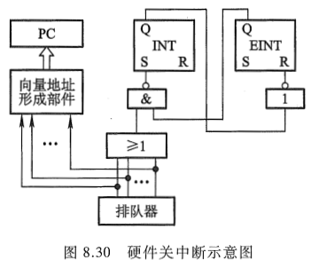

综上所述，从宏观上分析，程序中断方式克服了程序查询方式中的 CPU "踏步" 现象，实现了 CPU 与 I/O 的并行工作，提高了 CPU 的资源利用率。但从微观操作分析，发现 CPU 在处理中断服务程序时仍需暂停原程序的正常运行，尤其是当高速 I/O 设备或辅助存储器频繁地、成批地与主存交换信息时，需不断地打断 CPU 执行主程序而执行中断服务程序。图 5.44 是主程序和服务程序抢占 CPU 的示意图。为此，人们探索出使 CPU 效率更高的 DMA 控制方式（DMA 就是 Direct Memory Access，即直接存储器访问）。

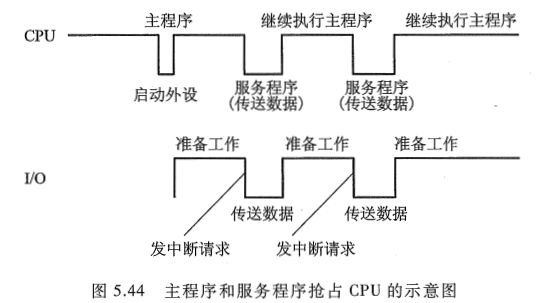
