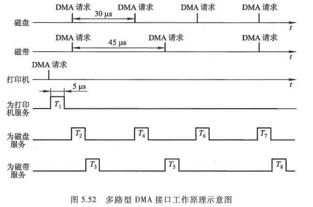

<!-- more -->

## 一、DMA 方式的特点

图 5.45 示意了 DMA 方式与程序中断方式的数据通路。

由图中可见, 由于主存和 DMA 接口之间有一条数据通路, 因此主存和设备交换信息时, **不通过 CPU, 也不需要 CPU 暂停现行程序为设备服务**, 省去了保护现场和恢复现场, 因此工作速度比程序中断方式的工作速度高。这一特点特别适合于高速 I/O 或辅存与主存之间的信息交换。

因为高速 I/O 设备若每次申请与主机交换信息时, 都要等待 CPU 做出中断响应后再进行, 很可能因此使数据丢失。值得注意的是, 若出现高速 I/O(通过 DMA 接口)和 CPU 同时访问主存, CPU 必须将总线(如地址线、数据线)占有权让给 DMA 接口使用, 即 DMA 采用周期窃取的方式占用一个存取周期。

在 DMA 方式中, 由于 DMA 接口与 CPU 共享主存, 这就有可能出现两者争用主存的冲突。为了有效地分时使用主存, 通常 DMA 与主存交换数据时采用如下三种方法。

（1）停止 CPU 访问主存

当外设要求传送一批数据时, 由 DMA 接口向 CPU 发一个停止信号, 要求 CPU 放弃地址线、数据线和有关控制线的使用权。DMA 接口获得总线控制权后, 开始进行数据传送, 在数据传送结束后, DMA 接口通知 CPU 可以使用主存, 并把总线控制权交回给 CPU, 图 5.46(a)是该方式的时间示意图。

这种方式的优点是控制简单, 适用于数据传输率很高的 I/O 设备实现成组数据的传送。缺点是 DMA 接口在访问主存时, CPU 基本上处于不工作状态或保持原状态。而且即使 I/O 设备高速运行, 两个数据之间的准备间隔时间也总大于一个存取周期, 因此, CPU 对主存的利用率并没得到充分的发挥。如软盘读一个 8 位二进制数大约需要 32us, 而半导体存储器的存取周期远小于 1us, 可见在软盘准备数据的时间内, 主存处于空闲状态, 而 CPU 又暂停访问主存。为此在 DMA 接口中, 一般设有一个小容量存储器(这种存储器是用半导体芯片制作的), 使 I/O 设备首先与小容量存储器交换数据, 然后由小容量存储器与主存交换数据, 这便可减少 DMA 传送数据时占用总线的时间, 即可减少 CPU 的暂停工作时间。

（2）周期挪用(或周期窃取)

在这种方法中, 每当 I/O 设备发出 DMA 请求时, I/O 设备便挪用或窃取总线占用权一个或几个主存周期, 而 DMA 不请求时, CPU 仍继续访问主存。I/O 设备请求 DMA 传送会遇到三种情况。一种是 CPU 此时不需要访问主存(如 CPU 正在执行乘法指令, 由于乘法指令执行时间较长, 此时 CPU 不需要访问主存), 故 I/O 设备与 CPU 不发生冲突。第二种情况是 I/O 设备请求 DMA 传送时, CPU 正在访问主存, 此时必须待存取周期结束, CPU 才能将总线占有权让出。第三种情况是 I/O 设备要求访问主存时, CPU 也要求访问主存, 这就出现了访问冲突。此刻, I/O 访存优先于 CPU 访问主存, 因为 I/O 不立即访问主存就可能丢失数据, 这时 I/O 要窃取一两个存取周期, 意味着 CPU 在执行访问主存指令过程中插入了 DMA 请求, 并挪用了一两个存取周期, 使 CPU 延缓了一两个存取周期再访问主存。图 5.46(b)示意了 DMA 周期挪用的时间对应关系。

与 CPU 暂停访存的方式相比, 这种方式既实现了 I/O 传送, 又较好地发挥了主存与 CPU 的效率, 是一种广泛采用的方法。

应该指出, I/O 设备每挪用一个主存周期都要申请总线控制权、建立总线控制权和归还总线控制权。因此, 尽管传送一个字对主存而言只占用一个主存周期, 但对 DMA 接口而言, 实质上要占 2~5 个主存周期(由逻辑线路的延迟特性而定)。因此周期挪用的方法比较适合于 I/O 设备的读/写周期大于主存周期的情况。

（3）DMA 与 CPU 交替访问

这种方法适合于 CPU 的工作周期比主存存取周期长的情况。例如，CPU 的工作周期为 1.2us，主存的存取周期小于 0.6us，那么可将一个 CPU 周期分为 C1 和 C2 两个分周期，其中 C1 专供 DMA 访存，C2 专供 CPU 访存，如图 5.46（c）所示。

这种方式不需要总线使用权的申请、建立和归还过程，总线使用权是通过 C1 和 C2 分别控制的。CPU 与 DMA 接口各自有独立的访存地址寄存器、数据寄存器和读/写信号。实际上总线变成了在 C1 和 C2 控制下的多路转换器，其总线控制权的转移几乎不需要什么时间，具有很高的 DMA 传送速率。在这种工作方式下，CPU 既不停止主程序的运行也不进入等待状态，即完成了 DMA 的数据传送。当然其相应的硬件逻辑变得更为复杂。

## 二、接口功能和组成

### 1. DMA 接口的功能

利用 DMA 方式传送数据时，数据的传输过程完全由 DMA 接口电路控制，故 DMA 接口又有 DMA 控制器之称。DMA 接口应具有如下几个功能。

① 向 CPU 申请 DMA 传送。

② 在 CPU 允许 DMA 工作时，处理总线控制权的转交，避免因进入 DMA 工作而影响 CPU 正常活动或引起总线竞争。

③ 在 DMA 期间管理系统总线，控制数据传送。

④ 确定数据传送的起始地址和数据长度，修正数据传送过程中的数据地址和数据长度。

⑤ 在数据块传送结束时，给出 DMA 操作完成的信号。

### 2. DMA 接口基本组成

最简单的 DMA 接口组成原理如图 5.47 所示，它由以下几个逻辑部件组成。  

（1）主存地址寄存器（AR）

AR 用于存放主存中需要交换数据的地址。在 DMA 传送数据前，必须通过程序将数据在主存中的首地址送到主存地址寄存器。在 DMA 传送过程中，每交换一次数据，将地址寄存器内容加 1，直到一批数据传送完毕为止。

（2）字计数器（WC）

WC 用于记录传送数据的总字数，通常以交换字数的补码值预置。在 DMA 传送过程中，每传送一个字，字计数器加 1，直到计数器为 0，即最高位产生进位时，表示该批数据传送完毕（若交换字数以原码值预置，则每传送一个字，字计数器减 1，直到计数器为 0 时，表示该批数据传送结束）。于是 DMA 接口向 CPU 发中断请求信号。

（3）数据缓冲寄存器（BR）

BR 用于暂存每次传送的数据。通常 DMA 接口与主存之间采用字传送，而 DMA 与设备之间可能是字节或位传送。因此 DMA 接口中还可能包括有装配或拆卸字信息的硬件逻辑，如数据移位缓冲寄存器、字节计数器等。

（4）DMA 控制逻辑

DMA 控制逻辑负责管理 DMA 的传送过程，由控制电路、时序电路及命令状态控制寄存器等组成。每当设备准备好一个数据字（或一个字传送结束），就向 DMA 接口提出申请（DREQ），DMA 控制逻辑便向 CPU 请求 DMA 服务，发出总线使用权的请求信号（HRQ）。待收到 CPU 发出的响应信号 HLDA 后，DMA 控制逻辑便开始负责管理 DMA 传送的全过程，包括对主存地址寄存器和字计数器的修改、识别总线地址、指定传送类型(输入或输出)以及通知设备已经被授予一个 DMA 周(DACK)等。

（5）中断机构

当字计数器溢出(全 "0")时, 表示一批数据交换完毕, 由 "溢出信号" 通过中断机构向 CPU 提出中断请求, 请求 CPU 作 DMA 操作的后处理。必须注意, 这里的中断与 《[计算机原理 第三版 唐朔飞](https://gitee.com/docs-site/computer-reference-guide/raw/master/10-%E8%AE%A1%E7%AE%97%E6%9C%BA%E7%BB%84%E6%88%90%E5%8E%9F%E7%90%86/%E8%AE%A1%E7%AE%97%E6%9C%BA%E7%BB%84%E6%88%90%E5%8E%9F%E7%90%86%E7%AC%AC3%E7%89%88%E5%94%90%E6%9C%94%E9%A3%9E.pdf)》5.5 节介绍的 I/O 中断的技术相同, 但中断的目的不同, 前面是为了数据的输入或输出, 而这里是为了报告一批数据传送结束。它们是 I/O 系统中不同的中断事件。

（6）设备地址寄存器(DAR)

DAR 存放 I/O 设备的设备码或表示设备信息存储区的寻址信息, 如磁盘数据所在的区号、盘面号和柱面号。具体内容取决于设备的数据格式和地址的编址方式。

## 三、工作过程

### 1. DMA 传送过程

DMA 的数据传送过程分为预处理、数据传送和后处理 3 个阶段。

（1）**预处理**

在 DMA 接口开始工作之前，CPU 必须给它预置如下信息。

- 给 DMA 控制逻辑指明数据传送方向是输入（写主存）还是输出（读主存）。
- 向 DMA 设备地址寄存器送入设备号，并启动设备。
- 向 DMA 主存地址寄存器送入交换数据的主存起始地址。
- 对字计数器赋予交换数据的个数。

上述工作由 CPU 执行几条输入输出指令完成，即程序的初始化阶段。这些工作完成后，CPU 继续执行原来的程序，如图 5.48（a）所示。

当 I/O 设备准备好发送的数据（输入）或上次接收的数据已经处理完毕（输出）时，它便通过 DMA 接口向 CPU 提出占用总线的申请，若有多个 DMA 同时申请，则按轻重缓急由硬件排队判优逻辑决定优先等。待 I/O 设备得到主存总线的控制权后，数据的传送便由该 DMA 接口进行管理。

（2）**数据传送**

DMA 方式是以数据块为单位传送的，以周期挪用的 DMA 方式为例，其数据传送的流程如图 5.48（b）所示。结合图 5.47，以数据输入为例，具体操作如下。

① 当设备准备好一个字时，发出选通信号，将该字读到 DMA 的数据缓冲寄存器（BR）中，表示数据缓冲寄存器 "满"（如果 I/O 设备是面向字符的，则一次读入一个字节，组装成一个字）。

② 与此同时设备向 DMA 接口发请求（DREQ）。

③DMA 接口向 CPU 申请总线控制权（HRQ）。

④CPU 发回 HLDA 信号，表示允许将总线控制权交给 DMA 接口。

⑤ 将 DMA 主存地址寄存器中的主存地址送地址总线，并命令存储器写。

⑥ 通知设备已被授予一个 DMA 周期（DACK），并为交换下一个字做准备。

⑦ 将 DMA 数据缓冲寄存器的内容送数据总线。

⑧ 主存将数据总线上的信息写至地址总线指定的存储单元中。

⑨ 修改主存地址和字计数值。

⑩ 判断数据块是否传送结束，若未结束，则继续传送；若已结束，（字计数器溢出），则向 CPU 申请程序中断，标志数据块传送结束。

若为输出数据，则应完成以下操作：

① 当 DMA 数据缓冲寄存器已将输出数据送至 I/O 设备后，表示数据缓冲寄存器已 "空"。

② 设备向 DMA 接口发请求（DREQ）。

③DMA 接口向 CPU 申请总线控制权（HRQ）。

④CPU 发回 HLDA 信号，表示允许将总线控制权交给 DMA 接口使用。

⑤ 将 DMA 主存地址寄存器中的主存地址送地址总线，并命令存储器读。

⑥ 通知设备已被授予一个 DMA 周期（DACK），并为交换下一个字做准备。

⑦ 主存将相应地址单元的内容通过数据总线读入 DMA 的数据缓冲寄存器中。

⑧ 将 DMA 数据缓冲寄存器的内容送到输出设备，若为字符设备，则需将其拆成字符输出。

⑨ 修改主存地址和字计数值。

⑩ 判断数据块是否已传送完毕, 若未完毕, 继续传送; 若已传送完毕, 则向 CPU 申请程序中断。

（3）**后处理**

当 DMA 的中断请求得到响应后, CPU 停止原程序的执行, 转去执行中断服务程序, 做一些 DMA 的结束工作, 如图 5.48(a)的后处理部分。这包括校验送入主存的数据是否正确; 决定是否继续用 DMA 传送其他数据块, 若继续传送, 则又要对 DMA 接口进行初始化, 若不需要传送, 则停止外设; 测试在传送过程中是否发生错误, 若出错, 则转错误诊断及处理错误程序。

### 2. DMA 接口与系统连接方式

DMA 接口与系统的连接方式有两种，如图 5.49 所示。

图 5.49（a）为具有公共请求线的 DMA 请求方式，若干个 DMA 接口通过一条公用的 DMA 请求线向 CPU 申请总线控制权。CPU 发出响应信号，用链式查询方式通过 DMA 接口，首先选中的设备获得总线控制权，即可占用总线与主存传送信息。

### 3. DMA 小结

与程序中断方式相比, DMA 方式有如下特点。

① 从数据传送看, 程序中断方式靠程序传送, DMA 方式靠硬件传送。

② 从 CPU 响应时间看, 程序中断方式是在一条指令执行结束时响应, 而 DMA 方式可在指令周期内的任一存取周期结束时响应。

③ 程序中断方式有处理异常事件的能力, DMA 方式没有这种能力, 主要用于大批数据的传送, 如硬盘存取、图像处理、高速数据采集系统等, 可提高数据吞吐量。

④ 程序中断方式需要中断现行程序, 故需保护现场; DMA 方式不中断现行程序, 无须保护现场。

⑤DMA 的优先级比程序中断的优先级高。

## 四、接口的类型

现代集成电路制造技术已将 DMA 接口制成芯片, 通常有选择型和多路型两类。

### 1. 选择型 DMA 接口

这种类型的 DMA 接口的基本组成如图 5.47 所示, 它的主要特点是在物理上可连接多个设备, 在逻辑上只允许连接一个设备, 即在某一段时间内, DMA 接口只能为一个设备服务, 关键是在预处理时将所选设备的设备号送入设备地址寄存器。图 5.50 是选择型 DMA 接口的逻辑框图。选择型 DMA 接口特别适用于数据传输率很高的设备。

### 2.多路型 DMA 接口

多路型 DMA 接口不仅在物理上可以连接多个设备, 而且在逻辑上也允许多个设备同时工作, 各个设备采用字节交叉的方式通过 DMA 接口进行数据传送。在多路型 DMA 接口中, 为每个与它连接的设备都设置了一套寄存器, 分别存放各自的传送参数。图 5.51(a)和(b)分别是链式多路型 DMA 接口和独立请求多路型 DMA 接口的逻辑框图。这类接口特别适合于同时为多个数据传输率不十分高的设备服务。

图 5.52 是多路型 DMA 接口工作原理示意图。图中磁盘、磁带、打印机同时工作。磁盘、磁带、打印机分别每隔 30us、45us、150us 向 DMA 接口发 DMA 请求, 磁盘的优先级高于磁带, 磁带的优先级高于打印机。

假设 DMA 接口完成一次 DMA 数据传送需 5us, 由图 5.52 可见, 打印机首先发请求, 故 DMA 接口首先为打印机服务(T1); 接着磁盘、磁带同时又有 DMA 请求, DMA 接口按优先级别先响应磁盘请求(T2), 再响应磁带请求(T3), 每次 DMA 传送都是一个字节。这样, 在 90 多微秒的时间里, DMA 接口为打印机服务一次(T1), 为磁盘服务 4 次(T2、T4、T6、T7), 为磁带服务 3 次(T3、T5、T8)。可见 DMA 接口还有很多空闲时间, 可再容纳更多的设备。
