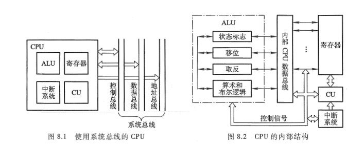
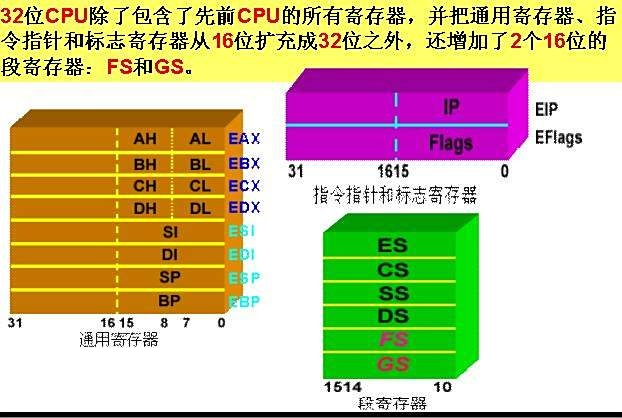
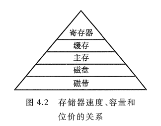
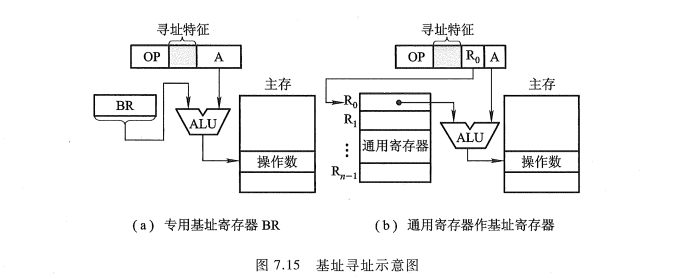
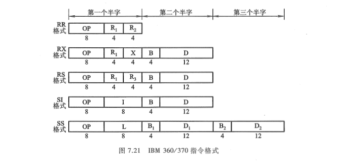
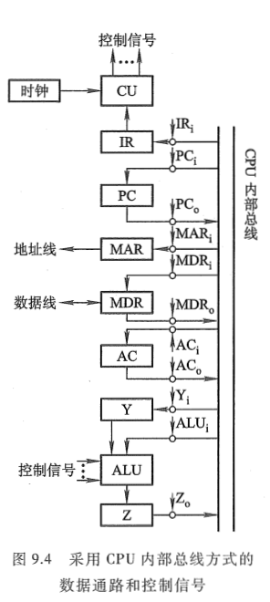
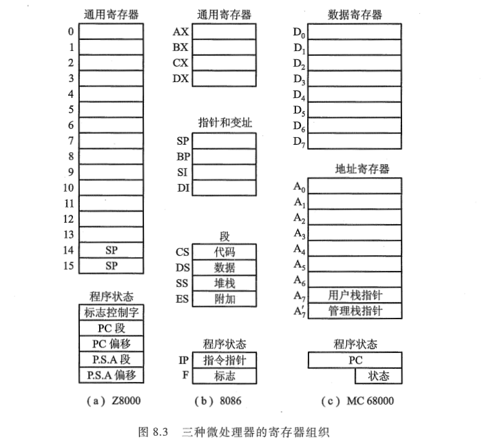
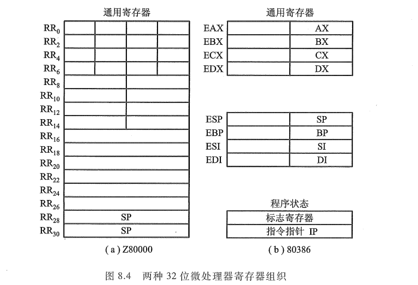

<!-- more -->

由第 1 章（[LV002-计算机基本组成.md](/sdoc/principle-of-computer/generality/computer-intro/126b0e8feb3227b55cb7da6f)）可知，CPU 实质包括运算器和控制器两大部分，第 6 章讨论了计算机内各种运算及相应的硬件配置，这里重点介绍控制器的功能。

## 一、需要有哪些功能

对于冯·诺依曼结构的计算机而言，一旦程序进入存储器后，就可由计算机自动完成取指令和执行指令的任务，控制器就是专用于完成此项工作的，它负责协调并控制计算机各部件执行程序的指令序列，其基本功能是取指令、分析指令和执行指令。

（1）取指令

控制器必须具备能自动地从存储器中取出指令的功能。为此，要求控制器能自动形成指令的地址，并能发出取指令的命令，将对应此地址的指令取到控制器中。第一条指令的地址可以人为指定，也可由系统设定。

（2）分析指令

分析指令包括两部分内容：其一，分析此指令要完成什么操作，即控制器需发出什么操作命令；其二，分析参与这次操作的操作数地址，即操作数的有效地址。

（3）执行指令

执行指令就是根据分析指令产生的 "操作命令" 和 "操作数地址" 的要求，形成操作控制信号序列（不同的指令有不同的操作控制信号序列），通过对运算器、存储器以及 I/O 设备的操作，执行每条指令。

此外，控制器还必须能控制程序的输入和运算结果的输出（即控制主机与 I/O 设备交换信息）以及对总线的管理，甚至能处理机器运行过程中出现的异常情况（如掉电）和特殊请求（如打印机请求打印一行字符), 即处理中断的能力。

总之, CPU 必须具有控制程序的顺序执行(称指令控制)、产生完成每条指令所需的控制命令(称操作控制)、对各种操作加以时间上的控制(称时间控制)、对数据进行算术运算和逻辑运算(数据加工)以及处理中断等功能。

## 二、结构框图

根据 CPU 的功能不难设想,：

- 要取指令, 必须有一个寄存器专用于存放当前指令的地址; 

- 要分析指令, 必须有存放当前指令的寄存器和对指令操作码进行译码的部件; 

- 要执行指令, 必须有一个能发出各种操作命令序列的控制部件 CU; 

- 要完成算术运算和逻辑运算, 必须有存放操作数的寄存器和实现算逻运算的部件 ALU; 

- 为了处理异常情况和特殊请求, 还必须有中断系统。

可见, CPU 可由四大部分组成, 如图 8.1 所示。将图 8.1 细化, 又可得图 8.2。图中 ALU 部件实际上只对 CPU 内部寄存器的数据进行操作, 有关 ALU 的内容已在第 6 章中有所介绍。

## 三、寄存器

寄存器（Register）是 [中央处理器](https://baike.baidu.com/item/中央处理器/284033?fromModule=lemma_inlink) 内部用于暂存指令、数据和地址的高速存储部件，由 [触发器](https://baike.baidu.com/item/触发器/193146?fromModule=lemma_inlink) 或 [锁存器](https://baike.baidu.com/item/锁存器/10801965?fromModule=lemma_inlink) 构成存储电路，每个触发器存储 1 位 [二进制代码](https://baike.baidu.com/item/二进制代码/4879654?fromModule=lemma_inlink)，n 位寄存器需 n 个触发器组合实现。其分为基本寄存器和 [移位寄存器](https://baike.baidu.com/item/移位寄存器/1755675?fromModule=lemma_inlink) 两类，前者支持并行输入输出，后者可通过移位脉冲实现串并行混合存取。

第 4 章图 4.2 示出了存储器速度、容量和位价的关系，最上层的寄存器速度最快，容量最小，位价最贵，它们通常设在 CPU 内部。CPU 中的寄存器大致可分两类：一类属于用户可见寄存器，用户可对这类寄存器编程，以及通过优化使 CPU 因使用这类寄存器而减少对主存的访问次数；另一类属于控制和状态寄存器，用户不可对这类寄存器编程，它们被控制部件使用，以控制 CPU 的操作，也可被带有特权的操作系统程序使用，从而控制程序的执行。

### 1. 用户可见寄存器

通常 CPU 执行机器语言访问的寄存器为用户可见寄存器，按其特征又可分为以下几类。

#### 1.1 通用寄存器

通用寄存器可由程序设计者指定许多功能，可用于存放操作数，也可作为满足某种寻址方式所需的寄存器。例如，基址寻址所需的基址寄存器、变址寻址所需的变址寄存器和堆栈寻址所需的栈指针，都可用通用寄存器代替。寄存器间接寻址时还可用通用寄存器存放有效地址的地址。

当然，也有一些机器用专用寄存器作为基址寄存器、变址寄存器或栈指针，这样，在设计指令格式时只需将这类专用寄存器隐含在操作码中，而不必占用指令字中的位。图 7.15（a）所示的就是用专用寄存器作为基址寄存器，而图 7.15（b）是用通用寄存器作为基址寄存器，所以指令字中必须有 R 字段指出寄存器编号。

又如图 7.21 所示的 IBM360/370 指令格式中，由于用通用寄存器作为变址寄存器和基址寄存器，故在指令字中设有 X 和 B 字段，分别指出作为变址寄存器和基址寄存器的通用寄存器编号。

#### 1.2 数据寄存器

数据寄存器用于存放操作数, 其位数应满足多数数据类型的数值范围, 有些机器允许使用两个连读的寄存器存放双倍字长的值。还有些机器的数据寄存器只能用于保存数据, 不能用于操作数地址的计算。

#### 1.3 地址寄存器

地址寄存器用于存放地址, 其本身可以具有通用性, 也可用于特殊的寻址方式, 如用于基址寻址的段指针(存放基地址)、用于变址寻址的变址寄存器和用于堆栈寻址的栈指针。地址寄存器的位数必须足够长, 以满足最大的地址范围。

#### 1.4 条件码寄存器

这类寄存器中存放条件码, 它们对用户来说是部分透明的。条件码是 CPU 根据运算结果由硬件设置的位, 例如, 算术运算会产生正、负、零或溢出等结果。条件码可被测试, 作为分支运算的依据。此外, 有些条件码也可被设置, 例如, 对于最高位进位标志 C, 可用指令对它置位和复位。将条件码放到一个或多个寄存器中, 就构成了条件码寄存器。

在调用子程序前, 必须将所有的用户可见寄存器的内容保存起来, 这种保存可由 CPU 自动完成, 也可由程序员编程保存, 视不同机器进行不同处理。

### 2. 控制和状态寄存器  

CPU 中还有一类寄存器用于控制 CPU 的操作或运算。在一些机器里，大部分这类寄存器对用户是透明的。如以下四种寄存器在指令执行过程中起重要作用。

① MAR: 存储器地址寄存器，用于存放将被访问的存储单元的地址。

② MDR: 存储器数据寄存器，用于存放欲存入存储器中的数据或最近从存储器中读出的数据。

③ PC: 程序计数器，存放现行指令的地址，通常具有计数功能。当遇到转移类指令时，PC 的值可被修改。

④ IR: 指令寄存器，存放当前欲执行的指令。

通过这 4 个寄存器，CPU 和主存可交换信息。例如，将现行指令地址从 PC 送至 MAR，启动存储器做读操作, 存储器就可将指定地址单元内的指令读至 MDR, 再由 MDR 送至 IR。

在 CPU 内部必须给 ALU 提供数据, 因此 ALU 必须可直接访问 MDR 和用户可见寄存器, ALU 的外围还可以有另一些寄存器, 这些寄存器用于 ALU 的输入输出以及用于和 MDR 及用户可见寄存器交换数据(如图 9.4 中的 Y 和 Z 寄存器)。

在 CPU 的控制和状态寄存器中, 还有用来存放程序状态字 PSW 的寄存器, 该寄存器用来存放条件码和其他状态信息。在具有中断系统的机器中还有中断标记寄存器。

### 3. 寄存器示例

不同计算机的 CPU 中，寄存器组织是不一样的，图 8.3 画出了 Z8000、8086 和 MC68000 三种计算机的寄存器组织。

Zilog Z8000 有 16 个 16 位的通用寄存器，这些寄存器可存放地址、数据，也可作为变址寄存器，其中有两个寄存器被用作栈指针，寄存器可被用作 8 位和 32 位的运算。Z8000 中有 5 个与程序状态有关的寄存器，一个用于存放状态标记，两个用于程序计数器，两个用于存放偏移量。确定一个地址需要两个寄存器。

Intel 8086 采用不同的寄存器组织, 尽管某些寄存器可以通用, 但它的每个寄存器大多是专用的。它有 4 个 16 位的数据寄存器, 即 AX(累加器)、BX(基址寄存器)、CX(计数寄存器)和 DX(数据寄存器), 也可兼作 8 个 8 位的寄存器(AH、AL、BH、BL、CH、CL、DH、DL)。另外, 还有两个 16 位的指针(栈指针 SP 和基址指针 BP)和两个变址寄存器(源变址寄存器 SI 和目的变址寄存器 DI)。在一些指令中, 寄存器是隐式使用的, 如乘法指令总是用累加器。8086 还有 4 个段地址寄存器(代码段 CS、数据段 DS、堆栈段 SS 和附加段 ES)以及指令指针 IP(相当于 PC)和状态标志寄存器 F。

Motorola MC68000 的寄存器组织介于 Zilog 和 Intel 微处理器之间,它将 32 位寄存器分为 8个数据寄存器(D0\~D7)和9个地址寄存器(A0\~A7‘)。数据寄存器主要用于数据运算,当需要变址时,也可作变址寄存器使用。寄存器允许8位、16位和32位的数据运算,这由操作码确定。地址寄存器存放32位地址(没有段),其中两个(A7和Ai)也可用作堆栈指针,分别供用户和操作系统使用。针对当前执行的模式,这两个寄存器在某个时刻只能用一个。此外,MC68000还有一个32位的程序计数器PC和一个16位的状态寄存器。

与 Zilog 的设计者类似,Motorola 设计的寄存器组织也不含专用寄存器。 至于到底什么形式的寄存器组织最好,目前尚无一致的观点,主要由设计者根据需要自行决定。

计算机的设计者们为了给在早期计算机上编写的程序提供向上的兼容性,在新计算机的设计上经常保留原设计的寄存器组织形式。图 8.4就是 Zilog 80000 和 Intel 80386的用户可见寄存器组织,它们分别是Z8000和8086的扩展,它们都采用32位寄存器,但又分别保留了原先的一些特点。由于受这种限制,因此32位处理器在寄存器组织的设计上只有有限的灵活性。

## 四、控制单元和中断系统

控制单元(CU)是提供完成计算机全部指令操作的微操作命令序列部件。现代计算机中微操作命令序列的形成方法有两种:一种是组合逻辑设计方法,为硬连线逻辑;另一种是微程序设计方法,为存储逻辑。具体内容详见第4篇。

中断系统主要用于处理计算机的各种中断,详细内容在本章的 [LV004-中断系统.md](/sdoc/principle-of-computer/cpu/structure-and-function/126b0e908f9400ac58cc8033) 介绍。
