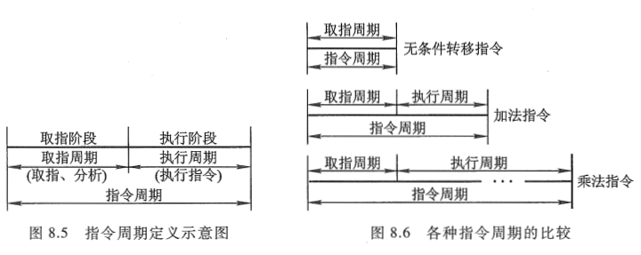
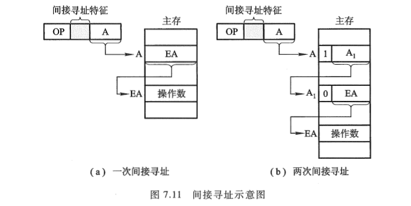
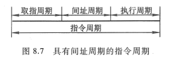
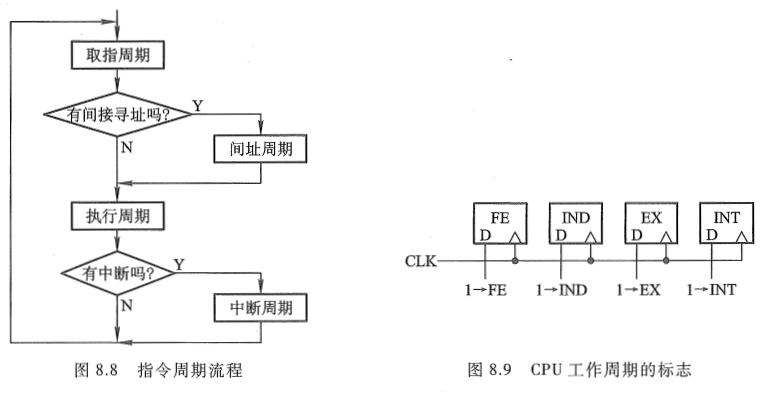
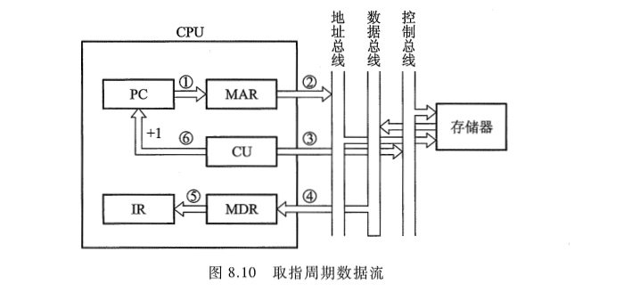
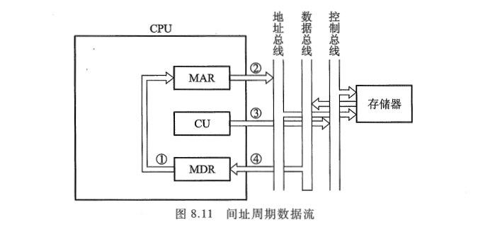
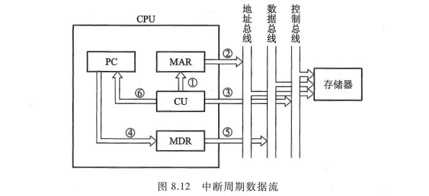
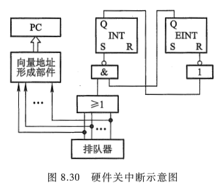

<!-- more -->

## 一、什么是指令周期

CPU 每 **取出并执行一条指令所需的全部时间** 称为 **指令周期**, 也即 CPU 完成一条指令的时间, 如图 8.5 所示。图中的取指阶段完成取指令和分析指令的操作, 又称 **取指周期**; 执行阶段完成执行指令的操作, 又称 **执行周期**。在大多数情况下, CPU 就是按 "取指一执行一再取指一再执行…" 的顺序自动工作的。

由于各种指令操作功能不同, 因此各种指令的指令周期是不相同的。

例如, 无条件转移指令 "JMP X", 在执行阶段不需要访问主存, 而且操作简单, 完全可以在取指阶段的后期将转移地址 X 送至 PC, 以达到转移的目的。这样, "JMP X" 指令的指令周期就是取指周期。

又如一地址格式的加法指令 "ADD X", 在执行阶段首先要从 X 所指示的存储单元中取出操作数, 然后和 ACC 的内容相加, 结果存于 AC, 故这种指令的指令周期在取指和执行阶段各访问一次存储器, 其指令周期就包括两个存取周期。

再如乘法指令, 其执行阶段所要完成的操作比加法指令多得多, 故它的执行周期超过了加法指令, 如图 8.6 所示。

此外, 当遇到间接寻址的指令时, 由于指令字中只给出操作数有效地址的地址, 因此, 为了取出操作数, 需先访问一次存储器, 取出有效地址, 然后再访问存储器, 取出操作数, 如图 7.11(a)所示：

这样，间接寻址的指令周期就包括取指周期、间址周期和执行周期 3 个阶段，其中间址周期用于取操作数的有效地址，因此间址周期介于取指周期和执行周期之间，如图 8.7 所示。

由第 5 章可知, 当 CPU 采用中断方式实现主机与 I/O 设备交换信息时, CPU 在每条指令执行阶段结束前, 都要发中断查询信号, 以检测是否有某个 I/O 设备提出中断请求。如果有请求, CPU 则要进入中断响应阶段, 又称中断周期。在此阶段, CPU 必须将程序断点保存到存储器中。这样, 一个完整的指令周期应包括取指、间址、执行和中断 4 个子周期, 如图 8.8 所示。由于间址周期和中断周期不一定包含在每个指令周期内, 故图中用菱形框判断。

总之, 上述 4 个周期都有 CPU 访存操作, 只是访存的目的不同。取指周期是为了取指令, 间址周期是为了取有效地址, 执行周期是为了取操作数(当指令为访存指令时), 中断周期是为了保存程序断点。这 4 个周期又可称为 CPU 的工作周期, 为了区别它们, 在 CPU 内可设置 4 个标志触发器, 如图 8.9 所示。

图 8.9 所示的 FE、IND、EX 和 INT 分别对应取指、间址、执行和中断 4 个周期, 并以 "1" 状态表示有效, 它们分别由 1→FE、1→IND、1→EX 和 1→INT 这 4 个信号控制。

设置 CPU 工作周期标志触发器对设计控制单元十分有利。例如, 在取指阶段, 只要设置取指周期标志触发器 FE 为 1, 由它控制取指阶段的各个操作, 便获得对任何一条指令的取指命令序列。又如, 在间接寻址时, 间址次数可由间址周期标志触发器 IND 确定, 当它为 "0" 状态时, 表示间接寻址结束。再如，对于一些执行周期不访存的指令（如转移指令、寄存器类型指令），同样可以用它们的操作码与取指周期标志触发器的状态相 "与"，作为相应微操作的控制条件。这些特点在控制单元的设计中可进一步体会。

## 二、指令周期的数据流

为了便于分析指令周期中的数据流, 假设 CPU 中有存储器地址寄存器 MAR、存储器数据寄存器 MDR、程序计数器 PC 和指令寄存器 IR。

### 1. 取指周期的数据流

图 8.10 所示的是取指周期的数据流。PC 中存放现行指令的地址, 该地址送到 MAR 并送至地址总线, 然后由控制部件 CU 向存储器发读命令, 使对应 MAR 所指单元的内容(指令)经数据总线送至 MDR, 再送至 IR, 并且 CU 控制 PC 内容加 1, 形成下一条指令的地址。

### 2. 间址周期的数据流

间址周期的数据流如图 8.11 所示。一旦取指周期结束, CU 便检查 IR 中的内容, 以确定其是否有间址操作, 如果需要间址操作, 则 MDR 中指示形式地址的右 N 位(记作 Ad(MDR))将被送到 MAR, 又送至地址总线, 此后 CU 向存储器发读命令, 以获取有效地址并存至 MDR。

### 3. 执行周期的数据流

由于不同的指令在执行周期的操作不同, 因此执行周期的数据流是多种多样的, 可能涉及 CPU 内部寄存器间的数据传送、对存储器(或 I/O)进行读写操作或对 ALU 的操作, 因此, 无法用统一的数据流图表示。

### 4. 中断周期的数据流

CPU 进入中断周期要完成一系列操作, 其中 PC 当前的内容必须保存起来, 以待执行完中断服务程序后可以准确返回到该程序的间断处, 这一操作的数据流如图 8.12 所示。

图中由 CU 把用于保存程序断点的存储器特殊地址（如栈指针的内容）送往 MAR，并送到地址总线上，然后由 CU 向存储器发写命令，并将 PC 的内容（程序断点）送到 MDR，最终使程序断点经数据总线存入存储器。此外，CU 还需将中断服务程序的入口地址送至 PC，为下一个指令周期的取指周期做好准备。

> Tips：中断周期完成的操作如下：
>
> 在执行周期结束时刻, CPU 要查询是否有请求中断的事件发生, 如果有则进入中断周期。在中断周期, 由中断隐指令自动完成保护断点、寻找中断服务程序入口地址以及硬件关中断的操作。假设程序断点存至主存的 0 地址单元, 且采用硬件向量法寻找入口地址, 则在中断周期需完成如下操作。
>
> ① 将特定地址 "0" 送至存储器地址寄存器, 记作 0→MAR。
>
> ② 向主存发写命令, 启动存储器作写操作, 记作 1→W。
>
> ③ 将 PC 的内容(程序断点)送至 MDR, 记作 PC→MDR。
>
> ④ 将 MDR 的内容(程序断点)通过数据总线写入 MAR(通过地址总线)所指示的主存单元(0 地址单元)中, 记作 MDR→M(MAR)。
>
> ⑤ 将向量地址形成部件的输出送至 PC, 记作向量地址 →PC, 为下一条指令的取指周期做准备。
>
> ⑥ 关中断, 将允许中断触发器清零, 记作 0→EINT(该操作可直接由硬件线路完成，如图 8.30)。
>
> 
