<!-- more -->

## 一、怎么提高处理机速度

由前面各章的介绍可知，为了提高访存速度，一方面要提高存储芯片的性能，另一方面可以从体系结构上，如采用多体、Cache 等分级存储措施来提高存储器的性能/价格比。为了提高主机与 I/O 交换信息的速度，可以采用 DMA 方式，也可以采用多总线结构，将速度不一的 I/O 分别挂到不同带宽的总线上，以解决总线的瓶颈问题。为了提高运算速度，可以采用高速芯片和快速进位链，以及改进算法等措施。为了进一步提高处理机速度，通常可从提高器件的性能和改进系统的结构，开发系统的并行性两方面入手。

（1）提高器件的性能  

提高器件的性能一直是提高整机性能的重要途径, 计算机的发展史就是按器件把计算机分为电子管、晶体管、集成电路和大规模集成电路 4 代的。器件的每一次更新换代都使计算机的软硬件技术和计算机性能获得突破性进展。特别是大规模集成电路的发展, 由于其集成度高、体积小、功耗低、可靠性高、价格便宜等特点, 使人们可采用更复杂的系统结构造出性能更高、工作更可靠、价格更低的计算机。但是由于半导体器件的集成度越来越接近物理极限, 使器件速度的提高越来越慢。

（2）改进系统的结构, 开发系统的并行性

所谓并行, 包含同时性和并发性两个方面。前者是指两个或多个事件在同一时刻发生, 后者是指两个或多个事件在同一时间段发生。也就是说, 在同一时刻或同一时间段内完成两种或两种以上性质相同或不同的功能, 只要在时间上互相重叠, 就存在并行性。

并行性体现在不同等级上。通常分为 4 个级别: 作业级或程序级、任务级或进程级、指令之间级和指令内部级。前两级为粗粒度, 又称为过程级; 后两级为细粒度, 又称为指令级。粗粒度并行性(Coarse-grained Parallism)一般用算法 (软件) 实现, 细粒度并行性(Fine-grained Parllelism)一般用硬件实现。从计算机体系上看, 粗粒度并行性是在多个处理机上分别运行多个进程, 由多台处理机合作完成一个程序; 细粒度并行性是指在处理机的操作级和指令级的并行性, 其中 **指令的流水作业** 就是一项重要技术。这里只讨论有关指令流水的一些主要问题, 其他有关粗粒度并行和粗粒度并行技术将在 "计算机体系结构" 课程中讲述。

## 二、指令流水原理

指令流水类似于工厂的装配线, 装配线利用了产品在装配的不同阶段其装配过程不同这一特点, 使不同产品处在不同的装配段上, 即每个装配段同时对不同产品进行加工, 这样可大大提高装配效率。将这种装配生产线的思想用到指令的执行上, 就引出了指令流水的概念。

从上面的分析可知, 完成一条指令实际上也可分为许多阶段。为简单起见, 把指令的处理过程分为取指令和执行指令两个阶段, 在不采用流水技术的计算机里, 取指令和执行指令是周而复始地重复出现, 各条指令按顺序串行执行的, 如图 8.13 所示。

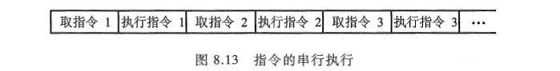

图中取指令的操作可由指令部件完成, 执行指令的操作可由执行部件完成。进一步分析发现, 这种顺序执行虽然控制简单, 但执行中各部件的利用率不高, 如指令部件工作时, 执行部件基本空闲, 而执行部件工作时, 指令部件基本空闲。如果指令执行阶段不访问主存, 则完全可以利用这段时间取下一条指令, 这样就使取下一条指令的操作和执行当前指令的操作同时进行, 如图 8.14 所示, 这就是两条指令的重叠, 即指令的二级流水。

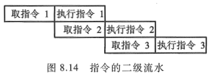

由指令部件取出一条指令, 并将它暂存起来, 如果执行部件空闲, 就将暂存的指令传给执行部件执行。与此同时, 指令部件又可取出下一条指令并暂存起来, 这称为 **指令预取**。显然, 这种工作方式能加速指令的执行。如果取指和执行阶段在时间上完全重叠, 相当于将指令周期减半。然而进一步分析流水线, 就会发现存在两个原因使得执行效率加倍是不可能的。

① 指令的执行时间一般大于取指时间, 因此, 取指阶段可能要等待一段时间, 也即存放在指令部件缓冲区的指令还不能立即传给执行部件, 缓冲区不能空出。

② 当遇到条件转移指令时, 下一条指令是不可知的, 因为必须等到执行阶段结束后, 才能获知条件是否成立, 从而决定下条指令的地址, 造成时间损失。

通常为了减少时间损失, 采用猜测法, 即当条件转移指令从取指阶段进入执行阶段时, 指令部件仍按顺序预取下一条指令。这样, 如果条件不成立, 转移没有发生, 则没有时间损失; 若条件成立, 转移发生, 则所取的指令必须丢掉, 并再取新的指令。

尽管这些因素降低了两级流水线的潜在效率，但还是可以获得一定程度的加速。为了进一步提高处理速度，可将指令的处理过程分解为更细的几个阶段。

- 取指（FI）：从存储器取出一条指令并暂时存入指令部件的缓冲区。
- 指令译码（DI）：确定操作性质和操作数地址的形成方式。
- 计算操作数地址（CO）：计算操作数的有效地址，涉及寄存器间接寻址、间接寻址、变址寻址、基址寻址、相对寻址等各种地址计算方式。
- 取操作数（FO）：从存储器中取操作数（若操作数在寄存器中，则无须此阶段）。
- 执行指令（EI）：执行指令所需的操作，并将结果存于目的位置（寄存器中）。
- 写操作数（WO）：将结果存入存储器。

为了说明方便起见，假设上述各段的时间都是相等的（即每段都为一个时间单元），于是可得图 8.15 所示的指令六级流水时序。在这个流水线中，处理器有 6 个操作部件，同时对 6 条指令进行加工，加快了程序的执行速度。

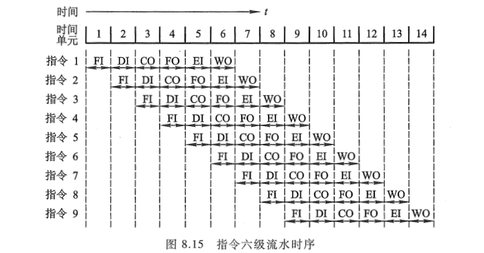

## 三、影响流水线性能因素

要使流水线具有良好的性能, 必须设法使流水线能畅通流动, 即必须做到充分流水, 不发生断流。但通常由于在流水过程中会出现三种相关, 使流水线不断流实现起来很困难, 这三种相关是结构相关、数据相关和控制相关。

**结构相关** 是当多条指令进入流水线后, 硬件资源满足不了指令重叠执行的要求时产生的。**数据相关** 是指令在流水线中重叠执行时, 当后继指令需要用到前面指令的执行结果时发生的。**控制相关** 是当流水线遇到分支指令和其他改变 PC 值的指令时引起的。

为了讨论方便起见, 假设流水线由 5 段组成, 它们分别是取指令(IF)、指令译码/读寄存器(ID)、执行/访存有效地址计算(EX)、存储器访问(MEM)、结果写回寄存器(WB)。

不同类型指令在各流水段的操作是不同的, 表 8.1 列出了 ALU 类指令、访存类(取数、存数)指令和转移类指令在各流水段中所进行的操作。

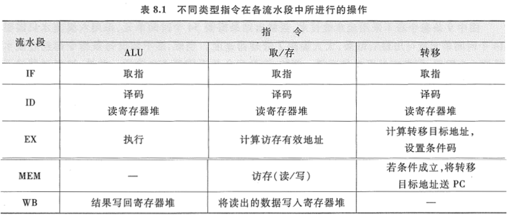

下面分析上述三种相关对流水线工作的影响。  

### 1. 结构相关

结构相关是当指令在重叠执行过程中，不同指令争用同一功能部件产生资源冲突时产生的，故又有资源相关之称。

通常，大多数机器都是将指令和数据保存在同一存储器中，且只有一个访问口，如果在某个时钟周期内，流水线既要完成某条指令对操作数的存储器访问操作，又要完成另一条指令的取指操作，这就会发生访存冲突。如表 8.2 中，在第 4 个时钟周期，第 i 条指令（LOAD）的 MEM 段和第 i+3 条指令的 IF 段发生了访存冲突。解决冲突的方法可以让流水线在完成前一条指令对数据的存储器访问时，暂停（一个时钟周期）取后一条指令的操作，如表 8.3 所示。当然，如果第 i 条指令不是 LOAD 指令，在 MEM 段不访存，也就不会发生访存冲突。

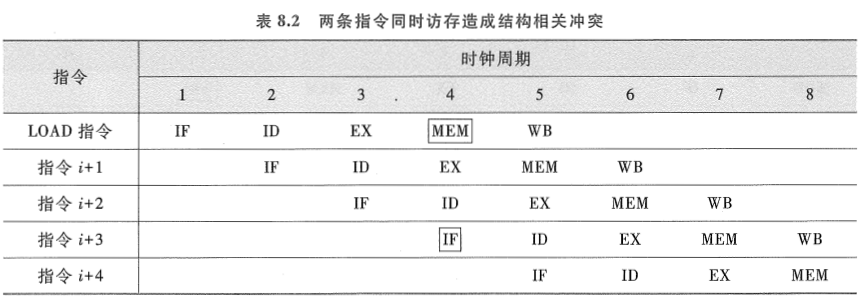

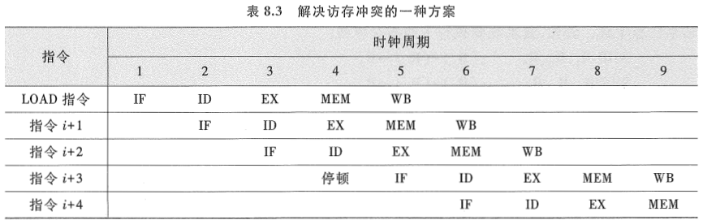

**解决访存冲突的另一种方法是设置两个独立的存储器分别存放操作数和指令**, 以免取指令和取操作数同时进行时互相冲突, 使取某条指令和取另一条指令的操作数实现时间上的重叠。还可以采用指令预取技术, 例如, 在 CPU(8086)中设置指令队列, 将指令预先取到指令队列中排队。指令预取技术的实现基于访存周期很短的情况, 例如, 在执行指令阶段, 取数时间很短, 因此在执行指令时, 主存会有空闲, 此时, 只要指令队列空出, 就可取下一条指令, 并放至空出的指令队列中, 从而保证在执行第 K 条指令的同时对第 K+1 条指令进行译码, 实现 "执行 K" 与 "分析 K+1" 的重叠。

### 2. 数据相关

数据相关是流水线中的各条指令因重叠操作，可能改变对操作数的读写访问顺序，从而导致了数据相关冲突。例如，流水线要执行以下两条指令：

```assembly
ADD R1, R2，R3 ;（R2）+（R3）→ R1
SUB R4, R1，R5 ;（R1）-（R5）→ R4
```

这里第二条 SUB 指令中 R1 的内容必须是第一条 ADD 指令的执行结果。可见正常的读写顺序是先由 ADD 指令写入 R1，再由 SUB 指令来读 R1。在非流水线时，这种先写后读的顺序是自然维持的。但在流水线时，由于重叠操作，使读写的先后顺序关系发生了变化，如表 8.4 所示。

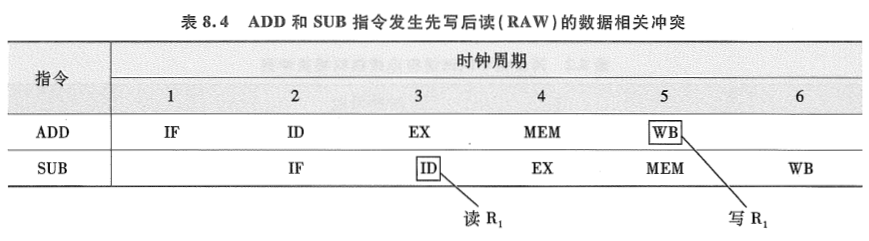

由表 8.4 可见, 在第 5 个时钟周期, ADD 指令方可将运算结果写入 R1, 但后继 SUB 指令在第 3 个时钟周期就要从 R1 中读数, 使先写后读的顺序改变为先读后写, 发生了先写后读(RAW)的数据相关冲突。如果不采取相应的措施, 按表 8.4 的读写顺序, 就会使操作结果出错。解决这种数据相关的方法可以采用后推法, 即遇到数据相关时, 就停顿后继指令的运行, 直至前面指令的结果已经生成。例如, 流水线要执行下列指令序列:

```assembly
ADD R1, R2, R3  ;(R2)+(R3)→R1
SUB R4, R1, R5  ;(R1)-(R5)→R4
AND R6, R1, R7  ;(R1)AND (R7)→R6
OR  R8, R1, R9  ;(R1)OR (R9)→R8
XOR R10, R1, R11;(R1·)XOR(R11)→R10
```

其中, 第一条 ADD 指令将向 R1 寄存器写入操作结果, 后继的 4 条指令都要使用 R1 中的值作为一个源操作数, 显然, 这时就出现了前述的 RAW 数据相关。表 8.5 列出了未对数据相关进行特殊处理的流水线，表中 ADD 指令在 WB 段才将计算结果写入寄存器 R1 中，但 SUB 指令在其 ID 段就要从寄存器 R1 中读取该计算结果。同样，AND 指令、OR 指令也要受到这种相关关系的影响。对于 XOR 指令，由于其 ID 段（第 6 个时钟周期）在 ADD 指令的 WB 段（第 5 个时钟周期）之后，因此可以正常操作。

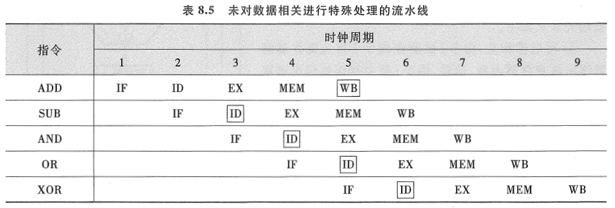

如果采用后推法，即将相关指令延迟到所需操作数被写回到寄存器后再执行的方式，就可解决这种数据相关冲突，其流水线如表 8.6 所示。显然这将要使流水线停顿 3 个时钟周期。

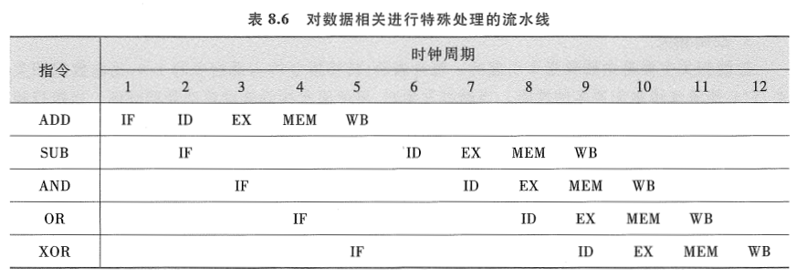

另一种解决方法是采用定向技术, 又称为旁路技术或相关专用通路技术。其主要思想是不必待某条指令的执行结果送回到寄存器后, 再从寄存器中取出该结果, 作为下一条指令的源操作数, 而是直接将执行结果送到其他指令所需要的地方。上述 5 条指令序列中, 实际上要写入 R1 的 ADD 指令在 EX 段的末尾处已形成, 如果设置专用通路技术, 将此时产生的结果直接送往需要它的 SUB、AND 和 OR 指令的 EX 段, 就可以使流水线不发生停顿。显然, 此时要对 3 条指令进行定向传送操作。图 8.16 示出了带有旁路技术的 ALU 执行部件。

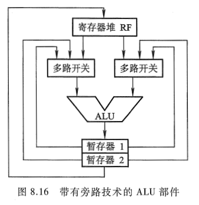

图中有两个暂存器, 当 AND 指令将进入 EX 段时, ADD 指令的执行结果已存入暂存器 2, SUB 指令的执行结果已存入暂存器 1, 而暂存器 2 的内容(存放送往 R1 的结果)可通过旁路通道, 经多路开关送到 ALU 中。这里的定向传送仅发生在 ALU 内部。

根据指令间对同一寄存器读和写操作的先后次序关系, 数据相关冲突可分为写后读相关(Read After Write, RAW)、读后写相关(Write After Read, WAR)和写后写相关(Write After Write, WAW)。例如, 有 i 和 j 两条指令, i 指令在前, j 指令在后, 则三种不同类型的数据相关含义如下。

① 写后读相关: 指令 j 试图在指令 i 写入寄存器前就读出该寄存器内容, 这样, 指令 j 就会错误地读出该寄存器旧的内容。

② 读后写相关: 指令 j 试图在指令 i 读出寄存器之前就写入该寄存器, 这样, 指令 i 就错误地读出该寄存器新的内容。

③ 写后写相关: 指令 j 试图在指令 i 写入寄存器之前就写入该寄存器, 这样, 两次写的先后次序被颠倒, 就会错误地使由指令 i 写入的值成为该寄存器的内容。

上述三种数据相关在按序流动的流水线中, 只可能出现 RAW 相关。在非按序流动的流水线中, 由于允许后进入流水线的指令超过先进入流水线的指令而先流出流水线, 则既可能发生 RAW 相关, 还可能发生 WAR 和 WAW 相关。

### 3. 控制相关

控制相关主要是由转移指令引起的。统计表明, 转移指令约占总指令的 1/4, 比起数据相关来, 它会使流水线丧失更多的性能。当转移发生时, 将使流水线的连续流动受到破坏。当执行转移指令时, 根据是否发生转移, 它可能将程序计数器 PC 内容改变成转移目标地址, 也可能只是使 PC 加上一个增量, 指向下一条指令的地址。图 8.17 示意了条件转移的效果。

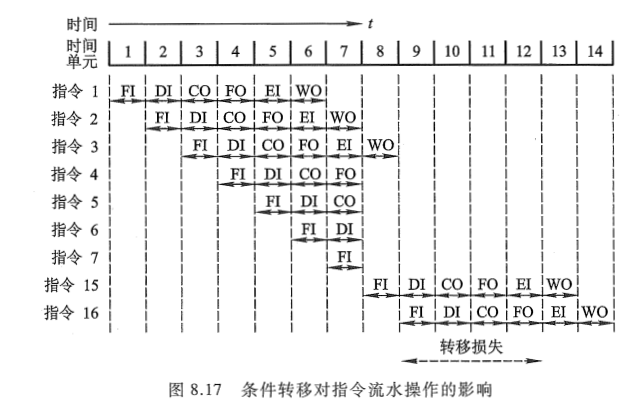

这里使用了和图 8.15 相同的程序，并假设指令 3 是一条条件转移指令，即指令 3 必须待指令 2 的结果出现后（第 7 个时间单元）才能决定下一条指令是 4（条件不满足）还是 15（条件满足）。由于结果无法预测，此流水线继续预取指令 4，并向前推进。当最后结果满足条件时，发现对第 4、5、6、7 条指令所做的操作全部报废。在第 8 个时间单元，指令 15 进入流水线。在时间单元 9\~12 之间没有指令完成，这就是由于不能预测转移条件而带来的性能损失。而图 8.15 中因转移条件不成立，未发生转移，得到了较好的流水线性能。

为了解决控制相关, 可以采用尽早判别转移是否发生, 尽早生成转移目标地址; 预取转移成功或不成功两个控制流方向上的目标指令; 加快和提前形成条件码; 提高转移方向的猜准率等方法。

## 四、流水线性能

流水线性能通常用吞吐率、加速比和效率 3 项指标来衡量。

### 1. 吞吐率(Throughput Rate)

在指令级流水线中, 吞吐率是指单位时间内流水线所完成指令或输出结果的数量。吞吐率又有最大吞吐率和实际吞吐率之分。

最大吞吐率是指流水线在连续流动达到稳定状态后所获得的吞吐率。这个稳定状态可以参考图 8.15 第 6~9 个时间单元, 流水线中各段都处于工作状态:


这个时候，对于 m 段的指令流水线而言, 若各段的时间均为 $\Delta{t}$, 则最大吞吐率为：

$$
T_{pmax}=\frac{1}{\Delta{t}}
$$


流水线仅在连续流动时才可达到最大吞吐率。实际上由于流水线在开始时有一段建立时间（第一条指令输入后到其完成的时间），结束时有一段排空时间（最后一条指令输入后到其完成的时间），以及由于各种相关因素使流水线无法连续流动，因此，**实际吞吐率总是小于最大吞吐率**。

实际吞吐率是指流水线完成 n 条指令的实际吞吐率。对于 m 段的指令流水线, 若各段的时间均为 $\Delta{t}$, 连续处理 n 条指令, 除第一条指令需 $m · \Delta{t}$ 外, 其余(n-1)条指令, 每隔 $\Delta{t}$ 就有一个结果输出, 即总共需 $m · \Delta{t} + (n + 1)\Delta{t}$ 时间, 故实际吞吐率为：

$$
T_p =\frac{n}{m\Delta{t} + (n-1)\Delta{t}}=\frac{1}{\Delta{t}[1+(m-1)/n]}=\frac{T_{pmax}}{1+(m-1)/n}
$$

仅当 $n >> m$ 时，才会有 $T_p \approx T_{pmax}$。

图 8.15 所示的六级流水线中, 设每段时间为 $\Delta{t}$，其最大吞吐率为 $\frac{1}{\Delta{t}}$, 完成 9 条指令的实际吞率为 $\frac{9}{6 \Delta{t} +(9-1)\Delta{t}}$。

### 2. 加速比(Speedup Ratio)  

流水线的加速比是指 m 段流水线的速度与等功能的非流水线的速度之比。如果流水线各段时间均为 $\Delta{t}$ ，则完成 n 条指令在 m 段流水线上共需 $T=m·\Delta{t}+(n-1)\Delta{t}$ 时间。而在等效的非流水线上所需时间为 $T^{'}=nm\Delta{t}$。故加速比 $S_p$ 为

$$
S_p =\frac{nm\Delta{t}}{m\Delta{t} + (n-1)\Delta{t}}=\frac{nm}{m+n-1}=\frac{m}{1+(m-1)/n}
$$

可以看出当 $n >> m$ 时，$S_p$ 接近于 m，即当流水线各段时间相等时，其最大加速比等于流水线的段数。

### 3. 效率（Efficiency）

效率是指流水线中各功能段的利用率。由于流水线有建立时间和排空时间，因此各功能段的设备不可能一直处于工作状态，总有一段空闲时间。图 8.18 是 4 段（m = 4）流水线的时空图，各段时间相等，均为 $\Delta{t}$。图中 $mn\Delta{t}$ 是流水线各段处于工作时间的时空区，而流水线中各段总的时空区是 $m(m+n-1)\Delta{t}$。通常用流水线各段处于工作时间的时空区与流水线中各段总的时空区之比来衡量流水线的效率。用公式表示为：

$$
E =\frac{mn\Delta{t}}{m(m+n-1)\Delta{t}}=\frac{n}{m+n-1}=\frac{S_p}{m}= T_p\Delta{t}
$$

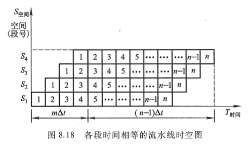

### 4. 例 8.1

【例 8.1】 假设指令流水线分取指(IF)、译码(ID)、执行(EX)、回写(WR)4 个过程段, 共有 10 条指令连续输入此流水线。

（1）画出指令周期流程。

（2）画出非流水线时空图。

（3）画出流水线时空图。

（4）假设时钟周期为 100 ns, 求流水线的实际吞吐率。

（5）求该流水处理器的加速比。

【解】:

（1）指令周期包括 IF、ID、EX、WR 这 4 个子过程, 图 8.19(a)为指令周期流程图。

（2）非流水线时空图如图 8.19 (b)所示。假设一个时间单位为一个时钟周期, 则每隔 4 个时钟周期才有一个输出结果。

（3）流水线时空图如图 8.19（c）所示。由图中可见，第一条指令出结果需要 4 个时钟周期。当流水线满载时，以后每一个时钟周期可以出一个结果，即执行完一条指令。

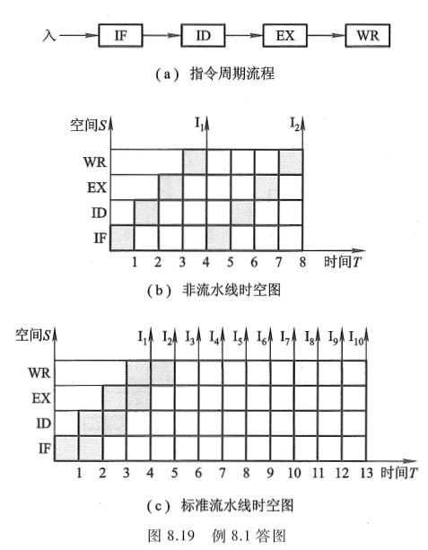

（4）由图 8.19(c)所示的 10 条指令进入流水线的时空图可见, 在 13 个时钟周期结束时, CPU 执行完 10 条指令, 故实际吞吐率为

$$
10/(100 ns *13) \approx 0.77* 10^7 条指令/秒
$$

（5）在流水处理器中, 当任务饱满时, 指令不断输入流水线, 不论是几级流水线, 每隔一个时钟周期都输出一个结果。对于本题四级流水线而言, 处理 10 条指令所需的时钟周期数为 $T_4 = 4+(10-1)= 13$, 而非流水线处理 10 条指令需 4x10 = 40 个时钟周期, 故该流水处理器的加速比为 40/13 ≈ 3.08。

## 五、流水线中的多发技术

流水线技术使计算机系统结构产生重大革新，为了进一步发展，除了采用好的指令调度算法、重新组织指令执行顺序、降低相关带来的干扰以及优化编译外，还可开发流水线中的多发技术，设法在一个时钟周期（机器主频的倒数）内产生更多条指令的结果。常见的多发技术有超标量技术、超流水线技术和超长指令字技术。假设处理一条指令分 4 个阶段：取指（IF）、译码（ID）、执行（EX）和回写（WR）。图 8.20 是三种多发技术与普通四级流水线的比较，其中图 8.20（a）为普通四级流水线，一个时钟周期出一个结果。

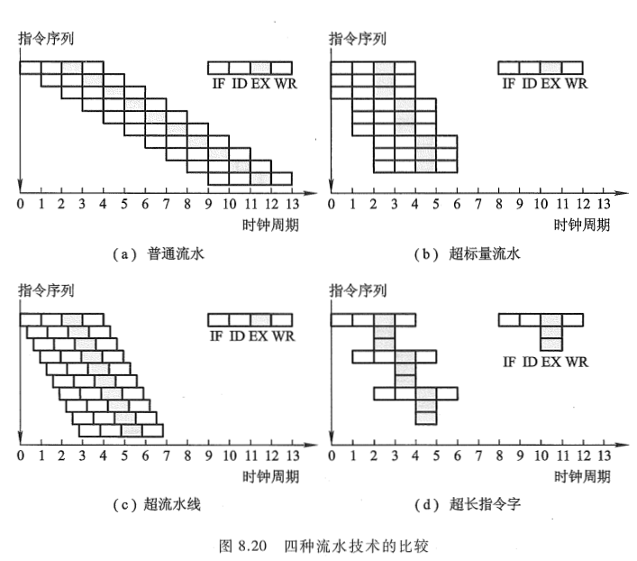


### 1. 超标量技术

超标量（Superscalar）技术如图 8.20（b）所示。它是指在每个时钟周期内可同时并发多条独立指令，即以并行操作方式将两条或两条以上（图中所示为 3 条）指令编译并执行。要实现超标量技术，要求处理机中配置多个功能部件和指令译码电路，以及多个寄存器端口和总线，以便能实现同时执行多个操作，此外还要编译程序决定哪几条相邻指令可并行执行。

例如，下面两个程序段：


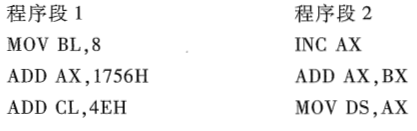

左边程序段中的 3 条指令是互相独立的，不存在数据相关，可实现指令级并行。右边程序段中的 3 条指令存在数据相关，不能并行执行。超标量计算机不能重新安排指令的执行顺序，但可以通过编译优化技术，在高级语言翻译成机器语言时精心安排，把能并行执行的指令搭配起来，挖掘更多的指令并行性。

### 2. 超流水线技术

超流水线（Superpipeline）技术是将一些流水线寄存器插入流水线段中，好比将流水线再分段，如图 8.20（c）所示。图中将原来的一个时钟周期又分成 3 段，使超流水线的处理器周期比普通流水线的处理器周期（如图 8.20（a）所示）短，这样，在原来的时钟周期内，功能部件被使用 3 次，使流水线以 3 倍于原来时钟频率的速度运行。与超标量计算机一样，硬件不能调整指令的执行顺序，靠编译程序解决优化问题。

### 3. 超长指令字技术

超长指令字（VLIW）技术和超标量技术都是采用多条指令在多个处理部件中并行处理的体系结构，在一个时钟周期内能流出多条指令。但超标量的指令来自同一标准的指令流，VLIW 则是由编译程序在编译时挖掘出指令间潜在的并行性后，把多条能并行操作的指令组合成一条具有多个操作码字段的超长指令（指令字长可达几百位），由这条超长指令控制 VLIW 机中多个独立工作的功能部件，由每一个操作码字段控制一个功能部件，`相当于同时执行多条指令，如图 8.20（d）所示。VLIW 较超标量具有更高的并行处理能力，但对优化编译器的要求更高，对 Cache 的容量要求更大。

## 六、流水线结构

### 1. 指令流水线结构

指令流水线是将指令的整个执行过程用流水线进行分段处理，典型的指令执行过程分为 "取指令一指令译码一形成地址一取操作数一执行指令一回写结果一修改指令指针" 这几个阶段，与此相对应的指令流水线结构由图 8.21 所示的几个部件组成。

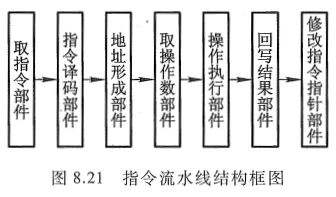

指令流水线对机器性能的改善程度取决于把处理过程分解成多少个相等的时间段数。如上述共分 7 段，若每一段需要一个时钟周期，则当不采用流水技术时，需 7 个时钟周期出一个结果。采用流水线后，假设流水线不出现断流（如遇到转移指令），则除第一条指令需 7 个时钟周期出结果外，以后所有的指令都是一个时钟周期出一个结果。因此，在理想的情况下（流水线不断流），该流水线的速度约提高到 7 倍。

### 2. 运算流水线

上述讨论的指令流水线是指令级的流水技术，实际上流水技术还可用于部件级。例如，浮点加法运算，可以分成 "对阶" "尾数加" 及 "结果规格化" 3 段，每一段都有一个专门的逻辑电路完成操作，并将其结果保存在锁存器中，作为下一段的输入。如图 8.22 所示，当对阶完成后，将结果存入锁存器，便又可进入下一条指令的对阶运算。

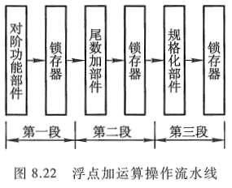

若执行浮点乘运算也按浮点加运算那样分段，即分成阶码运算、尾数乘和结果规格化三级流水线，就不够合理。因为尾数乘所需的时间比阶码运算和规格化操作长得多，而且尾数乘可以和阶码运算同时进行，因此，尾数乘本身就可以用流水线。

由图 8.22 可见，流水线相邻两段在执行不同的操作，因此在相邻两段之间必须设置锁存器或寄存器，以保证在一个时钟周期内流水线的输入信号不变。这一指导思想也适用于指令流水。此外，只有当流水线各段工作饱满时，才能发挥最大作用。上例中如果浮点运算没有足够的数据来源，那么流水线中的某些段甚至全部段都处于空闲状态，使流水线的作用没有充分发挥。因此具体是否采用流水线技术以及在计算机的哪一部分采用流水线技术需根据情况而定。
