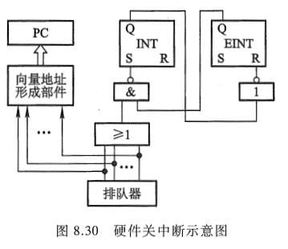

<!-- more -->

第 5 章已经介绍了有关中断的一些概念, 特别对 I/O 中断做了较详细的讨论。实际上 I/O 中断只是 CPU 众多中断中的一种, 引起中断的因素很多, 为了处理各种中断, CPU 内通常设有处理中断的机构一中断系统, 以解决各种中断的共性问题。本节进一步分析中断系统的功能, 以便更深入地了解中断系统在 CPU 中的作用和地位。

## 一、概述

从前面分析可知, 采用中断方式实现主机与 I/O 交换信息可使 CPU 和 I/O 并行工作, 提高 CPU 的效率。其实, 计算机在运行过程中, 除了会遇到 I/O 中断外, 还有许多意外事件发生, 如电源突然掉电, 机器硬件突然出现故障, 人们在机器运行过程中想随机抽查计算的中间结果, 实现人机联系等。此外, 在实时处理系统中, 必须及时处理某个事件或现象, 例如, 在过程控制系统中, 当突然出现温度过高、电压过大等情况时, 必须及时将这些信息送至计算机, 由计算机暂时中断现行程序, 转去执行中断服务程序, 以解决这种异常情况。再如, 计算机实现多道程序运行时, 可以通过分配给每道程序一个固定时间片, 利用时钟定时发中断进行程序切换。在多处理机系统中, 各处理器之间的信息交流和任务切换也可通过中断来实现。总之, 为了提高计算机的效率, 为了处理一些异常情况以及实时控制、多道程序和多处理机的需要, 提出了中断的概念。

### 1. 引起中断的各种因素

引起中断的因素很多，大致可分为以下几类。

（1）人为设置的中断

这种中断一般称为自愿中断，因为它是在程序中人为设置的，故一旦机器执行这种人为中断，便自愿停止现行程序而转入中断处理，如图 8.23 所示。

图中的 "转管指令" 可能是转至从 I/O 设备调入一批信息到主存的管理程序, 也可能是转至将一批数据送往打印机打印的管理程序。显然, 当用户程序执行
了 "转管指令" 后, 便中断现行程序, 转入管理程序, 这种转移完全是自愿的。

IBM PC(Intel 8086)的 INT TYPE 指令类似于这种自愿中断, 它完成系统调用。 TYPE 决定了系统调用的类型。

（2）程序性事故

如定点溢出、浮点溢出、操作码不能识别、除法中出现 "非法" 等，这些都属于由程序设计不周而引起的中断。

（3）硬件故障

硬件故障类型很多，如插件接触不良、通风不良、磁表面损坏、电源掉电等，这些都属于硬设备故障。

（4）I/O 设备

I/O 设备被启动以后，一旦准备就绪，便向 CPU 发出中断请求。每个 I/O 设备都能发中断请求，因此这种中断与计算机所配置的 I/O 设备多少有关。

（5）外部事件

用户通过键盘来中断现行程序属于外部事件中断。

上述各种中断因素除自愿中断是人为的以外，大多都是随机的。通常将 **能引起中断的各个因素** 称为 **中断源**。中断源可分两大类：一类为不可屏蔽中断，这类中断 CPU 不能禁止响应，如电源掉电；另一类为可屏蔽中断，对可屏蔽中断源的请求，CPU 可根据该中断源是否被屏蔽来确定是否给予响应。若未屏蔽则能响应；若已被屏蔽，则 CPU 不能响应（有关内容详见 8.4.6 节中断屏蔽技术）。

### 2. 中断系统须解决的问题

① 各中断源如何向 CPU 提出中断请求。

② 当多个中断源同时提出中断请求时, 中断系统如何确定优先响应哪个中断源的请求。

③CPU 在什么条件、什么时候、以什么方式来响应中断。

④CPU 响应中断后如何保护现场。

⑤CPU 响应中断后, 如何停止原程序的执行而转入中断服务程序的入口地址。

⑥ 中断处理结束后, CPU 如何恢复现场, 如何返回到原程序的间断处。

⑦ 在中断处理过程中又出现了新的中断请求, CPU 该如何处理。

要解决上述 7 个问题, 只有在中断系统中配置相应的硬件和软件, 才能完成中断处理任务。

## 二、中断请求标记和中断判优逻辑

### 1. 中断请求标记

为了判断是哪个中断源提出请求, 在中断系统中必须设置中断请求标记触发器, 简称中断请求触发器, 记作 INTR。当其状态为 "1" 时, 表示中断源有请求。这种触发器可集中设在 CPU 内, 组成一个中断请求标记寄存器, 如图 8.24 所示。

图中 1,2,3,4,5,…, n 分别对应掉电、过热、主存读写校验错、阶上溢、非法除法……打印机输出等中断源的中断请求触发器, 其中任意一个触发器为 1, 即表明对应的中断源提出了中断请求。显然, 中断请求触发器越多, 说明计算机处理中断的能力越强。

有一点需要说明, 尽管中断请求标记寄存器是由各中断请求触发器组成的, 但这些触发器既可以集中在 CPU 的中断系统内, 也可以分散到各个中断源中。在图 5.41 所示的程序中断方式接口电路中, INTR 就是分散在各个接口电路内的中断请求触发器。

### 2. 中断判优逻辑

任何一个中断系统, 在任一时刻, 只能响应一个中断源的请求。但许多中断源提出请求都是随机的, 当某一时刻有多个中断源提出中断请求时, 中断系统必须按其优先顺序予以响应, 这称为中断判优。

各中断源的优先顺序是根据该中断源若得不到及时响应, 致使机器工作出错的严重程度而定的。例如, 电源掉电对计算机工作影响程度最大, 优先等级为最高。又如 "定点溢出" 对机器正常工作影响也很大, 若不及时响应, 将使计算机一切运行均无效, 故它的优先等级也较高。对于 I/O 设备, 则可按其速度高低安排优先等级, 速度高的设备优先级比速度低的设备高。

中断判优可用硬件实现, 也可用软件实现。

#### 2.1 硬件排队

硬件排队又分两种。一种为链式排队器, 对应中断请求触发器分散在各个接口电路中的情况, 如图 5.38 所示, 每一个接口电路中都设有一个非门和一个与非门, 它们犹如链条一样串接起来。

另一种排队器设在 CPU 内, 如图 8.25 所示, 图中假设其优先顺序按 1、2、3、4 由高向低排列。这样, 当最高优先级的中断源有请求时 INTR1 = 1, 就可封住比它级别低的中断源的请求。

#### 2.2 软件排队

软件排队是通过编写查询程序实现的，其程序框图如图 8.26 所示。程序按中断源的优先等级，从高至低逐级查询各中断源是否有中断请求，这样就可以保证 CPU 首先响应级别高的中断源的请求。

## 三、中断服务程序入口

由于不同的中断源对应不同的中断服务程序，故准确找到服务程序的入口地址是中断处理的核心问题。通常有两种方法寻找入口地址：硬件向量法和软件查询法。

### 1. 硬件向量法

硬件向量法就是利用硬件产生向量地址，再由向量地址找到中断服务程序的入口地址。向量地址由中断向量地址形成部件产生，这个电路可分散设置在各个接口电路中（如图 5.41 中的设备编码器），也可设置在 CPU 内，如图 8.27 所示。

<table style="border: none;">
  <tbody>
	<tr style="border: none;">
	<td width="50%" align="center" style="border: none;">  </td> <td width="50%" align="center" style="border: none; ">  </td>
	</tr>
  </tbody>
</table>

由向量地址寻找中断服务程序的入口地址通常采用两种办法。一种如图 5.40 所示，在向量地址内存放一条无条件转移指令，CPU 响应中断时，只要将向量地址（如 12H）送至 PC，执行这条指令，便可无条件转向打印机服务程序的入口地址 200。另一种是设置向量地址表，如图 8.28 所示。该表设在存储器内，存储单元的地址为向量地址，存储单元的内容为入口地址，例如，图 8.28 中的 12H、13H、14H 为向量地址，200、300、400 为入口地址，只要访问向量地址所指示的存
储单元，便可获得入口地址。**硬件向量法寻找入口地址速度快**，在现代计算机中被普遍采用。

<table style="border: none;">
  <tbody>
	<tr style="border: none;">
	<td width="50%" align="center" style="border: none;">  </td> <td width="50%" align="center" style="border: none; ">  </td>
	</tr>
  </tbody>
</table>

### 2. 软件查询法

用软件寻找中断服务程序入口地址的方法称为软件查询法, 其框图同图 8.26。由图 8.26 中可见, 当查到某一中断源有中断请求时, 接着安排一条转移指令, 直接指向此中断源的中断服务程序入口地址, 机器便能自动进入中断处理。至于各中断源对应的入口地址, 则由程序员(或系统)事先确定。这种方法不涉及硬件设备, 但查询时间较长。计算机可具备软、硬件两种方法寻找入口地址, 使用户使用更方便、灵活。

## 四、中断响应

### 1. 响应中断的条件

由第 5 章已知，CPU 响应 I/O 中断的条件是允许中断触发器必须为 "1"，这一结论同样适合于其他中断源。在中断系统中有一个允许中断触发器 EINT，它可被开中断指令置 "1"，也可被关中断指令置 "0"。当允许中断触发器为 "1" 时，意味着 CPU 允许响应中断源的请求；当其为 "0" 时，意味着 CPU 禁止响应中断。故当 EINT = 1，且有中断请求（即中断请求标记触发器 INTR = 1）时，CPU 可以响应中断。

### 2. 响应中断的时间

与响应 I/O 中断一样, CPU 总是在指令执行周期结束后, 响应任何中断源的请求, 如图 8.8 所示。在指令执行周期结束后, 若有中断, CPU 则进入中断周期; 若无中断, 则进入下一条指令的取指周期。

之所以 CPU 在指令的执行周期后进入中断周期, 是因为 CPU 在执行周期的结束时刻统一向所有中断源发中断查询信号, 只有此时, CPU 才能获知哪个中断源有请求。如图 8.29 所示, 图中 INTRi(i = 1,2,…)是各个中断源的中断请求触发器, 触发器的数据端来自各中断源, 当它们有请求时, 数据端为 "1", 而且只有当 CPU 发出的中断查询信号输入触发器的时钟端时, 才能将 INTRi 置 "1"。

在某些计算机中, 有些指令执行时间很长, 若 CPU 的查询信号一律安排在执行周期结束时刻, 有可能因 CPU 发现中断请求过迟而出差错。为此, 可在指令执行过程中设置若干个查询断点, CPU 在每个 "查询断点" 时刻均发中断查询信号, 以便发现有中断请求便可及时响应。

### 3. 中断隐指令

CPU 响应中断后, 即进入中断周期。在中断周期内, CPU 要自动完成一系列操作, 具体如下:

（1）保护程序断点

保护程序断点就是要将当前程序计数器 PC 的内容(程序断点)保存到存储器中。它可以存在存储器的特定单元(如 0 号地址)内, 也可以存入堆栈。

（2）寻找中断服务程序的入口地址

由于中断周期结束后进入下条指令(即中断服务程序的第一条指令)的取指周期, 因此在中断周期内必须设法找到中断服务程序的入口地址。由于入口地址有两种方法获得, 因此在中断周期内也有两种方法寻找入口地址。

其一, 在中断周期内, 将向量地址送至 PC(对应硬件向量法), 使 CPU 执行下一条无条件转移指令, 转至中断服务程序的入口地址。

其二, 在中断周期内, 将如图 8.26 所示的软件查询入口地址的程序(又称中断识别程序)首地址送至 PC, 使 CPU 执行中断识别程序, 找到入口地址(对应软件查询法)。

（3）关中断

CPU 进入中断周期, 意味着 CPU 响应了某个中断源的请求, 为了确保 CPU 响应后所需做的一系列操作不至于又受到新的中断请求的干扰, 在一系列操作不至于又受到新的中断请求的干扰, 在中断周期内必须自动关中断, 以禁止 CPU 再次响应新的中断请求。图 8.30 是 CPU 自动关中断的示意图。

图中允许中断触发器 EINT 和中断标记触发器 INT 可选用标准的 R-S 触发器。当进入中断周期时, INT 为 "1" 状态, 触发器原端输出有一个正跳变, 经反相后产生一个负跳变, 使 EINT 置 "0", 即关中断。

上述保护断点、寻找入口地址和关中断这些操作都是在中断周期内由一条中断隐指令完成的。所谓中断隐指令, 即在机器指令系统中没有的指令, 它是 CPU 在中断周期内由硬件自动完成的一条指令。

## 五、中断服务流程

不同设备的服务程序是不相同的, 可它们的程序流程又是类似的, 一般中断服务程序的流程分四大部分: 保护现场、中断服务、恢复现场和中断返回。

### 1. 保护现场

保护现场有两个含义, 其一是保存程序的断点; 其二是保存通用寄存器和状态寄存器的内容。前者由中断隐指令完成（前面上一小节已了解过了）, 后者由中断服务程序完成。具体而言, 可在中断服务程序的起始部分安排若干条存数指令, 将寄存器的内容存至存储器中保存, 或用进栈指令(PUSH)将各寄存器的内容推入堆栈保存, 即将程序中断时的 "现场" 保存起来。

### 2. 中断服务(设备服务)

这是中断服务程序的主体部分, 对于不同的中断请求源, 其中断服务操作内容是不同的, 例如, 打印机要求 CPU 将需打印的一行字符代码, 通过接口送入打印机的缓冲存储器中(参见图 5.23)以供打印机打印。又如, 显示设备要求 CPU 将需显示的一屏字符代码通过接口送入显示器的显示存储器中(参见图 5.18)。

<table style="border: none;">
  <tbody>
	<tr style="border: none;">
	<td width="50%" align="center" style="border: none;">  </td> <td width="50%" align="center" style="border: none; ">  </td>
	</tr>
  </tbody>
</table>
### 3. 恢复现场

这是中断服务程序的结尾部分, 要求在退出服务程序前, 将原程序中断时的 "现场" 恢复到原来的寄存器中。通常可用取数指令或出栈指令(POP), 将保存在存储器(或堆栈)中的信息送回到原来的寄存器中。 这部分工作也由中断服务程序完成, 如下面的图 5.43 所示。

### 4. 中断返回

中断服务程序的最后一条指令通常是一条中断返回指令, 使其返回到原程序的断点处, 以便继续执行原程序。

### 5. 小结

计算机在处理中断的过程中, 有可能出现新的中断请求, 此时如果 CPU 暂停现行的中断服务程序, 转去处理新的中断请求, 这种现象称为 **中断嵌套**, 或多重中断，这个下一节会再说明。倘若 CPU 在执行中断服务程序时, 对新的中断请求不予理睬, 这种中断称为单重中断。这两种处理方式的中断服务程序略有区别。图 5.43(a)和图 5.43(b)分别为单重中断和多重中断服务程序流程。比较图 5.43(a)和图 5.43(b)可以发现, 其区别在于 "开中断" 的设置时间不同。

CPU 一旦响应了某中断源的中断请求后，便由硬件线路自动关中断，即中断允许触发器 EINT 被置 "0"（详见图 8.30），以确保该中断服务程序的顺利执行。因此如果不用 "开中断" 指令将 EINT 置 "1"，则意味着 CPU 不能再响应其他任何一个中断源的中断请求。对于单重中断，开中断指令设置在最后 "中断返回" 之前，意味着在整个中断服务处理过程中，不能再响应其他中断源的请求。对于多重中断，开中断指令提前至 "保护现场" 之后，意味着在保护现场后，若有级别更高的中断源提出请求（这是实现多重中断的必要条件），CPU 也可以响应，即再次中断现行的服务程序，转至新的中断服务程序，这是单重中断与多重中断的主要区别。有关多重中断的详细内容参见 8.4.6 节。

综上所述，从宏观上分析，程序中断方式克服了程序查询方式中的 CPU "踏步" 现象，实现了 CPU 与 I/O 的并行工作，提高了 CPU 的资源利用率。但从微观操作分析，发现 CPU 在处理中断服务程序时仍需暂停原程序的正常运行，尤其是当高速 I/O 设备或辅助存储器频繁地、成批地与主存交换信息时，需不断地打断 CPU 执行主程序而执行中断服务程序。图 5.44 是主程序和服务程序抢占 CPU 的示意图。为此，人们探索出使 CPU 效率更高的 DMA 控制方式（DMA 就是 Direct Memory Access，即直接存储器访问）。

## 六、中断屏蔽技术

中断屏蔽技术主要用于多重中断。

### 1. 多重中断的概念

当 CPU 正在执行某个中断服务程序时，另一个中断源又提出了新的中断请求，而 CPU 又响应了这个新的请求，暂时停止正在运行的服务程序，转去执行新的中断服务程序，这称为多重中断，又称中断嵌套，如图 8.31 所示。如果 CPU 对新的请求不予响应，待执行完当前的服务程序后再响应，即为单重中断。中断系统若要具有处理多重中断的功能，必须具备各项条件。

### 2. 实现多重中断的条件

① 提前设置 "开中断" 指令。

由上述分析可知, CPU 进入中断周期后, 由中断隐指令自动将 EINT 置 "0", 即关中断, 这就意味着 CPU 在执行中断服务程序中禁止响应新的中断请求。CPU 若想再次响应中断请求, 必须开中断, 这一任务通常由中断服务程序中的开中断指令实现。由于开中断指令设置的位置不同, 决定了 CPU 能否实现多重中断。由图 5.43 可见, 多重中断 "开中断" 指令的位置前于单重中断, 从而保证了多重中断允许出现中断嵌套。

② 优先级别高的中断源有权中断优先级别低的中断源。

在满足 ① 的前提下, 只有优先级别更高的中断源请求才可以中断比其级别低的中断服务程序, 反之则不然。例如, 有 A、B、C、D4 个中断源, 其优先级按 A→B→C→D 由高向低次序排列。在 CPU 执行主程序期间, 同时出现了 B 和 C 的中断请求, 由于 B 级别高于 C, 故首先执行 B 的服务程序。当 B 级中断服务程序执行完返回主程序后, 由于 C 请求未撤销, 故 CPU 又再去执行 C 级的中断服务程序。若此时又出现了 D 请求, 因为 D 级别低于 C, 故 CPU 不响应, 当 C 级中断服务程序执行完返回主程序后再去执行 D 级的服务程序。若此时又出现了 A 请求, 因 A 级别高于 D, 故 CPU 暂停对 D 级中断服务程序的执行, 转去执行 A 级中断服务程序, 等 A 级中断服务程序执行完后, 再去执行 D 级中断服务程序。上述的中断处理示意图如图 8.32 所示。

为了保证级别低的中断源不干扰比其级别高的中断源的中断处理过程, 保证上述 ② 的实施, 可采用屏蔽技术。

### 3. 屏蔽技术

（1）屏蔽触发器与屏蔽字

图 5.37 示出了程序中断接口电路中完成触发器 D、中断请求触发器 INTR 和屏蔽触发器 MASK 三者之间的关系。当该中断源被屏蔽时（MASK = 1），此时即使 D = 1，中断查询信号到来时刻只能将 INTR 置 "0"，CPU 接收不到该中断源的中断请求，即它被屏蔽。若该中断源未被屏蔽（MASK = 0），当设备工作已完成时（D = 1），中断查询信号则将 INTR 置 "1"，表示该中断源向 CPU 发出中断请求，该信号送至排队器进行优先级判断。

如果排队器集中设在 CPU 内，加上屏蔽条件，就可组成具有屏蔽功能的排队器，如图 8.33 所示。

显然，对应每个中断请求触发器就有一个屏蔽触发器，将所有屏蔽触发器组合在一起，便构成一个屏蔽寄存器，屏蔽寄存器的内容称为屏蔽字。屏蔽字与中断源的优先级别是一一对应的，如表 8.7 所示。

表 8.7 是对应 16 个中断源的屏蔽字，每个屏蔽字由左向右排序为第 1，2，3…，共 16 位。不难发现，每个中断源对应的屏蔽字是不同的。1 级中断源的屏蔽字是 16 个 1；2 级中断源的屏蔽字是从第 2 位开始共 15 个 1；3 级中断源的屏蔽字是从第 3 位开始共 14 个 1……第 16 级中断源的屏蔽字只有第 16 位为 1，其余各位为 0。

在中断服务程序中设置适当的屏蔽字，能起到对优先级别不同的中断源的屏蔽作用。例如，1 级中断源的请求已被 CPU 响应，若在其中断服务程序中（通常在开中断指令前）设置一个全 "1" 的屏蔽字，便可保证在执行 1 级中断服务程序过程中，CPU 不再响应任何一个中断源（包括本级在内）的中断请求，即此刻不能实现多重中断。如果在 4 级中断源的服务程序中设置一个屏蔽字 00011111111, 由于第 1~3 位为 0, 意味着第 1~3 级的中断源未被屏蔽, 因此在开中断指令后, 比第 4 级中断源级别更高的 1、2、3 级中断源可以中断 4 级中断源的中断服务程序, 实现多重中断。

（2）屏蔽技术可改变优先等级

严格地说, 优先级包含响应优先级和处理优先级。响应优先级是指 CPU 响应各中断源请求的优先次序, 这种次序往往是硬件线路已设置好的, 不便于改动。处理优先级是指 CPU 实际对各中断源请求的处理优先次序。如果不采用屏蔽技术, 响应的优先次序就是处理的优先次序。

采用了屏蔽技术后, 可以改变 CPU 处理各中断源的优先等级, 从而改变 CPU 执行程序的轨迹。例如, A、B、C、D 这 4 个中断源的优先级别按 A→B→C→D 降序排列, 根据这一次序, CPU 执行程序的轨迹如图 8.34 所示。当 4 个中断源同时提出请求时, 处理次序与响应次序一致。

在不改变 CPU 响应中断的次序下，通过改变屏蔽字可以改变 CPU 处理中断的次序。例如，将上述 4 个中断源的处理次序改为 A→D→C→B，则每个中断源所对应的屏蔽字发生了变化，如表 8.8 所示。表中原屏蔽字对应 A→B→C→D 的响应顺序，新屏蔽字对应 A→D→C→B 的处理顺序。

在同样中断请求的情况下, CPU 执行程序的轨迹发生了变化, 如图 8.35 所示。CPU 在运行程序的过程中, 若 A、B、C、D4 个中断源同时提出请求, 按照中断级别的高低, CPU 首先响应并处理 A 中断源的请求, 由于 A 的屏蔽字是 1111, 屏蔽了所有的中断源, 故 A 程序可以全部执行完, 然后回到主程序。由于 B、C、D 的中断请求还未响应, 而 B 的响应优先级高于其他, 所以 CPU 响应 B 的请求, 进入 B 的中断服务程序。在 B 的服务程序中, 由于设置了新的屏蔽字 0100, 即 A、C、D 可打断 B, 而 A 程序已执行完, C 的响应优先级又高于 D, 于是 CPU 响应 C, 进入 C 的服务程序。在 C 的服务程序中, 由于设置了新的屏蔽字 0110, 即 A、D 可打断 C, 由于 A 程序已执行完, 于是 CPU 响应 D, 执行 D 的服务程序。在 D 的服务程序中, 屏蔽字变成 0111, 即只有 A 可打断 D, 但 A 已处理结束, 所以 D 可以一直执行完, 然后回到 C 程序。C 程序执行完后, 回到 B 程序。B 程序执行完后, 回到主程序。至此, A、B、C、D 均处理完毕。

采用了屏蔽技术后, 在中断服务程序中需设置新的屏蔽字, 流程如图 8.36 所示。与第 5 章图 5.43(b)所示的中断服务程序相比, 增加了置屏蔽字和恢复屏蔽字两部分内容。而且为了防止在恢复现场过程中又出现新的中断, 在恢复现场前又增加了关中断, 恢复屏蔽字之后, 必须再次开中断。

【例 8.2】 设某机有 4 个中断源 1、2、3、4, 其硬件排队优先次序按 1→2→3→4 降序排列, 各中断源的服务程序中所对应的屏蔽字如表 8.9 所示。

（1）给出上述 4 个中断源的中断处理次序。

（2）若 4 个中断源同时有中断请求，画出 CPU 执行程序的轨迹。

【解】：

（1）根据表 8.9，4 个中断源的处理次序是按 3→1→4→2 降序排列。

（2）当 4 个中断源同时有中断请求时，由于硬件排队的优先次序是 1→2→3→4，故 CPU 先响应 1 的请求，执行 1 的服务程序。由于在该服务程序中设置了屏蔽字 1101，故开中断指令后转去执行 3 的服务程序，且 3 的服务程序执行结束后又回到 1 的服务程序。1 的服务程序结束后，CPU 还有 2、4 两个中断源请求未响应。由于 2 的响应优先级高于 4，故 CPU 先响应 2 的请求，执行 2 的服务程序。在 2 的服务程序中由于设置了屏蔽字 0100，意味着 1、3、4 可中断 2 的服务程序。而 1、3 的请求已处理结束，因此在开中断指令之后转去执行 4 的服务程序，4 的服务程序执行结束后又回到 2 的服务程序的断点处，继续执行 2 的服务程序，直至该程序执行结束。图 8.37 示意了 CPU 执行程序的轨迹。

（3）屏蔽技术的其他作用
屏蔽技术还能给程序控制带来更大的灵活性。例如，在浮点运算中，当程序员估计到执行某段程序时可能出现 "阶上溢"，但又不希望因 "阶上溢" 而使机器停机，为此可设一屏蔽字，使对应 "阶上溢" 的屏蔽位为 "1"，这样，即使出现 "阶上溢"，机器也不停机。

### 4. 多重中断的断点保护

多重中断时, 每次中断出现的断点都必须保存起来, 如图 8.31 中共出现了 3 次中断, 有 3 个断点 k+1、l+1、m+1 需保存。中断系统对断点的保存都是在中断周期内由中断隐指令实现的, 对用户是透明的。

断点可以保存在堆栈中, 由于堆栈先进后出的特点, 因此图 8.31 中的 k+1 先进栈, 接着是 l+1 进栈, 最后是 m+1 进栈。出栈时, 按相反顺序便可准确返回到程序间断处。

断点也可保存在特定的存储单元内, 例如约定一律将程序断点存至主存的 0 号地址单元内。由于保存断点是由中断隐指令自动完成的, 因此 3 次中断的断点都将存入 0 地址单元, 这势必造成前两次存入的断点 k+1 和 l+1 被冲掉。为此, 在中断服务程序中的开中断指令之前, 必须先将 0 地址单元的内容转存至其他地址单元中, 才能真正保存每一个断点。读者可自行练习, 画出将程序断点保存到 0 号地址单元的多重中断服务程序流程。
